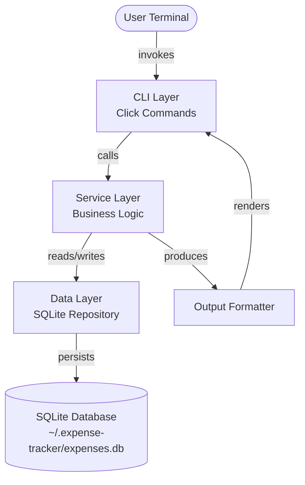
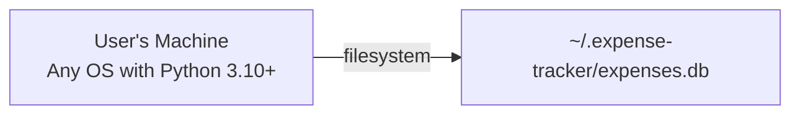
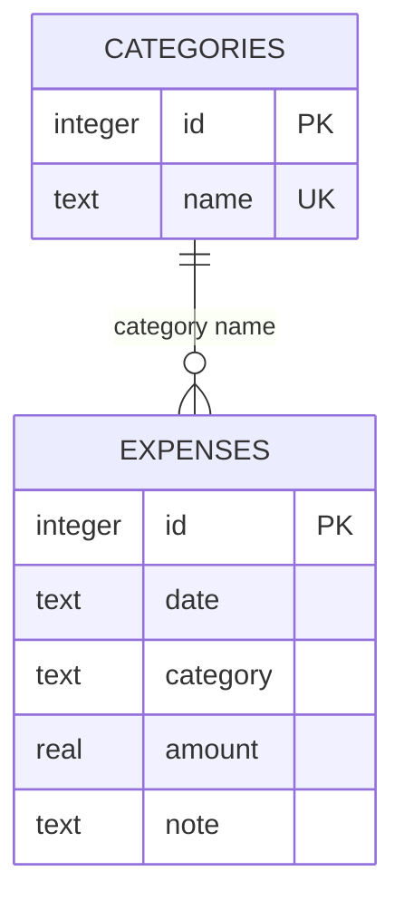
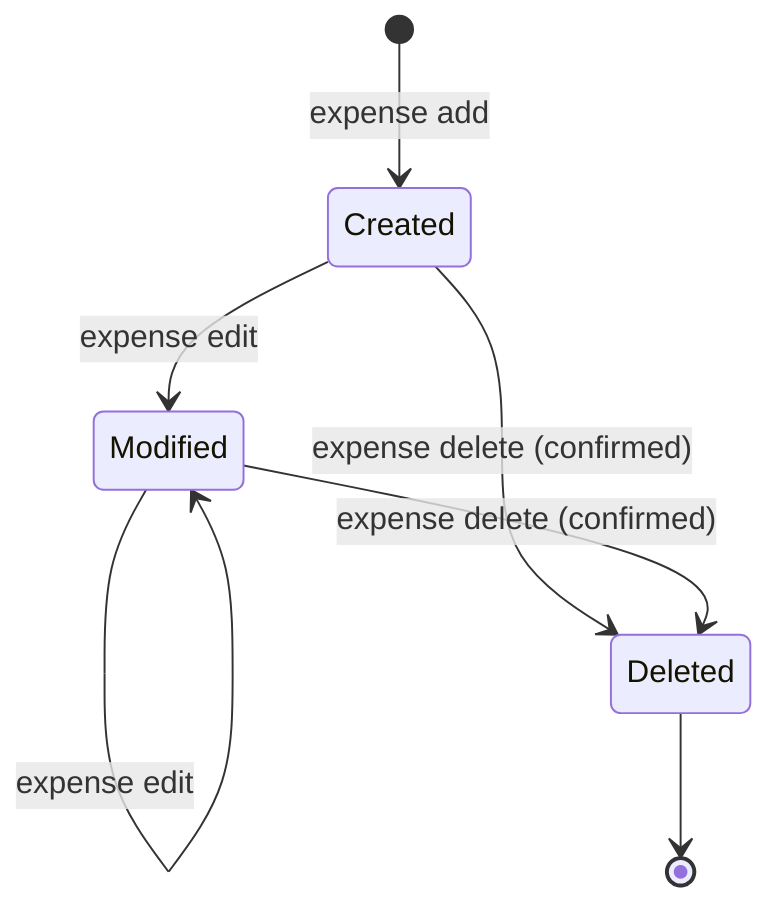

# Expense Tracker CLI — Architecture Blueprint

**Version:** v1
**Date:** 2026-03-12
**Previous Version:** N/A — initial draft
**Status:** Draft
**Author(s):** Claude (with user input)
**Product Spec:** expense-tracker-product-spec-v1

---

## 1. Executive Summary

The Expense Tracker CLI is a single-user, terminal-based application for recording and analyzing personal expenses. It is designed as a lightweight Python CLI tool that stores data locally in SQLite and exposes all functionality through Click commands. There are no background services, no network calls, and no external dependencies beyond Python and Click.

The architecture follows a three-layer design: a CLI layer that handles user interaction and argument parsing, a service layer that contains all business logic (validation, filtering, aggregation), and a data layer that manages SQLite persistence. This separation keeps the CLI thin, makes the business logic independently testable, and isolates database concerns behind a clean interface.

The system stores two entity types — expenses and categories — in a single SQLite database file at a well-known default location. Categories are seeded on first use and can be extended by the user. All write operations use transactions to maintain data integrity. The CLI produces formatted table output for interactive use and CSV files for export.

This is a deliberately simple architecture. The system runs entirely in-process, has no concurrency requirements, and handles one command per invocation. The design prioritizes fast startup, clear code organization, and testability over extensibility or scalability.

## 2. Design Principles & Constraints

### Hard Constraints (from Product Spec)

These are non-negotiable and directly shape the architecture:

- **C-001: Python 3.10+** — The entire system is a single Python package. No polyglot components.
- **C-002: Click** — All CLI parsing, argument validation, and help text generation go through Click. No argparse, no custom parsers.
- **C-003: SQLite via sqlite3** — The built-in `sqlite3` module is the only persistence mechanism. No ORM, no external database driver.
- **C-004: Single currency (USD)** — Amounts are stored as numeric values with no currency metadata. This eliminates any need for currency handling logic.
- **C-005: Single user** — No authentication, no access control, no multi-tenant considerations. The database file's filesystem permissions are the only access boundary.

### Design Principles

- **Thin CLI, fat service.** Click commands do argument parsing and output formatting only. All logic — validation, querying, aggregation — lives in the service layer. This means the service layer can be tested with plain Python calls, without invoking Click.
- **Fail fast with clear messages.** Invalid input is caught at the service layer boundary and reported as actionable error messages (NFR-003). The system does not attempt to guess what the user meant.
- **Transactions for all writes.** Every write operation (insert, update, delete) runs inside an explicit SQLite transaction. If the process is interrupted, the database remains in its last consistent state (NFR-002).
- **No magic defaults hidden from the user.** When the system applies a default (today's date, current month for summary), the output confirms what default was used.

## 3. System Overview

The system is a single Python package with three internal layers and one external dependency (SQLite file on disk). There is no network communication, no background process, and no inter-process coordination.



**CLI Layer** — Click command group with subcommands: `add`, `list`, `edit`, `delete`, `summary`, `export`, and `category` (with sub-subcommands `add` and `list`). Responsible for argument parsing, calling the service layer, and rendering output.

**Service Layer** — Pure Python module containing the `ExpenseService` and `CategoryService` classes. Handles validation (date formats, positive amounts, category existence), query construction for filters, summary aggregation (totals, per-category breakdown, daily averages), and CSV generation. This layer has no knowledge of Click — it receives plain Python arguments and returns plain Python objects.

**Data Layer** — A `Repository` class that wraps all SQLite operations. Provides methods for CRUD operations on expenses and categories. Manages connection lifecycle, schema initialization, and transaction boundaries. The repository is the only code that imports `sqlite3`.

**Output Formatter** — A small module that formats expenses and summaries into human-readable tables for terminal display. Separated from the CLI layer so that formatting logic can be tested independently.

## 4. Hardware & Infrastructure Topology

This system runs entirely on the user's local machine. There is no server, no cloud infrastructure, and no network communication.



- **Runtime environment:** Any machine with Python 3.10+ and pip. No OS-specific requirements.
- **Storage:** A single SQLite database file at `~/.expense-tracker/expenses.db`. The directory and file are created automatically on first invocation. Expected size is negligible — thousands of expenses occupy single-digit megabytes.
- **No network:** The application makes zero network calls. It works fully offline.

## 5. Component Architecture

### 5.1 CLI Layer

The CLI layer is a Click command group that serves as the entry point for all user interaction. The top-level group is named `expense` and contains subcommands that map one-to-one to the functional requirements.

The command group hierarchy:

- `expense add` — FR-001
- `expense list` — FR-002 through FR-005
- `expense edit` — FR-006
- `expense delete` — FR-007
- `expense summary` — FR-008, FR-009
- `expense export` — FR-013
- `expense category add` — FR-011
- `expense category list` — FR-012

Each command function does three things: (1) receives parsed arguments from Click, (2) calls the appropriate service method, (3) formats and displays the result. Error handling at this layer catches service-layer exceptions and renders them as user-friendly messages via `click.echo` with appropriate exit codes.

Click's built-in type system handles basic argument validation (types, required fields). Domain validation (category existence, positive amounts, valid date ranges) happens in the service layer.

### 5.2 Service Layer

The service layer contains two classes that encapsulate all business logic.

**ExpenseService** is responsible for expense lifecycle operations. It validates inputs against domain rules before passing them to the repository. For the `add` operation, it verifies the category exists, the amount is positive, and the date is a valid date string (defaulting to today if not provided). For `edit`, it verifies the expense exists, then applies only the fields that were provided (partial update). For `list` and `summary`, it builds filter criteria from the optional date range and category parameters and delegates the query to the repository. The summary method computes total spending, per-category totals sorted by amount descending, and average daily spend by dividing the total by the number of days in the requested period.

**CategoryService** manages the category list. On first use (when the database is initialized), it seeds the default categories defined in the product spec: food, transport, housing, utilities, entertainment, health, shopping, education, and other. It provides methods to add a custom category (rejecting duplicates) and list all categories. Categories are stored as lowercase strings and compared case-insensitively.

Both services receive a repository instance via constructor injection. This makes them testable with either a real database or a test database — no mocking required.

### 5.3 Data Layer (Repository)

The repository is a single class that owns the SQLite connection and encapsulates all SQL. It provides typed methods for each operation rather than exposing raw SQL to callers.

The repository handles three concerns:

**Connection management.** The repository opens a connection to the SQLite database on instantiation. It accepts a database path as a constructor argument, defaulting to `~/.expense-tracker/expenses.db`. Before connecting, it ensures the parent directory exists (creating it if needed). The connection uses `isolation_level=None` to allow explicit transaction control via `BEGIN`/`COMMIT`/`ROLLBACK`.

**Schema initialization.** On first connection, the repository checks whether the required tables exist and creates them if they don't. This is idempotent — running it against an existing database is a no-op. The schema is versioned implicitly: if future versions need migrations, the repository will check the current schema and apply necessary changes. For v1, there is no migration system; the schema is created once.

**Transaction management.** All write operations (insert, update, delete) are wrapped in explicit transactions. A context manager or decorator pattern ensures that if an exception occurs mid-operation, the transaction is rolled back. Read operations do not need explicit transactions since SQLite provides read consistency by default.

### 5.4 Output Formatter

A dedicated formatting module that converts data objects into human-readable strings. It produces two types of output:

**Table output** for terminal display. Expenses are rendered in aligned columns showing ID, date, category, amount (right-aligned, two decimal places), and note (truncated if too long). The formatter calculates column widths dynamically based on content. The summary output shows total spending, a category breakdown table, and the average daily spend.

**CSV output** for export. The formatter uses Python's built-in `csv` module to write expenses to a file with headers: date, category, amount, note. The ID is excluded from CSV export since it is an internal identifier.

### 5.5 Database Schema

Two tables serve all data needs:

**expenses** — Stores individual expense records. Columns: `id` (integer primary key, autoincrement), `date` (text in YYYY-MM-DD format), `category` (text, foreign key to categories), `amount` (real, stored as a floating-point number), `note` (text, nullable). The `date` column is indexed for efficient range queries. The `category` column is indexed for filtered lookups.

**categories** — Stores the list of valid categories. Columns: `id` (integer primary key, autoincrement), `name` (text, unique). The uniqueness constraint prevents duplicate categories. Default categories are inserted during schema initialization.

The foreign key relationship between `expenses.category` and `categories.name` is enforced at the application level (the service validates category existence before insert/update) rather than via SQLite foreign keys. This simplifies the schema and avoids the need to enable SQLite's foreign key pragma.



## 6. Data Flow & Pipeline

The system has a simple request-response data flow with no asynchronous processing or queuing. Every CLI invocation follows the same path: parse arguments, validate, execute, format, display.

```mermaid
sequenceDiagram
    participant U as User
    participant CLI as CLI Layer
    participant SVC as Service Layer
    participant REPO as Repository
    participant DB as SQLite

    U->>CLI: expense add --category food --amount 12.50
    CLI->>SVC: add_expense(category="food", amount=12.50, date=None, note=None)
    SVC->>SVC: Validate amount > 0
    SVC->>REPO: get_category("food")
    REPO->>DB: SELECT FROM categories WHERE name = "food"
    DB-->>REPO: Category row
    REPO-->>SVC: Category exists
    SVC->>SVC: Default date to today (2026-03-12)
    SVC->>REPO: insert_expense(date, category, amount, note)
    REPO->>DB: BEGIN; INSERT INTO expenses; COMMIT
    DB-->>REPO: New row ID
    REPO-->>SVC: Expense object with ID
    SVC-->>CLI: Expense object
    CLI->>U: "Added expense #42: $12.50 in food on 2026-03-12"
```

**Add flow:** CLI parses arguments → Service validates (amount positive, category exists, date valid or defaulted) → Repository inserts within a transaction → CLI confirms with the new ID.

**List flow:** CLI parses filter arguments → Service builds filter criteria → Repository executes SELECT with optional WHERE clauses for date range and category → Service returns expense list → Formatter renders as table → CLI outputs.

**Summary flow:** CLI parses date range (defaulting to current month) → Repository retrieves matching expenses → Service computes total, groups by category with subtotals, calculates daily average → Formatter renders summary → CLI outputs.

**Edit flow:** CLI parses expense ID and fields to update → Service verifies expense exists → Service validates any changed fields → Repository updates within a transaction → CLI confirms with updated record.

**Delete flow:** CLI parses expense ID → CLI prompts for confirmation → If confirmed, Service verifies expense exists → Repository deletes within a transaction → CLI confirms deletion.

**Export flow:** CLI parses filter arguments and output path → Service retrieves filtered expenses (same as list flow) → Formatter writes CSV to the specified path → CLI confirms with count.

## 7. State Machine & Lifecycle Definitions

The system is stateless between invocations. Each CLI command runs to completion and exits. There is no persistent process, no daemon, and no session state.

The only entity with a meaningful lifecycle is an **expense record**, and its lifecycle is trivial:



- **Created:** An expense is inserted into the database. It has an ID and all required fields.
- **Modified:** One or more fields of the expense are updated. The ID is preserved. There is no limit on the number of edits.
- **Deleted:** The expense is removed from the database. This is irreversible (no soft delete, no trash).

Categories have an even simpler lifecycle: they are created (either during initialization or via `category add`) and exist permanently. There is no category deletion in v1, since deleting a category that has associated expenses would require a decision about what to do with those expenses.

## 8. Configuration Management

The system has minimal configuration by design. The only configurable element is implicit: the database file path.

**Database path** defaults to `~/.expense-tracker/expenses.db`. This is defined as a constant in the repository module. There is no configuration file, no environment variable override, and no CLI flag to change it in v1. If a future version needs path configurability, an environment variable (e.g., `EXPENSE_TRACKER_DB`) would be the natural extension point.

**Default categories** are defined as a constant list in the service layer. They are seeded into the database on first use. This is not user-configurable — the user extends categories via the `category add` command rather than editing a config file.

**Output formatting** (column widths, date format) is hardcoded. The date format is ISO 8601 (YYYY-MM-DD) everywhere — input, storage, and output. This avoids locale-dependent parsing issues.

No configuration file format is needed for v1. The system follows a "convention over configuration" approach where sensible defaults cover all use cases defined in the product spec.

## 9. Safety & Guardrails

Given that this is a single-user, local-only CLI tool, the safety surface is small. The guardrails focus on preventing data loss and catching input errors.

**Delete confirmation (FR-007).** The `delete` command requires the user to confirm before removing a record. The default answer is "No" (safe default). This prevents accidental deletion from a mistyped command. The `--yes` flag can bypass the prompt for scripting use cases, but the user must explicitly opt in.

**Input validation.** The service layer rejects: negative or zero amounts, dates that don't parse as valid YYYY-MM-DD, categories that don't exist in the database, and expense IDs that don't correspond to existing records. Each rejection includes an actionable error message (NFR-003).

**Transaction protection (NFR-002).** All write operations are transactional. If the process is killed mid-write (Ctrl+C, power loss), the database rolls back to its last committed state. SQLite's write-ahead log (WAL) mode is not needed for this single-user, single-connection use case — the default journal mode is sufficient.

**No bulk destructive operations.** There is no "delete all" or "drop table" command. Expenses can only be deleted one at a time, each requiring confirmation. This bounds the damage from any single mistake.

## 10. Security Model

The security model is minimal, appropriate for a single-user local tool.

**No authentication or authorization.** The system has no concept of users, sessions, or permissions. Anyone who can execute the CLI binary and read/write the database file has full access.

**Database file permissions.** The database file is created with the default umask of the user's shell. On Unix-like systems, this typically means the file is readable/writable by the owner only (mode 0644 or 0600 depending on umask). The system does not explicitly set file permissions — it relies on the OS default.

**No secrets.** The system stores no credentials, API keys, tokens, or other secrets. There is nothing sensitive in the database beyond the user's expense data.

**No network exposure.** The application makes no network calls, opens no ports, and has no remote attack surface.

**SQL injection prevention.** All SQL queries use parameterized statements (the `?` placeholder syntax in sqlite3). User input is never interpolated into SQL strings.

## 11. Dependencies & External Services

### Runtime Dependencies

| Dependency | Purpose | Failure Impact |
|---|---|---|
| Python 3.10+ | Runtime environment | System cannot run |
| Click | CLI framework, argument parsing, help generation | System cannot run |
| sqlite3 (stdlib) | Database access | System cannot run |
| csv (stdlib) | CSV export | Export command fails; all other commands work |

### Development Dependencies

| Dependency | Purpose |
|---|---|
| pytest | Test runner |
| click.testing.CliRunner | Integration testing of CLI commands |

There are no external services, APIs, or network dependencies. The system is fully self-contained. Click is the only third-party runtime dependency.

## 12. Notification & Alerting

Not applicable. This is an interactive CLI tool with no background processing. All feedback is delivered synchronously as command output. There are no notifications, no alerts, and no monitoring. The user sees the result of every operation immediately in their terminal.

## 13. Logging & Audit Trail

The system does not implement application-level logging in v1. Diagnostic information is conveyed through error messages displayed to the user (NFR-003).

The SQLite database itself serves as an implicit audit trail — expenses have IDs that increment monotonically, providing a rough insertion order. However, there is no explicit audit log tracking who changed what and when. Edits overwrite the previous values without preserving history.

If audit requirements emerge in a future version, the natural approach would be an `expense_history` table that captures a snapshot of the expense before each edit or delete, along with a timestamp.

## 14. Scaling & Evolution Notes

### Known Limitations

- **No undo for delete.** Once an expense is deleted and confirmed, it cannot be recovered. A future version could implement soft deletes or an undo buffer.
- **No category deletion.** Categories can be added but not removed. Adding category deletion would require a policy for orphaned expenses (reassign to "other"? reject deletion?).
- **No recurring expenses.** Every expense must be entered manually. A future version could support templates or recurring entries.
- **Flat category structure.** Categories are a flat list with no hierarchy. A future version could support subcategories (e.g., food → groceries, restaurants).

### Evolution Paths

- **Budget tracking.** Adding monthly budget targets per category and showing remaining budget in summaries. This would add a `budgets` table and extend the summary output.
- **Multi-currency.** Storing currency per expense and converting for summaries. This would require an exchange rate source (breaking the "no network" constraint).
- **Import from CSV/bank statements.** A reverse of the export flow — parsing CSV files and inserting them as expenses. This would add an `import` command.
- **Database path configurability.** An environment variable `EXPENSE_TRACKER_DB` to support multiple databases or non-standard locations.

## 15. Decision Log

#### Three-Layer Architecture
- **Date:** 2026-03-12
- **Context:** Need to organize a small CLI application for testability and clarity.
- **Options Considered:** (1) Flat script with all logic in Click command functions. (2) Two-layer: CLI + database module. (3) Three-layer: CLI, service, repository.
- **Decision:** Three-layer architecture.
- **Rationale:** The service layer provides a natural place for business logic that is independent of both Click (CLI) and sqlite3 (persistence). This makes unit testing straightforward — service methods can be tested with plain Python without invoking Click or mocking the database. The overhead of the extra layer is minimal for this project.

#### Application-Level Category Validation vs. SQLite Foreign Keys
- **Date:** 2026-03-12
- **Context:** Expenses reference categories by name. Need to ensure only valid categories are used.
- **Options Considered:** (1) SQLite foreign key constraint on `expenses.category` referencing `categories.name`. (2) Application-level validation in the service layer.
- **Decision:** Application-level validation.
- **Rationale:** SQLite foreign keys require `PRAGMA foreign_keys = ON` per connection, which is easy to forget and produces cryptic error messages. Validating in the service layer produces clear, actionable error messages (NFR-003) and keeps the database schema simple.

#### Store Amounts as REAL (Float) vs. INTEGER (Cents)
- **Date:** 2026-03-12
- **Context:** Need to store monetary amounts. Floating-point arithmetic can introduce rounding errors.
- **Options Considered:** (1) Store as REAL (e.g., 12.50). (2) Store as INTEGER in cents (e.g., 1250) and convert on display.
- **Decision:** Store as REAL.
- **Rationale:** For a personal expense tracker, floating-point precision is more than sufficient. The amounts are entered and displayed with two decimal places, and rounding errors at the sub-cent level are irrelevant. Using REAL avoids the complexity of cents conversion throughout the codebase. If this were a financial system handling transactions between accounts, integer cents would be the right choice.

#### No ORM
- **Date:** 2026-03-12
- **Context:** Need to interact with SQLite. ORMs like SQLAlchemy are available.
- **Options Considered:** (1) SQLAlchemy ORM. (2) Raw sqlite3 with parameterized queries.
- **Decision:** Raw sqlite3.
- **Rationale:** The schema has two tables and a handful of queries. An ORM would add a dependency, increase startup time (NFR-001), and add complexity without meaningful benefit. The repository class provides a clean abstraction over the raw SQL.

## 16. Diagrams

All diagrams are embedded in their relevant sections above. Index:

- **System Overview** (Section 3) — Component diagram showing the three layers and database.
- **Entity Relationship** (Section 5.5) — Categories and Expenses tables.
- **Data Flow: Add Expense** (Section 6) — Sequence diagram showing a complete add operation.
- **Expense Lifecycle** (Section 7) — State diagram for expense records.

## 17. Glossary

| Term | Definition |
|---|---|
| **CLI Layer** | The Click-based command interface that parses user input and renders output. |
| **Service Layer** | Pure Python business logic (validation, aggregation, filtering) independent of CLI and database. |
| **Data Layer / Repository** | The module that owns the SQLite connection and encapsulates all SQL operations. |
| **Expense** | A single spending record with date, category, amount, and optional note. |
| **Category** | A label used to classify expenses (e.g., "food", "transport"). |
| **Default Categories** | The predefined set of categories seeded on first use: food, transport, housing, utilities, entertainment, health, shopping, education, other. |
| **Filter** | Optional criteria (date range, category) used to narrow list and export queries. |
| **Summary** | An aggregated view showing total spending, per-category breakdown, and average daily spend for a time period. |

## 18. Open Questions & TODOs

_No open questions. The architecture is straightforward and all design decisions have been resolved._

## 19. Changelog

### v1 — Initial Draft
- Initial architecture blueprint created from expense-tracker-product-spec-v1.
- Key design decisions: three-layer architecture, application-level category validation, REAL storage for amounts, no ORM.
- All 14 functional requirements from the product spec are addressed in the component architecture.
