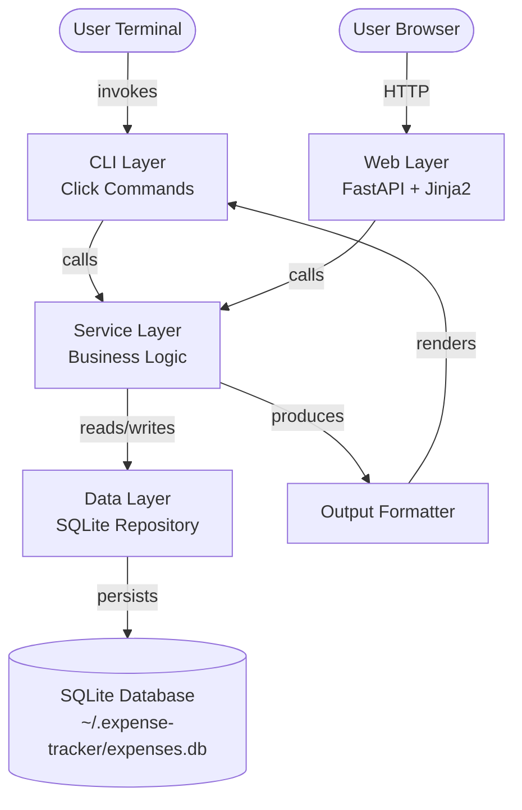
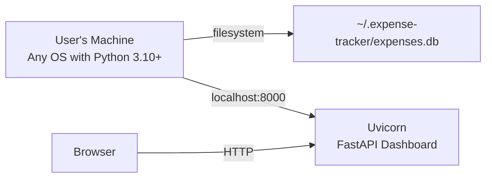
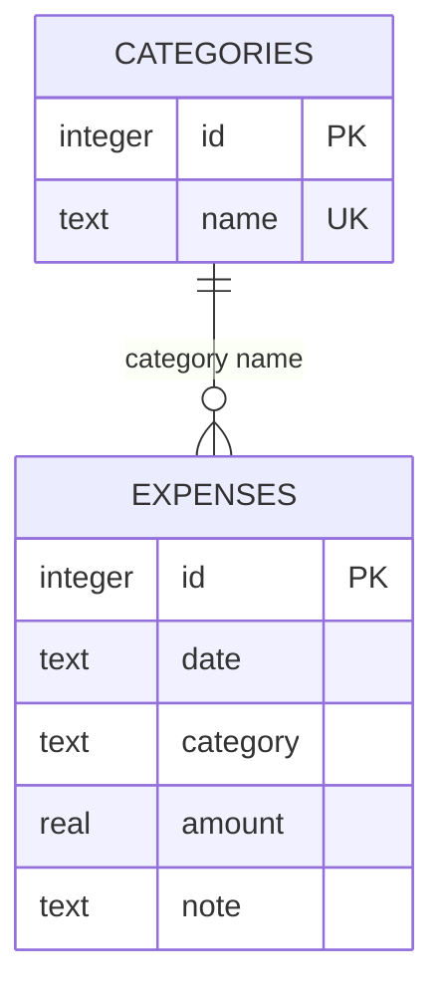
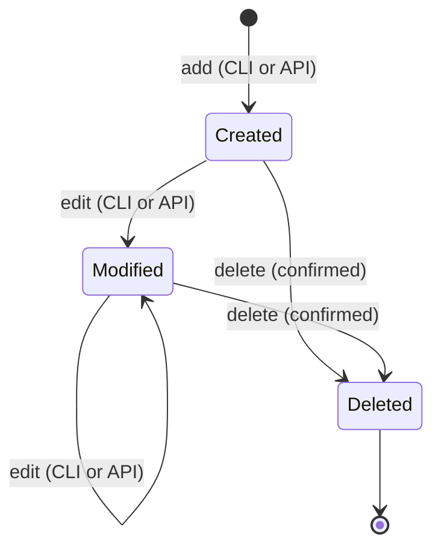
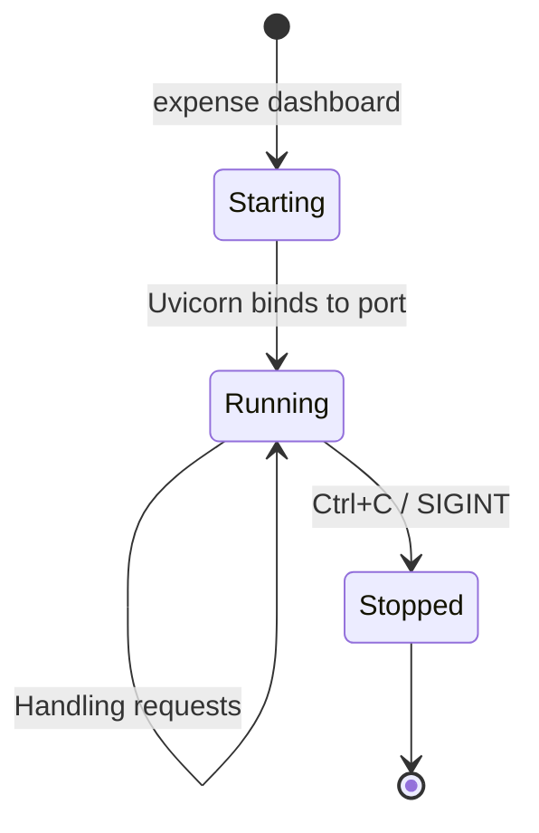

# Expense Tracker — Architecture Blueprint

**Version:** v2
**Date:** 2026-03-12
**Previous Version:** v1 — 2026-03-12
**Status:** Draft
**Author(s):** Claude (with user input)
**Product Spec:** expense-tracker-product-spec-v2

---

## 1. Executive Summary

The Expense Tracker is a dual-interface personal expense management tool. The original CLI interface provides fast terminal-based expense tracking via Click commands, backed by a local SQLite database. Version 2 adds a web dashboard built with FastAPI that provides full CRUD capabilities — users can view, add, edit, and delete expenses, see spending summaries, and manage categories through a browser interface.

The architecture extends the existing three-layer design (CLI → Service → Repository) by adding a fourth interface layer: a FastAPI web application that reuses the same service and repository layers. Both the CLI and web dashboard share the same SQLite database, ensuring data consistency regardless of which interface is used.

The web layer consists of two parts: a RESTful JSON API that exposes all expense and category operations, and server-rendered HTML pages using Jinja2 templates that consume the API. The FastAPI server runs locally as a development server (uvicorn) and is started via a new `expense dashboard` CLI command.

This remains a deliberately simple architecture. The web dashboard is a local tool — it binds to localhost, has no authentication, and is designed for a single user. The key architectural property is that the service layer is interface-agnostic: the CLI and web dashboard are both thin wrappers around the same business logic.

## 2. Design Principles & Constraints

### Hard Constraints (from Product Spec v2)

These are non-negotiable and directly shape the architecture:

- **C-001: Python 3.10+** — The entire system is a single Python package.
- **C-002: Click** — CLI parsing uses Click.
- **C-003: SQLite via sqlite3** — Built-in `sqlite3` is the only persistence mechanism.
- **C-004: FastAPI** — The web dashboard is built with FastAPI.
- **C-005: Single currency (USD)** — No currency handling logic.
- **C-006: Single user** — No authentication, no multi-user access.
- **C-007: Shared database** — CLI and web dashboard use the same SQLite database.

### Design Principles

- **Thin CLI, thin API, fat service.** Both the Click commands and FastAPI route handlers do argument parsing and output formatting only. All logic — validation, querying, aggregation — lives in the service layer. This means adding a new interface (CLI, web, or future API consumer) requires only writing a thin adapter.
- **Fail fast with clear messages.** Invalid input is caught at the service layer boundary and reported as actionable error messages. For the CLI, this means text output. For the API, this means appropriate HTTP status codes with JSON error bodies.
- **Transactions for all writes.** Every write operation runs inside an explicit SQLite transaction regardless of which interface triggered it.
- **No magic defaults hidden from the user.** When the system applies a default (today's date, current month for summary), the response confirms what default was used.
- **Server-rendered HTML.** The dashboard uses Jinja2 templates rendered server-side, not a separate frontend framework. This keeps the stack simple and avoids a JavaScript build pipeline.

## 3. System Overview

The system is a single Python package with four interface surfaces (CLI commands, API routes, HTML pages, output formatter) sharing a common service and data layer.



**CLI Layer** — Click command group with subcommands: `add`, `list`, `edit`, `delete`, `summary`, `export`, `category` (with `add`/`list` sub-subcommands), and `dashboard` (starts the web server). Unchanged from v1 except for the new `dashboard` command.

**Web Layer** — FastAPI application with two sets of routes: (1) JSON API endpoints under `/api/` for programmatic access, and (2) HTML template routes at `/` for the browser UI. The HTML pages use forms that submit to the API endpoints, with the responses used to re-render the page.

**Service Layer** — `ExpenseService` and `CategoryService` classes. Unchanged from v1. Both interfaces call these same classes.

**Data Layer** — `Repository` class wrapping all SQLite operations. Unchanged from v1.

**Output Formatter** — Formats data for CLI terminal display. Used only by the CLI layer; the web layer uses Jinja2 templates for rendering.

## 4. Hardware & Infrastructure Topology

The system runs entirely on the user's local machine. The web dashboard binds to localhost only.



- **Runtime environment:** Any machine with Python 3.10+ and pip.
- **Storage:** SQLite database at `~/.expense-tracker/expenses.db`.
- **Web server:** Uvicorn running FastAPI, bound to `127.0.0.1:8000`. Started on demand via `expense dashboard`. Not a persistent service — runs in the foreground until stopped.
- **No external network:** The server binds to localhost only. No external network access required.

## 5. Component Architecture

### 5.1 CLI Layer

Unchanged from v1. The Click command group serves as the entry point for terminal-based interaction. The only addition is the `dashboard` command:

- `expense dashboard` — FR-022: Starts the FastAPI/Uvicorn server and displays the URL.

The `dashboard` command imports uvicorn and runs the FastAPI app. It does not go through the service layer — it simply boots the web server.

### 5.2 Web Layer

The web layer is a FastAPI application module that provides both a JSON API and server-rendered HTML pages.

**API Routes (JSON)** — RESTful endpoints under `/api/`:

| Method | Path | Description | FR |
|--------|------|-------------|-----|
| GET | `/api/expenses` | List expenses (with optional query params: `start_date`, `end_date`, `category`) | FR-015 |
| POST | `/api/expenses` | Create an expense | FR-016 |
| PUT | `/api/expenses/{id}` | Update an expense | FR-017 |
| DELETE | `/api/expenses/{id}` | Delete an expense | FR-018 |
| GET | `/api/summary` | Get spending summary (with optional `start_date`, `end_date`) | FR-019 |
| GET | `/api/categories` | List categories | FR-020 |
| POST | `/api/categories` | Add a category | FR-020 |

Each API route creates a service instance (using the same `_get_services()` pattern as the CLI, or a FastAPI dependency), calls the appropriate service method, and returns JSON. Error handling converts service-layer exceptions to HTTP responses: `ValueError` → 400/422, `KeyError` → 404.

**HTML Routes** — Server-rendered pages:

| Path | Description |
|------|-------------|
| `/` | Dashboard home: expense table with filter controls, summary sidebar |
| `/add` | Add expense form |
| `/edit/{id}` | Edit expense form (pre-populated) |

HTML pages are rendered using Jinja2 templates. Forms submit via standard POST to the API endpoints. After a successful mutation (add/edit/delete), the browser redirects back to the expense list.

**Pydantic Models** — Request/response schemas for the API:

- `ExpenseCreate` — category, amount, date (optional), note (optional)
- `ExpenseUpdate` — all fields optional
- `ExpenseResponse` — id, date, category, amount, note
- `SummaryResponse` — total, by_category, daily_average, start_date, end_date, num_days
- `CategoryCreate` — name
- `ErrorResponse` — detail (error message string)

### 5.3 Service Layer

Unchanged from v1. `ExpenseService` and `CategoryService` contain all business logic. The web layer calls these same classes with the same arguments.

One consideration: the service layer currently returns dataclass instances (`Expense`, `Summary`, `CategorySummary`). FastAPI's JSON serialization handles dataclasses natively (converting them to dicts), so no adapter is needed.

### 5.4 Data Layer (Repository)

Unchanged from v1. The repository manages the SQLite connection, schema, and transactions.

**Concurrency note:** SQLite supports concurrent reads but serializes writes. Since the web server runs in a single process and the dashboard is single-user, contention is not a concern. If the CLI and web server are used simultaneously (rare), SQLite's file-level locking handles serialization automatically — the slower operation will wait briefly.

### 5.5 Output Formatter

Unchanged from v1. Used only by CLI commands. The web layer uses Jinja2 templates for HTML rendering instead.

### 5.6 Database Schema

Unchanged from v1. No schema changes are needed for the web dashboard — it operates on the same two tables (expenses, categories) using the same repository methods.



## 6. Data Flow & Pipeline

### CLI Data Flow (unchanged from v1)

```mermaid
sequenceDiagram
    participant U as User
    participant CLI as CLI Layer
    participant SVC as Service Layer
    participant REPO as Repository
    participant DB as SQLite

    U->>CLI: expense add --category food --amount 12.50
    CLI->>SVC: add_expense(category="food", amount=12.50, date=None, note=None)
    SVC->>SVC: Validate amount > 0
    SVC->>REPO: get_category("food")
    REPO->>DB: SELECT FROM categories WHERE name = "food"
    DB-->>REPO: Category row
    REPO-->>SVC: Category exists
    SVC->>SVC: Default date to today (2026-03-12)
    SVC->>REPO: insert_expense(date, category, amount, note)
    REPO->>DB: BEGIN; INSERT INTO expenses; COMMIT
    DB-->>REPO: New row ID
    REPO-->>SVC: Expense object with ID
    SVC-->>CLI: Expense object
    CLI->>U: "Added expense #42: $12.50 in food on 2026-03-12"
```

### Web Dashboard Data Flow

```mermaid
sequenceDiagram
    participant B as Browser
    participant API as FastAPI Routes
    participant SVC as Service Layer
    participant REPO as Repository
    participant DB as SQLite

    B->>API: POST /api/expenses {category: "food", amount: 12.50}
    API->>API: Parse & validate request body (Pydantic)
    API->>SVC: add_expense(category="food", amount=12.50, date=None, note=None)
    SVC->>SVC: Validate amount > 0, category exists
    SVC->>REPO: insert_expense(date, category, amount, note)
    REPO->>DB: BEGIN; INSERT INTO expenses; COMMIT
    DB-->>REPO: New row ID
    REPO-->>SVC: Expense object
    SVC-->>API: Expense object
    API-->>B: 201 Created {id: 42, date: "2026-03-12", ...}
```

**HTML page flow:** Browser requests `GET /` → FastAPI calls service.list_expenses() and service.get_summary() → renders Jinja2 template with data → returns HTML. Forms on the page POST to `/api/` endpoints → API returns JSON → page redirects to `GET /`.

## 7. State Machine & Lifecycle Definitions

### Expense Lifecycle (unchanged from v1)



The lifecycle is the same regardless of which interface triggers the state change.

### Web Server Lifecycle



The web server is not a persistent service. It runs in the foreground of the terminal session that started it.

## 8. Configuration Management

Minimal configuration, extended slightly from v1:

**Database path** defaults to `~/.expense-tracker/expenses.db`. Overridable via `EXPENSE_TRACKER_DB` environment variable (used in testing).

**Dashboard server settings** — the host and port default to `127.0.0.1:8000`. These could be made configurable via CLI flags on the `dashboard` command (`--host`, `--port`) but are not required for v1 of the dashboard feature.

**Default categories** — unchanged from v1. Defined as a constant and seeded on first database use.

## 9. Safety & Guardrails

All v1 guardrails remain in effect (delete confirmation, input validation, transaction protection, no bulk destructive operations).

Additional guardrails for the web dashboard:

**API input validation.** FastAPI's Pydantic models validate request bodies before they reach the service layer. Invalid JSON, missing required fields, and wrong types are caught at the framework level and return 422 responses.

**Service-layer validation unchanged.** The same business rules (positive amounts, valid categories, valid dates) are enforced regardless of whether the request came from the CLI or the API. There is no separate validation path for the web dashboard.

**Localhost binding.** The web server binds to `127.0.0.1` by default, not `0.0.0.0`. This prevents accidental network exposure of the unauthentic dashboard.

## 10. Security Model

Extends v1's minimal security model:

**No authentication or authorization.** The web dashboard has no login, no sessions, no tokens. It relies on the same assumption as the CLI: anyone who can reach the server has full access. Since the server binds to localhost, only processes on the same machine can access it.

**Localhost only.** The server binds to `127.0.0.1`, not all interfaces. This is a deliberate security boundary — the dashboard is not intended to be accessed from other machines.

**SQL injection prevention.** Unchanged — all SQL uses parameterized statements. The API layer adds Pydantic validation as an additional input sanitization step.

**No secrets.** The web server has no API keys, no tokens, no session secrets. There is no sensitive configuration.

**CORS not needed.** Since the HTML pages are served from the same origin as the API, no CORS configuration is needed.

## 11. Dependencies & External Services

### Runtime Dependencies

| Dependency | Purpose | Failure Impact |
|---|---|---|
| Python 3.10+ | Runtime environment | System cannot run |
| Click | CLI framework | CLI cannot run |
| sqlite3 (stdlib) | Database access | System cannot run |
| csv (stdlib) | CSV export | Export command fails |
| FastAPI | Web framework, API routes | Dashboard cannot run; CLI works fine |
| Uvicorn | ASGI server for FastAPI | Dashboard cannot run; CLI works fine |
| Jinja2 | HTML template rendering | Dashboard pages don't render; API still works |

### Development Dependencies

| Dependency | Purpose |
|---|---|
| pytest | Test runner |
| httpx | Testing FastAPI endpoints (async test client) |
| click.testing.CliRunner | CLI integration tests |

FastAPI, Uvicorn, and Jinja2 are new runtime dependencies for the dashboard feature. If these are not installed, the CLI continues to work normally — the dashboard feature simply won't be available.

## 12. Notification & Alerting

Not applicable. Same as v1. All feedback is synchronous — CLI output or HTTP responses.

## 13. Logging & Audit Trail

Same as v1. No application-level logging. Uvicorn provides standard HTTP access logging to stdout when the dashboard is running.

## 14. Scaling & Evolution Notes

### Known Limitations (carried from v1)

- No undo for delete
- No category deletion
- No recurring expenses
- Flat category structure

### New v2 Limitations

- **No concurrent write safety beyond SQLite's built-in locking.** If the CLI and dashboard write simultaneously, SQLite handles serialization, but users won't see real-time updates in the browser without refreshing.
- **No real-time updates.** The dashboard shows data as of page load. Changes made via CLI require a browser refresh to appear. WebSocket-based live updates are out of scope.
- **Desktop only.** The dashboard layout targets desktop viewports (1024px+). Mobile layout is out of scope.

### Evolution Paths (extended from v1)

- **Budget tracking** — Adding budget targets per category.
- **Multi-currency** — Per-expense currency with conversion.
- **CSV import** — Reverse of export.
- **Dashboard charts** — Visual spending charts (bar charts for categories, line charts for trends).
- **Real-time updates** — WebSocket connection for live dashboard updates.
- **Mobile-responsive layout** — CSS media queries for smaller viewports.

## 15. Decision Log

#### Three-Layer Architecture (v1)
- **Date:** 2026-03-12
- **Context:** Need to organize a small CLI application for testability and clarity.
- **Options Considered:** (1) Flat script. (2) Two-layer: CLI + database. (3) Three-layer: CLI, service, repository.
- **Decision:** Three-layer architecture.
- **Rationale:** The service layer provides a natural place for business logic independent of both CLI and persistence. Adding the web dashboard in v2 validates this decision — the web layer simply calls the same service classes.

#### Application-Level Category Validation (v1)
- **Date:** 2026-03-12
- **Context:** Need to ensure only valid categories are used.
- **Options Considered:** (1) SQLite foreign keys. (2) Application-level validation.
- **Decision:** Application-level validation.
- **Rationale:** Produces clear error messages and keeps the schema simple.

#### Store Amounts as REAL (v1)
- **Date:** 2026-03-12
- **Context:** Need to store monetary amounts.
- **Options Considered:** (1) REAL (float). (2) INTEGER (cents).
- **Decision:** REAL.
- **Rationale:** Sufficient precision for personal expense tracking.

#### No ORM (v1)
- **Date:** 2026-03-12
- **Context:** Need SQLite access.
- **Options Considered:** (1) SQLAlchemy. (2) Raw sqlite3.
- **Decision:** Raw sqlite3.
- **Rationale:** Simple schema, few queries, minimal benefit from ORM.

#### Server-Rendered HTML vs. SPA
- **Date:** 2026-03-12
- **Context:** Need to build the web dashboard UI.
- **Options Considered:** (1) Server-rendered HTML with Jinja2 templates. (2) Separate SPA frontend (React/Vue) consuming the API. (3) HTMX for progressive enhancement.
- **Decision:** Server-rendered HTML with Jinja2.
- **Rationale:** Avoids a JavaScript build pipeline, keeps the stack pure Python, and is sufficient for a single-user local tool with simple CRUD forms. The JSON API is still available for future use or scripting.

#### FastAPI over Flask
- **Date:** 2026-03-12
- **Context:** User chose FastAPI as the web framework.
- **Options Considered:** (1) FastAPI. (2) Flask.
- **Decision:** FastAPI.
- **Rationale:** User's explicit choice. FastAPI provides built-in Pydantic validation, automatic OpenAPI documentation, and async support. The type-annotation-based approach aligns well with the existing codebase's use of type hints.

## 16. Diagrams

All diagrams are embedded in their relevant sections. Index:

- **System Overview** (Section 3) — Component diagram showing CLI, Web, Service, and Data layers.
- **Infrastructure Topology** (Section 4) — Local machine with localhost server.
- **Entity Relationship** (Section 5.6) — Categories and Expenses tables (unchanged).
- **CLI Data Flow** (Section 6) — Sequence diagram for add via CLI.
- **Web Data Flow** (Section 6) — Sequence diagram for add via API.
- **Expense Lifecycle** (Section 7) — State diagram for expense records.
- **Web Server Lifecycle** (Section 7) — State diagram for the dashboard server.

## 17. Glossary

| Term | Definition |
|---|---|
| **CLI Layer** | The Click-based command interface that parses user input and renders output. |
| **Web Layer** | The FastAPI application serving both JSON API and HTML pages. |
| **Service Layer** | Pure Python business logic independent of CLI, web, and database. |
| **Data Layer / Repository** | The module that owns the SQLite connection and encapsulates all SQL. |
| **API Routes** | FastAPI endpoint handlers under `/api/` that return JSON. |
| **HTML Routes** | FastAPI endpoint handlers that render Jinja2 templates and return HTML. |
| **Expense** | A single spending record with date, category, amount, and optional note. |
| **Category** | A label used to classify expenses. |
| **Default Categories** | Predefined set: food, transport, housing, utilities, entertainment, health, shopping, education, other. |
| **Dashboard** | The web-based interface for managing expenses through a browser. |
| **Pydantic Model** | A FastAPI schema class used for request validation and response serialization. |

## 18. Open Questions & TODOs

_No open questions. The architecture extends cleanly from v1._

## 19. Changelog

### v2 — 2026-03-12

#### Added
- Web Layer (Section 5.2): FastAPI application with JSON API routes and Jinja2 HTML routes
- API route table mapping endpoints to functional requirements
- Pydantic model descriptions for request/response schemas
- Web dashboard data flow sequence diagram (Section 6)
- Web server lifecycle state diagram (Section 7)
- New runtime dependencies: FastAPI, Uvicorn, Jinja2
- New dev dependency: httpx for API testing
- Decision log entries: Server-Rendered HTML vs. SPA, FastAPI over Flask
- Glossary entries for web-specific terms

#### Changed
- Executive Summary rewritten to describe dual-interface system
- System Overview diagram now includes Web Layer alongside CLI Layer
- Design Principles updated: "Thin CLI, thin API, fat service"
- Infrastructure Topology updated to show localhost web server
- Constraints section updated with C-004 (FastAPI), C-007 (Shared database)
- Expense lifecycle updated to note state changes can come from CLI or API
- Dependencies table expanded with new runtime and dev dependencies
- Scaling & Evolution notes expanded with v2 limitations and evolution paths

#### Clarified
- Concurrency model for simultaneous CLI and web access (SQLite file locking)
- Localhost binding as a deliberate security boundary
