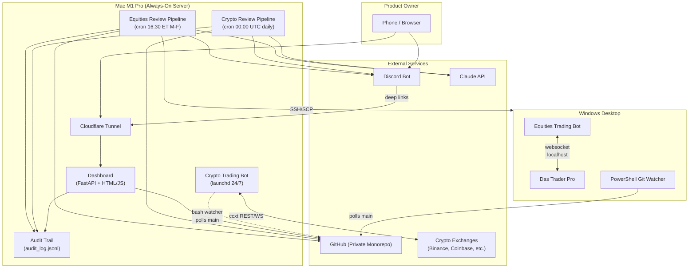
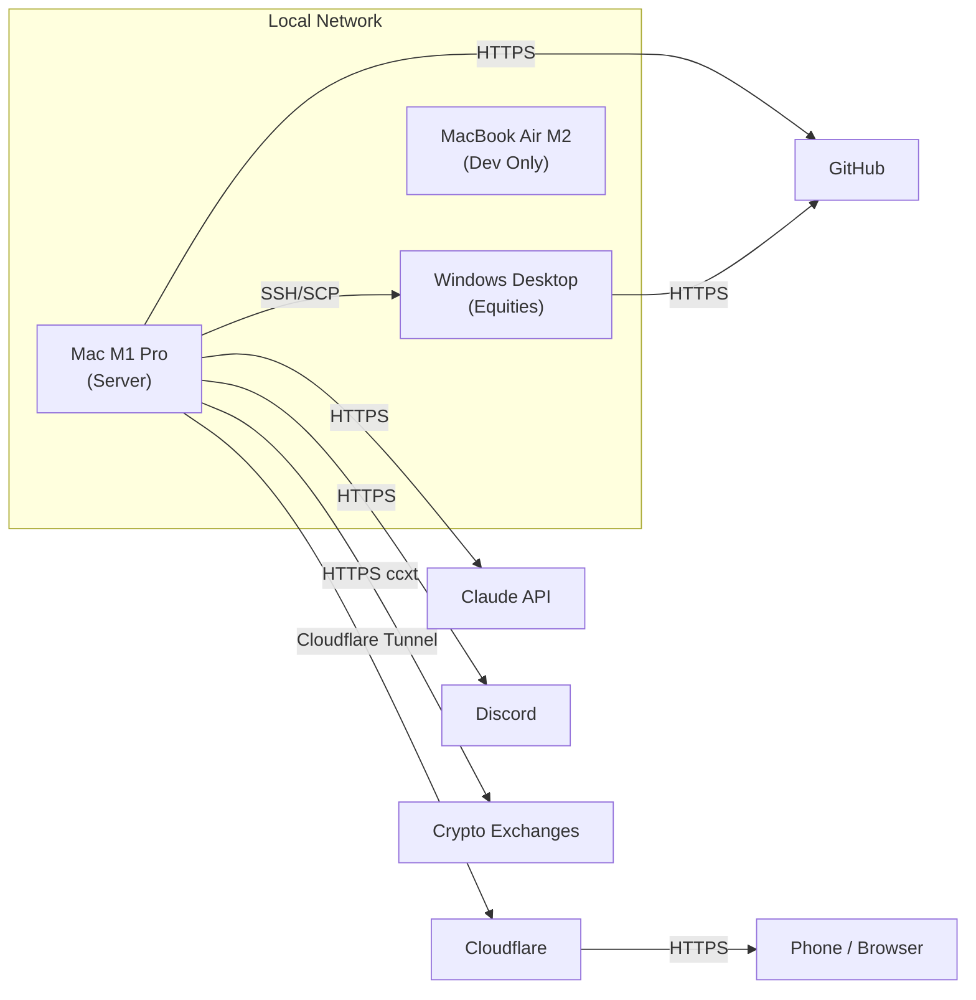
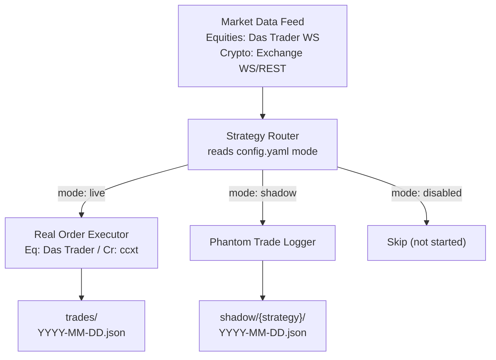
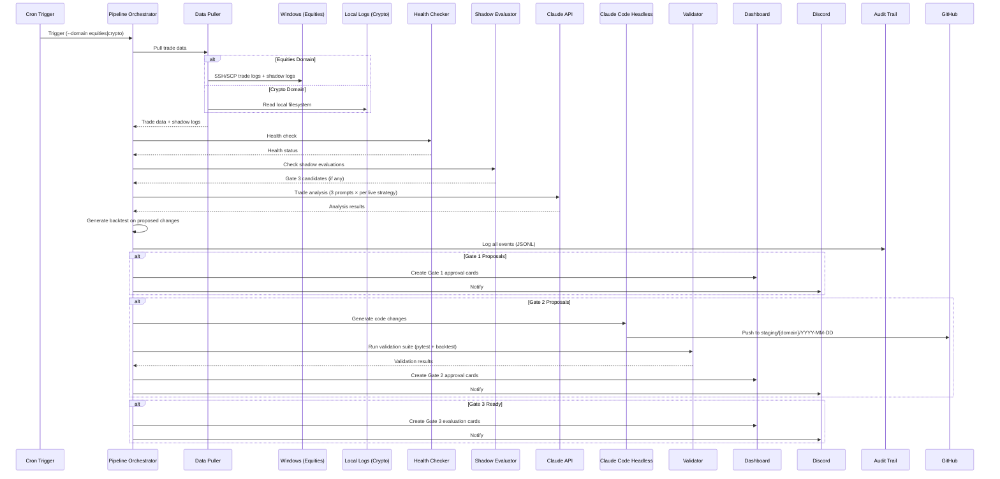
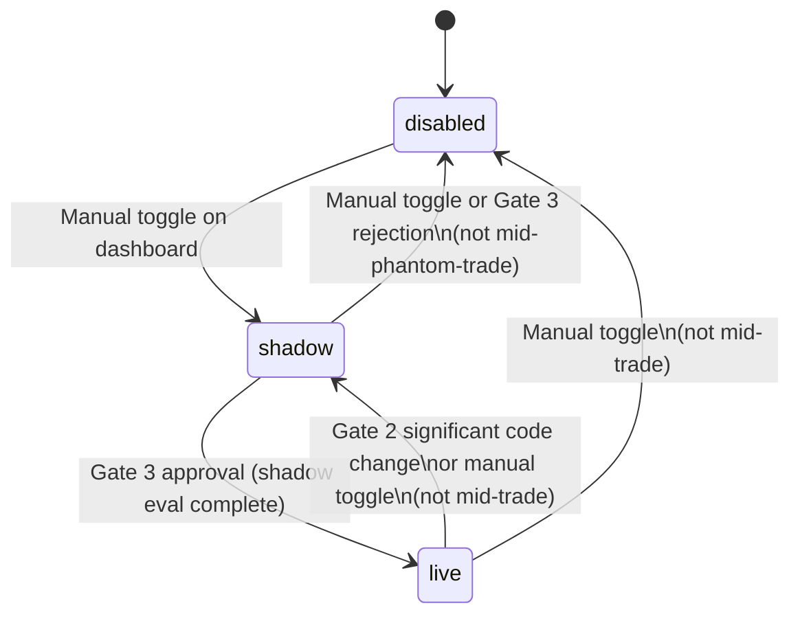
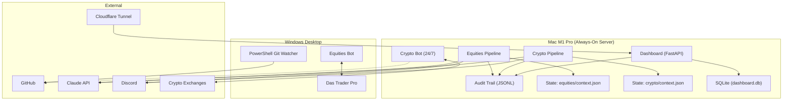
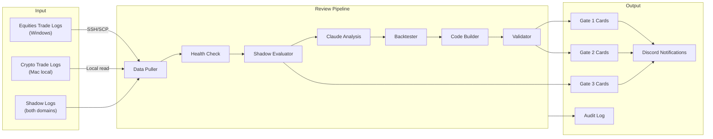
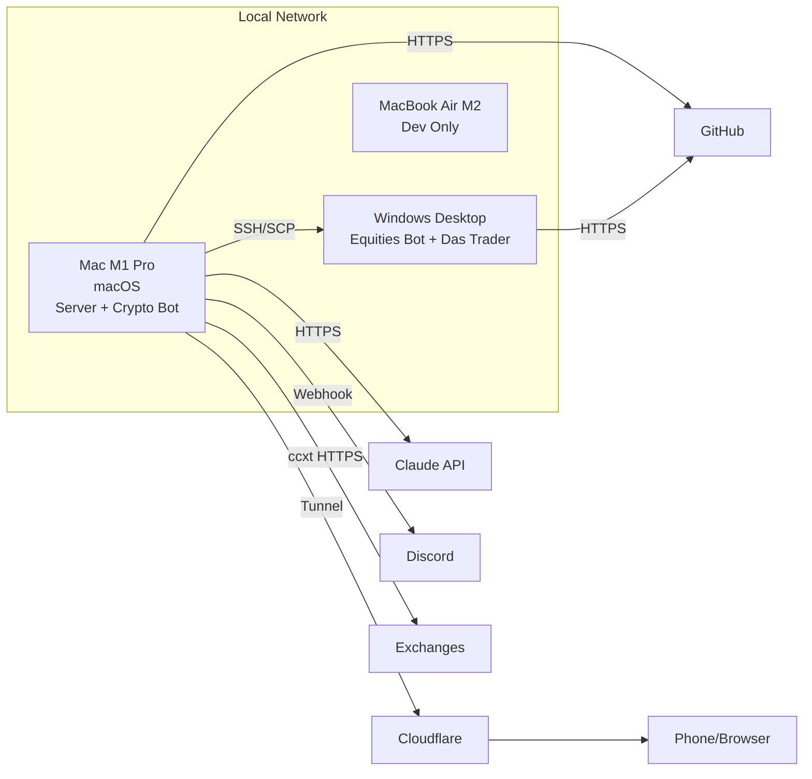

# Autonomous Trading Bot System — Architecture Blueprint

**Version:** v8
**Date:** March 8, 2026
**Previous Version:** v7 — March 8, 2026
**Status:** Draft
**Author(s):** Taylor (product owner), Claude (revision to skill-compliant format)

---

## 1. Executive Summary

This system is a hybrid autonomous trading pipeline that uses Claude Code headless mode and Python orchestration to analyze trades, propose improvements, and deploy changes — all with human-in-the-loop approval. The product owner operates from a phone or any browser; no terminal is needed unless manual intervention is required.

The system operates across two domains — **equities** and **crypto** — that share pipeline infrastructure but have different execution targets, schedules, and risk profiles. Equities trade US stocks through Das Trader Pro on a Windows desktop during market hours. Crypto trades pairs like BTC/USDT, ETH/USDT, and SOL/USDT around the clock through exchange APIs via the ccxt library, running as a persistent service on a Mac.

Every change to the system flows through a **three-gate approval pipeline**. Gate 1 handles configuration tuning (position size, stop loss, etc.) with immediate application on approval. Gate 2 handles code changes (strategy logic, new strategies) with a full validation suite — pytest, in-sample backtest, out-of-sample backtest, and threshold checks — deploying approved changes to shadow mode. Gate 3 validates strategies through shadow trading (paper trading against live market data) before promoting them to live execution. All three gates operate per-strategy and per-domain, with a 3-day cooling period between changes to the same strategy.

The pipeline runs daily on a MacBook Pro M1 (always-on, lid closed). It pulls trade data, runs health checks, evaluates shadow strategies, invokes Claude's API for multi-prompt analysis, generates backtest results, and produces proposals that surface as Discord notifications and dashboard approval cards. A FastAPI dashboard exposed via Cloudflare Tunnel provides the single control surface for all gate interactions, strategy management, and audit history across both domains.

Architecturally, the key decisions that define this system are: strategies are mode-unaware (they call `self.submit_order()` and the execution layer routes based on mode), all logging is append-only, there are no external cloud dependencies beyond Cloudflare Tunnel and the Claude API, the system runs entirely on existing hardware with no new purchases, and every event is recorded in a domain-tagged JSONL audit trail that serves as the system's source of truth.

---

## 2. Design Principles & Constraints

### Hard Constraints (Non-Negotiable)

**No new hardware purchases.** The system runs on the three existing machines: MacBook Pro M1 16GB (always-on server), MacBook Air M2 16GB (daily driver), and a Windows desktop (equities execution). The architecture must fit within these resources.

**Strategies must be mode-unaware.** Strategy code calls `self.submit_order()` and never checks whether it's running in live, shadow, or disabled mode. The execution layer handles routing. This ensures strategy logic is identical in shadow testing and live trading — no divergence bugs.

**All logging is append-only.** Trade logs, shadow logs, and the audit trail are never modified after creation. This guarantees auditability and prevents accidental or intentional tampering with historical records.

**No secrets in config or git.** API keys, tokens, and credentials are stored exclusively in environment variables or `.env` files that are gitignored. Config files contain only operational parameters.

**Das Trader connection is localhost-only, Windows-only.** The equities bot must run on the Windows desktop because Das Trader Pro's websocket API binds to `127.0.0.1` and only runs on Windows. This is a broker-imposed constraint.

**Human approval for all changes.** No configuration or code change reaches live trading without explicit human approval through the dashboard. The system proposes; the human decides.

**Crypto API keys loaded from environment variables, never from config.yaml.** Exchange credentials are sensitive and must never appear in version-controlled files.

**Shared code must not import from domain-specific code.** Code in `shared/` must not import from `equities/` or `crypto/`. Dependencies flow inward: domain code imports shared utilities, never the reverse.

### Soft Principles (Preferred but Flexible)

**Phone-first operation.** The system should be fully operable from a phone browser. The dashboard and Discord notifications are designed so that the product owner never needs to open a terminal for routine operations.

**Minimize manual intervention.** The pipeline runs automatically on cron. Human involvement is limited to approving or rejecting proposals, plus occasional debugging.

**Per-strategy isolation.** Each strategy is an independent unit with its own mode, config, gate history, and 3-day rule. Changes to one strategy never affect another.

**Prefer observation over action when uncertain.** If a backtest crashes or analysis fails, the pipeline reports observations without proposing changes rather than guessing.

**Start in shadow/sandbox mode.** Every new strategy and every significant code change must pass through shadow trading before reaching live execution.

---

## 3. System Overview

The system has five major subsystems that work together:

**Trading Bots** execute strategies against live markets. The equities bot runs on the Windows desktop, connecting to Das Trader Pro via websocket. The crypto bot runs on the Mac M1 Pro as a persistent launchd service, connecting to exchanges via ccxt. Both bots use a strategy router that dispatches based on each strategy's mode (live, shadow, or disabled) and write structured JSON trade logs.

**Daily Review Pipeline** runs on the Mac M1 Pro on cron schedules (16:30 ET for equities after market close, 00:00 UTC for crypto). It pulls trade data, runs health checks, evaluates shadow strategies, invokes Claude's API for per-strategy analysis (trade analyst, strategy advisor, pattern scanner), generates backtest results, and produces Gate 1/2/3 proposals.

**Dashboard** is a FastAPI application with an HTML/JS frontend, exposed via Cloudflare Tunnel. It is the single control surface for approving or rejecting proposals across all three gates, managing strategy modes, viewing audit history, and monitoring system health. Every page has a domain filter (All / Equities / Crypto).

**Discord Bot** sends notifications to organized channels when the pipeline produces proposals, when gates require attention, and when failures or anomalies occur. Messages are domain-tagged (📈 equities, ₿ crypto) and include deep links back to the dashboard for action.

**Audit Trail** is an append-only JSONL log that records every event in the system — pipeline runs, proposals, approvals, rejections, mode changes, failures — tagged with domain and strategy. It is the authoritative record of what happened and why.



---

## 4. Hardware & Infrastructure Topology

### Machines

**MacBook Pro M1 16GB — Always-On Server (lid closed)**
- **OS:** macOS
- **Role:** Runs the daily review pipelines (equities + crypto), the crypto trading bot (24/7 as launchd service), the FastAPI dashboard, the Discord bot, and the Cloudflare Tunnel. This is the operational nerve center.
- **Services:** Cron jobs for equities pipeline (16:30 ET M-F) and crypto pipeline (00:00 UTC daily), crypto health checks (every 4 hours), morning equities health check (9:35 ET M-F), weekend equities summary (Saturday 10:00 ET), crypto git watcher (every 60 seconds via cron), launchd service for crypto bot, launchd service for dashboard.
- **Network:** Same local network as all other machines. SSH client for connecting to Windows. Outbound HTTPS to Claude API, Discord webhooks, Cloudflare Tunnel, GitHub, and crypto exchanges.

**MacBook Air M2 16GB — Daily Driver**
- **OS:** macOS
- **Role:** Development machine. Used for writing code, running tests locally, manual intervention, and debugging. Not part of the production pipeline.
- **Network:** Same local network.

**Windows Desktop — Equities Execution**
- **OS:** Windows
- **Role:** Runs Das Trader Pro and the equities trading bot. Das Trader's websocket API binds to `127.0.0.1` (localhost only), so the bot must run on this machine. Also runs the equities shadow trade engine and a PowerShell git watcher.
- **Services:** Das Trader Pro (market hours), equities bot (market hours), PowerShell git watcher (polls main every 60 seconds), OpenSSH server (for the Mac to pull trade logs).
- **Network:** Same local network. OpenSSH server accepts connections from the Mac M1 for log retrieval via SCP.

### Network Communication

All machines are on the same local network. Communication paths:

| From | To | Protocol | Purpose |
|------|----|----------|---------|
| Mac M1 | Windows | SSH/SCP | Pull equities trade logs + shadow logs |
| Mac M1 | Claude API | HTTPS | Trade analysis, code generation |
| Mac M1 | Discord | HTTPS (webhook) | Notifications |
| Mac M1 | GitHub | HTTPS | Push staging branches, merge to main |
| Mac M1 | Crypto Exchanges | HTTPS (ccxt) | Trading, market data, OHLCV |
| Mac M1 | Cloudflare | HTTPS (Tunnel) | Expose dashboard to internet |
| Windows | GitHub | HTTPS | Pull main branch (git watcher) |
| Phone/Browser | Cloudflare Tunnel | HTTPS | Access dashboard |
| Phone | Discord | Mobile app | Read notifications, slash commands |



---

## 5. Component Architecture

### 5.1 Trading Bots

#### Equities Bot (Windows)

The equities bot connects to Das Trader Pro via websocket on `127.0.0.1` (localhost only, Windows only). It reads per-strategy config from `equities/bot/config.yaml` including the `mode` field.

The **Strategy Router** dispatches each strategy based on its mode: `live` sends orders to the real Das Trader API, `shadow` routes to the phantom trade logger, and `disabled` means the strategy's `setup()` is never called. The bot writes structured JSON trade logs per day: `trades/YYYY-MM-DD.json` for live trades and `shadow/{strategy_name}/YYYY-MM-DD.json` for phantom trades.

Strategies inherit from `base.Strategy` with the interface: `setup()`, `on_bar(bar)`, `on_tick(tick)` (optional), and `teardown()`. Strategy code does not know its mode — it calls `self.submit_order()` and the execution layer routes it.

The **PowerShell git watcher** polls main branch every 60 seconds, auto-pulls and restarts the bot on changes. **OpenSSH on Windows** allows the Mac M1 to pull both live and shadow trade logs via SCP.

Key modules:
- `equities/bot/main.py` — entry point, websocket connection to Das Trader
- `equities/bot/strategies/base.py` — abstract strategy class with `setup/on_bar/on_tick/teardown`
- `equities/bot/execution/das_connector.py` — Das Trader websocket client
- `equities/bot/execution/order_manager.py` — order routing, position tracking
- `equities/bot/execution/risk_manager.py` — position sizing, drawdown limits
- `equities/bot/execution/strategy_router.py` — dispatches by mode (live/shadow/disabled)
- `equities/bot/execution/phantom_trader.py` — shadow trade logger
- `equities/bot/data/market_data.py` — real-time data feed handling
- `equities/bot/data/indicators.py` — technical indicator calculations
- `equities/bot/utils/logger.py` — structured JSON logging
- `equities/bot/utils/health.py` — heartbeat writer, connection status

#### Crypto Bot (Mac)

The crypto bot uses [ccxt](https://github.com/ccxt/ccxt) as a unified exchange abstraction. The bot code doesn't care if it's trading on Binance, Coinbase, or Kraken — the connector handles the differences. It runs 24/7 as a launchd service on the Mac M1 Pro.

The exchange connector wraps ccxt to provide a unified interface:

```python
# crypto/bot/execution/exchange_connector.py (simplified)

import ccxt

class ExchangeConnector:
    """
    Unified exchange interface using ccxt.
    Supports both REST and websocket for market data.
    """
    
    def __init__(self, exchange_id: str, config: dict):
        self.exchange = getattr(ccxt, exchange_id)({
            'apiKey': config['api_key'],
            'secret': config['api_secret'],
            'sandbox': config.get('sandbox', True),  # Paper trading by default
            'options': {'defaultType': 'spot'}
        })
    
    def place_order(self, symbol, side, amount, order_type='limit', price=None):
        return self.exchange.create_order(symbol, order_type, side, amount, price)
    
    def get_balance(self):
        return self.exchange.fetch_balance()
    
    def get_ohlcv(self, symbol, timeframe='5m', limit=100):
        return self.exchange.fetch_ohlcv(symbol, timeframe, limit=limit)
    
    def get_ticker(self, symbol):
        return self.exchange.fetch_ticker(symbol)
    
    def get_open_orders(self, symbol=None):
        return self.exchange.fetch_open_orders(symbol)
    
    def cancel_order(self, order_id, symbol):
        return self.exchange.cancel_order(order_id, symbol)
```

The **CryptoStrategy** base class is adapted for 24/7 markets and crypto-specific concepts:

```python
# crypto/bot/strategies/base.py

from abc import ABC, abstractmethod

class CryptoStrategy(ABC):
    """
    Base class for all crypto strategies.
    
    Key differences from equities Strategy:
    - No market open/close (24/7)
    - Uses candle-based loop instead of tick-by-tick
    - Must handle exchange-specific quirks (rate limits, etc.)
    - Funding rate awareness for futures/perps
    
    Like equities strategies, crypto strategies are mode-unaware.
    They call self.submit_order() and the execution layer routes
    based on mode (live → exchange API, shadow → phantom logger).
    """
    
    @abstractmethod
    def setup(self, connector, config: dict):
        """Initialize indicators, state, subscribe to pairs."""
        pass
    
    @abstractmethod
    def on_candle(self, symbol: str, candle: dict):
        """Called on each new candle close."""
        pass
    
    @abstractmethod
    def on_tick(self, symbol: str, ticker: dict):
        """Called on each price update (optional, higher frequency)."""
        pass
    
    @abstractmethod
    def on_fill(self, order: dict):
        """Called when an order fills. Update position tracking."""
        pass
    
    def should_pause(self) -> bool:
        """Override for pause conditions (extreme volatility, low liquidity, etc.)."""
        return False
    
    @abstractmethod
    def teardown(self):
        """Cleanup: cancel open orders, log final state."""
        pass
```

Key modules:
- `crypto/bot/main.py` — entry point, exchange connection loop
- `crypto/bot/strategies/base.py` — abstract CryptoStrategy class
- `crypto/bot/execution/exchange_connector.py` — ccxt wrapper, unified exchange interface
- `crypto/bot/execution/order_manager.py` — order routing, position tracking (crypto)
- `crypto/bot/execution/risk_manager.py` — crypto-specific: funding rates, liquidation, spread checks, portfolio exposure, emergency kill switch
- `crypto/bot/execution/strategy_router.py` — dispatches by mode (live/shadow/disabled)
- `crypto/bot/execution/phantom_trader.py` — shadow trade logger (crypto)
- `crypto/bot/data/market_data.py` — exchange websocket + REST OHLCV
- `crypto/bot/data/indicators.py` — technical indicators for crypto
- `crypto/bot/utils/logger.py` — structured logging
- `crypto/bot/utils/health.py` — exchange health, rate limit monitoring

#### Crypto vs. Equities: Key Architectural Differences

| Aspect | Equities | Crypto |
|--------|----------|--------|
| Broker/Exchange | Das Trader (websocket, localhost) | ccxt (REST + WS, remote APIs) |
| Market hours | 9:30–16:00 ET, M–F | 24/7/365 |
| Bot runs on | Windows desktop | Mac M1 Pro |
| Bot lifecycle | Starts morning, idles at close | Runs as persistent service (launchd) |
| Log retrieval | SSH/SCP from Mac → Windows | Local filesystem read |
| Position types | Long/short shares | Spot, limit, stop-limit (futures later) |
| Risk factors | Market hours, halts, gaps | Exchange downtime, API rate limits, funding rates, liquidation |
| Price data | Das Trader data feed | Exchange websocket + REST OHLCV |
| Strategy base class | `base.Strategy` (on_bar/on_tick) | `CryptoStrategy` (on_candle/on_tick/on_fill) |
| Backtester data | Historical trade logs | Historical OHLCV from exchange API |
| Shadow evaluation days | Trading days (M-F only) | Calendar days (24/7) |
| Pipeline schedule | 16:30 ET weekdays | 00:00 UTC daily (configurable) |
| Config path | equities/bot/config.yaml | crypto/bot/config.yaml |
| Deployment mechanism | PowerShell git watcher | Bash git watcher + launchd service |

#### Crypto Risk Manager

The crypto risk manager extends common risk logic with crypto-specific checks:

```python
# crypto/bot/execution/risk_manager.py — additional concerns beyond equities

class CryptoRiskManager:
    """
    Extends common risk logic with crypto-specific checks.
    """
    
    def check_exchange_health(self) -> bool:
        """Verify exchange API is responsive before trading."""
        pass
    
    def check_rate_limits(self) -> bool:
        """Ensure we have API call budget remaining."""
        pass
    
    def check_funding_rate(self, symbol: str) -> float:
        """For futures: check funding rate before opening positions."""
        pass
    
    def check_spread(self, symbol: str, max_spread_pct: float) -> bool:
        """Verify bid-ask spread is reasonable. Low-liquidity pairs can have dangerous spreads."""
        pass
    
    def check_portfolio_exposure(self) -> dict:
        """Crypto-specific: check correlation exposure. BTC + ETH + SOL might all dump together."""
        pass
    
    def emergency_close_all(self):
        """Kill switch: cancel all open orders and market-sell all positions."""
        pass
```

### 5.2 Shadow Trade Engine

Both domains use the same pattern: shadow strategies run full strategy logic but route order execution to a phantom trade logger instead of the real broker/exchange.

The strategy code itself doesn't know whether it's live or shadow — it calls `self.submit_order()`. The bot's execution layer checks the mode and routes accordingly.



**Shadow Evaluation Differences:**

| Aspect | Equities | Crypto |
|--------|----------|--------|
| Shadow days | Trading days (M-F) | Calendar days (24/7) |
| Typical evaluation | 5 trading days (~1 week) | 5-7 calendar days |
| Force-close rule | End of trading day | Optional — crypto can carry overnight |
| Data source for phantom tracking | Das Trader price feed | Exchange ticker/candles |

### 5.3 Daily Review Pipeline

The pipeline is a Python orchestration layer that runs on cron. It accepts a `--domain` flag to target equities or crypto. The pipeline stages execute in order:

1. **Data Pull** — SSH/SCP for equities logs from Windows, local filesystem read for crypto logs
2. **Health Check** — Validate data completeness, bot connectivity, exchange health (crypto)
3. **Gate 3 Shadow Evaluation Check** — Check if any shadow strategies have completed their evaluation period, trigger Gate 3 dashboard cards
4. **Claude API Analysis** — Three prompts per live strategy (trade analyst, strategy advisor, pattern scanner), using domain-specific prompt templates
5. **Backtest** — Run backtests on proposed changes using historical data
6. **Gate 1 Config Proposals** — Generate config change proposals with reasoning and backtest results
7. **Gate 2 Code Proposals** — Invoke Claude Code headless for code changes, run full validation suite (pytest + in-sample backtest + out-of-sample backtest + threshold checks)
8. **Notify** — Send Discord notifications with deep links to dashboard, create dashboard approval cards

Key modules:
- `review/pipeline.py` — main orchestration, accepts `--domain` flag
- `review/data_puller.py` — domain-aware data retrieval (SSH for equities, local for crypto)
- `review/health_checker.py` — validates data completeness (both domains)
- `review/shadow_evaluator.py` — tracks shadow progress, triggers Gate 3
- `review/analyst.py` — Claude API calls, per-strategy analysis
- `review/code_builder.py` — Claude Code headless for code changes
- `review/validator.py` — validation suite: pytest + in/out-of-sample + thresholds
- `review/reporter.py` — formats and sends Discord notifications

#### Domain-Aware Data Puller

```python
# review/data_puller.py

def pull_trade_data(domain: str, date: str):
    """Domain-aware: SSH for equities, local for crypto."""
    if domain == "equities":
        # SSH into Windows, pull trade logs + shadow logs
        scp(f"{WIN_USER}@{WIN_IP}:C:/trading-system/equities/logs/trades/{date}.json", "./")
        scp(f"{WIN_USER}@{WIN_IP}:C:/trading-system/equities/logs/shadow/", "./", recursive=True)
    elif domain == "crypto":
        # Local file — crypto bot runs on this same Mac
        log_path = Path.home() / "trading-system" / "crypto" / "logs" / "trades" / f"{date}.json"
        if not log_path.exists():
            raise FileNotFoundError(f"No crypto trade log for {date}")
        return json.loads(log_path.read_text())
```

### 5.4 Dashboard

The dashboard is the single place for all gate interactions and strategy management across both domains. Discord is notification-only — all actions happen on the dashboard. Every page has a domain filter (All / Equities / Crypto).

**Tech Stack:**
- FastAPI backend (Python, runs on Mac M1)
- Simple HTML/JS frontend (no heavy framework — personal tool)
- Exposed via Cloudflare Tunnel for mobile access anywhere
- Auth: simple token-based auth or Cloudflare Access (zero trust) since it's single-user

**Pages:**

**Home / Status** — Domain toggle (All / Equities / Crypto), current bot status per domain (running, stopped, error), strategy overview table (name, domain, mode, today's P&L per strategy), active shadow evaluations with progress bars, today's combined P&L (equities + crypto, separate colors), last pipeline run summary per domain, quick links to recent pending approvals across all gates.

**Gate 1 — Config Approvals** — Domain filter. List of pending config change proposals (per-strategy, per-domain). Each proposal shows strategy name, domain, current mode, config diff, reasoning, backtest. Actions: Approve / Reject / Suggest Modification.

**Gate 2 — Code Approvals** — Domain filter. Each proposal shows strategy affected, domain, change classification (significant/minor). Full validation suite results (pytest, in-sample, out-of-sample, thresholds). Actions: Approve & Deploy to Shadow / Approve & Keep Current Mode / Reject / Request Changes.

**Gate 3 — Shadow Evaluations** — Domain filter. Active evaluations with progress bars (note: crypto counts calendar days, equities trading days). Completed evaluations with backtest-vs-shadow comparison. Actions: Promote to Live / Reject / Extend Shadow.

**Strategy Management** — All strategies from both domains in one control table:

```
Domain     Strategy              Mode        Status          Actions
───────────────────────────────────────────────────────────────────────
📈 Equity  momentum_v2          🟢 live     No position     [Shadow] [Disable]
📈 Equity  rsi_mean_reversion   🟡 shadow   Day 3/5         [Disable] [Extend]
📈 Equity  breakout_v1          ⚫ disabled  —              [Shadow]
₿ Crypto   grid_trading         🟢 live     2 BTC grids     [Shadow] [Disable]
₿ Crypto   trend_follow         🟡 shadow   Day 2/7         [Disable] [Extend]
```

Domain filter at top, per-strategy performance history (mini chart of daily P&L), per-strategy 3-day rule countdown timers.

**Audit Timeline** — Domain filter. Searchable, filterable timeline of every event. Filter by: date range, event type, gate, outcome, domain, strategy name. "Why is this broken?" mode — select a strategy + config param and see every change.

**Settings** — Discord webhook URL, pipeline schedules (per domain), default shadow evaluation period (per domain — trading days for equities, calendar days for crypto), minimum performance thresholds (per domain), circuit breaker thresholds (per domain), manual pipeline trigger button (per domain).

### 5.5 Discord Bot

The Discord bot handles notifications, slash commands, and emergency controls.

**Why Discord over Telegram:** Richer embeds with structured fields, colors, and inline buttons that link directly to dashboard actions. Threads allow each pipeline run its own conversation. Webhooks are simpler (no bot polling needed for send-only notifications). Slash commands enable quick status checks (`/status`, `/last-run`, `/audit <date>`). Channel organization allows separate channels per gate plus alerts and audit. Discord mobile app works well for push alerts.

**Channel Structure:**

```
📁 trading-bot (server)
├── #pipeline-runs      — Daily run summaries, health checks (both domains)
├── #gate-1-config      — Config change proposals (tagged: 📈 or ₿)
├── #gate-2-code        — Code change proposals (tagged: 📈 or ₿)
├── #gate-3-shadow      — Shadow evaluation progress + completion (tagged: 📈 or ₿)
├── #alerts             — Failures, anomalies, circuit breakers (both domains)
├── #audit-log          — Daily digest of all approved/rejected changes
└── #general            — Manual commands, ad hoc discussion
```

**Emergency: Crypto Kill Switch via Discord:**

```
You: /kill crypto

Bot: ⚠️ Emergency shutdown initiated for crypto domain.
     ✅ 4 orders cancelled (2 BTC, 2 ETH)
     ✅ Positions closed: BTC 0.015 @ $67,420, ETH 0.5 @ $3,847
     ✅ Emergency P&L: -$12.30 (slippage on market close)
     Crypto bot stopped. Reply "/start crypto" to restart.
```

---

## 6. Data Flow & Pipeline

### Daily Pipeline Flow

The equities pipeline runs at 16:30 ET on weekdays (30 minutes after market close). The crypto pipeline runs at 00:00 UTC daily. Both follow the same sequence of stages, differing only in data source and domain-specific prompts.



### Cron Schedule (Mac M1 Pro)

```crontab
# EQUITIES
# Daily review pipeline — 30 min after market close
30 16 * * 1-5  cd ~/trading-system && python -m review.pipeline --domain equities >> logs/equities-pipeline.log 2>&1

# Morning health check — verify equities bot started and is connected
35 9 * * 1-5   cd ~/trading-system && python -m review.health_checker --domain equities >> logs/equities-health.log 2>&1

# Weekend summary — broader analysis (equities only, market closed)
0 10 * * 6     cd ~/trading-system && python -m review.pipeline --domain equities --weekly >> logs/equities-pipeline.log 2>&1

# CRYPTO
# Daily review (midnight UTC — crypto runs 24/7)
0 0 * * *      cd ~/trading-system && python -m review.pipeline --domain crypto >> logs/crypto-pipeline.log 2>&1

# Health check — every 4 hours (crypto runs 24/7)
0 */4 * * *    cd ~/trading-system && python -m review.health_checker --domain crypto >> logs/crypto-health.log 2>&1

# Git watcher — check for new commits every 60 seconds (restarts crypto bot)
* * * * *      cd ~/trading-system && bash crypto/deploy/watcher.sh >> logs/crypto-watcher.log 2>&1
```

### 24/7 Markets: Crypto Review Scheduling

Unlike equities with a clear "market close" trigger, crypto runs continuously. Default is once daily at midnight UTC. Alternative configurations:

```
# Default: once daily at midnight UTC
0 0 * * *  python -m review.pipeline --domain crypto

# Alternative: every 8 hours for more active management
0 0,8,16 * * *  python -m review.pipeline --domain crypto

# Weekend: equities off, crypto gets extra analysis
0 10 * * 6  python -m review.pipeline --domain crypto --weekly
```

The "daily" concept for crypto uses UTC day boundaries. Trade logs are split by UTC date. The rolling 10-day context window works the same way.

### Discord Message Examples

**Equities Pipeline Run (`#pipeline-runs`):**
```
📈 Equities Pipeline — March 8, 2026

📊 Today's Trades: 12 executed, 8 winners (66.7%)
💰 P&L: +$342.50
📈 10-Day Sharpe: 1.38
👻 Shadow: rsi_mean_reversion — Day 3/5, +$215 phantom

🔧 Config Changes: 1 proposed (momentum_v2) → [Review]
💻 Code Changes: 0 proposed
⏱️ 3-Day Rule: momentum_v2 clear, rsi_mean_reversion locked (Day 1)

🔗 Full Report: https://your-dashboard.example.com/runs/20260308
```

**Crypto Pipeline Run (`#pipeline-runs`):**
```
₿ Crypto Pipeline — March 8, 2026 (UTC)

📊 24h Trades: 18 fills, 14 winners (77.8%)
💰 P&L: +$127.30
💱 Exchange: Binance (sandbox mode)

📋 Per Strategy:
  Grid (BTC/USDT): +$85.80 — 12 fills
  Grid (ETH/USDT): +$41.50 — 6 fills, tighter range today
👻 Shadow: trend_follow — Day 2/7, +$62 phantom

BTC held $67k-68k range, ideal for grid. ETH correlation
drifted slightly — monitoring. SOL trend_follow showing
early promise in shadow.

Funding rates: BTC +0.01% (neutral), ETH +0.03% (slightly long-heavy)

🔧 Suggestions:
1️⃣ [CONFIG] Widen ETH grid spacing: 0.5% → 0.7%
   Rationale: ETH swings wider than BTC, current grid
   getting filled too quickly with small profit per fill.

🔗 Full Report: https://your-dashboard.example.com/runs/20260308-crypto
```

---

## 7. State Machine & Lifecycle Definitions

### Strategy Lifecycle

Every strategy is an independent unit with its own domain, mode, config, and gate history. Strategies never affect each other's flow — the 3-day rule, shadow evaluation, and approvals all operate per strategy, per domain.



**States:**
- **`disabled`** — strategy code exists but doesn't run at all
- **`shadow`** — strategy runs against live market data, generates signals, but executes phantom trades instead of real orders; results logged for evaluation
- **`live`** — strategy executes real orders (through Das Trader for equities, through exchange API for crypto)

**Transition Rules:**

| Transition | Trigger | Guard |
|------------|---------|-------|
| disabled → shadow | Manual toggle on dashboard | — |
| disabled → live | Not allowed | Must pass through shadow first |
| shadow → live | Gate 3 approval (promote) | Shadow evaluation must be complete |
| shadow → disabled | Manual toggle or Gate 3 rejection | Not mid-phantom-trade |
| live → shadow | Gate 2 approval of significant code change, or manual toggle | Not mid-trade (holding position) |
| live → disabled | Manual toggle on dashboard | Not mid-trade (holding position) |

### Mid-Trade Guard

A strategy cannot change mode while it has an open position (live) or an unresolved phantom trade (shadow). The dashboard shows the strategy's current position state, and if it's holding, the toggle buttons are grayed out with an explanation. Every blocked attempt is logged as `STRATEGY_MODE_BLOCKED` in the audit trail.

For crypto: since markets are 24/7, mid-trade guards are especially important — there's no "market close" to force-resolve positions.

---

## 8. Configuration Management

### Domain Concept

The system operates across **domains** — independent trading environments that share pipeline infrastructure but have different execution targets, schedules, and risk profiles.

**Domain: Equities**
- Execution target: Das Trader Pro via websocket (Windows, localhost)
- Market hours: 9:30 AM – 4:00 PM ET, Mon–Fri
- Bot location: Windows desktop
- Log retrieval: SSH/SCP from Mac → Windows
- Review schedule: 16:30 ET weekdays (30 min after close)
- Assets: US equities (SPY, NVDA, AAPL, etc.)

**Domain: Crypto**
- Execution target: Exchange APIs via ccxt (Binance, Coinbase, Kraken, etc.)
- Market hours: 24/7/365
- Bot location: Mac M1 Pro (same machine as pipeline)
- Log retrieval: Local filesystem read (no SSH needed)
- Review schedule: 00:00 UTC daily (configurable — could be multiple per day)
- Assets: Crypto pairs (BTC/USDT, ETH/USDT, SOL/USDT, etc.)

**What's Shared Across Domains:** Same GitHub monorepo, same three-gate approval pipeline, same Discord bot (messages tagged with domain: 📈 equities, ₿ crypto), same Claude Code headless for both analysis and code generation, same dashboard (single UI, domain filter on every page), same audit trail format (every event tagged with `domain` + `strategy`), same per-strategy lifecycle (disabled → shadow → live), same per-strategy 3-day rule (per domain, independent).

**What's Different Per Domain:** Bot code and strategy implementations (separate base classes), execution layer (Das Trader websocket vs ccxt REST/WS), risk management (market hours vs 24/7, exchange health, funding rates), config files (equities/bot/config.yaml vs crypto/bot/config.yaml), log locations and retrieval method, pipeline schedule (16:30 ET vs 00:00 UTC), backtester data source (trade logs vs exchange OHLCV API), deployment mechanism (PowerShell watcher on Windows vs launchd + bash watcher on Mac).

### Equities Config

```yaml
# equities/bot/config.yaml

global:
  max_total_exposure: 10000     # across all live equities strategies
  max_strategies_live: 3         # max strategies in live mode at once
  max_daily_loss: 500

strategies:
  momentum_v2:
    mode: live
    position_size: 100
    stop_loss_pct: 0.02
    take_profit_pct: 0.04
    max_daily_trades: 5

  rsi_mean_reversion:
    mode: shadow
    shadow_start: "2026-03-08"
    shadow_days: 5
    position_size: 75
    stop_loss_pct: 0.015
    take_profit_pct: 0.03
    max_daily_trades: 3

  breakout_v1:
    mode: disabled
    position_size: 50
    stop_loss_pct: 0.025
    take_profit_pct: 0.05
    max_daily_trades: 4
```

### Crypto Config

```yaml
# crypto/bot/config.yaml

exchange:
  id: binance                    # ccxt exchange ID
  sandbox: true                  # Paper trading mode
  rate_limit_ms: 100             # Min ms between API calls
  # API keys loaded from environment variables, NOT this file
  # CRYPTO_API_KEY, CRYPTO_API_SECRET

pairs:
  - BTC/USDT
  - ETH/USDT
  - SOL/USDT

global:
  max_portfolio_drawdown_pct: 5.0    # Kill switch: stop all if portfolio -5%
  max_position_pct: 20.0             # No single position > 20% of portfolio
  max_open_positions: 5
  daily_loss_limit_usd: 500
  portfolio_base_currency: USDT
  max_strategies_live: 3

strategies:
  grid_trading:
    mode: live
    pairs: [BTC/USDT, ETH/USDT]
    grid_levels: 10
    grid_spacing_pct: 0.5
    position_size_usd: 100
    take_profit_pct: 1.5
    stop_loss_pct: 3.0

  trend_follow:
    mode: shadow
    shadow_start: "2026-03-08"
    shadow_days: 7              # 7 calendar days (24/7 market)
    pairs: [SOL/USDT]
    timeframe: 1h
    ema_fast: 12
    ema_slow: 26
    position_size_usd: 200
    trailing_stop_pct: 2.0

candle_interval: 5m
health_heartbeat_seconds: 60
```

Gate 1 config changes are per-strategy — a proposal to change `grid_trading.grid_spacing_pct` doesn't affect `trend_follow`. The 3-day rule is per-strategy per-domain.

### Config Change Propagation

When a Gate 1 config change is approved on the dashboard, the pipeline writes the updated config.yaml, commits to the main branch on GitHub with a reference to the audit event ID, and the git watcher on the target machine (PowerShell on Windows for equities, bash on Mac for crypto) detects the new commit, pulls, and restarts the bot. The bot reads the updated config.yaml on startup and applies the changes. For crypto, since the bot runs 24/7, the watcher restarts the launchd service. For equities, the change takes effect on the next bot startup (typically next trading day morning).

---

## 9. Safety & Guardrails

### Three-Gate Approval Pipeline

All three gates work identically across both domains. The only differences are in the data sources, schedules, and domain-specific context in the analysis prompts.

**Gate 1 — Config Changes (Per-Strategy, Per-Domain):** Config proposals are per-strategy within a domain. Each proposal includes the current value, proposed value, reasoning from Claude's analysis, and backtest results. The product owner approves, rejects, or suggests modifications on the dashboard. Approved changes are applied immediately via git commit.

**Gate 2 — Code Changes (with Validation Suite):** Code changes go through Claude Code headless, which generates the code and pushes to a staging branch namespaced by domain: `staging/equities/YYYY-MM-DD` or `staging/crypto/YYYY-MM-DD`. The validation suite runs automatically: pytest (unit + integration + regression for all strategies in that domain), in-sample backtest, out-of-sample backtest, and threshold checks. Results are displayed on the Gate 2 dashboard card. Approved significant changes automatically move the affected strategy to shadow mode.

**Gate 3 — Shadow Evaluation:** Shadow strategies run for a configured evaluation period (trading days for equities, calendar days for crypto). The pipeline tracks daily progress, and when the period completes, a Gate 3 card is created with phantom P&L, win rate, comparison to backtest, and a promote/reject/extend decision.

### 3-Day Rule (Per-Strategy, Per-Domain)

No config or code changes to the same strategy within 3 days of its last approved change. The rule is per-strategy and per-domain — changes to `momentum_v2` (equities) don't affect `grid_trading` (crypto). This prevents over-optimization and gives changes time to manifest in real market conditions.

### Mid-Trade Guard

See Section 7 (State Machine & Lifecycle Definitions). Prevents mode changes while holding positions.

### Approval Timeout

Proposals that are not acted on within 24 hours are auto-rejected and logged as expired. This prevents stale proposals from accumulating.

### Equities Risk Limits

- `max_total_exposure`: Maximum dollar exposure across all live equities strategies
- `max_strategies_live`: Maximum number of strategies in live mode simultaneously
- `max_daily_loss`: Daily loss limit across all equities strategies

### Crypto Risk Limits

- `max_portfolio_drawdown_pct`: Kill switch — stop all trading if portfolio drops by this percentage
- `max_position_pct`: No single position exceeds this percentage of total portfolio
- `max_open_positions`: Maximum concurrent open positions
- `daily_loss_limit_usd`: Daily loss limit in USD
- Exchange health checks every 4 hours
- Spread checks before order placement (low-liquidity pairs can have dangerous spreads)
- Portfolio correlation exposure monitoring (BTC + ETH + SOL can dump together)
- Emergency kill switch via Discord (`/kill crypto`) or dashboard

### Build Spec Classification

Every code change is classified to determine gate behavior:
- **SIGNIFICANT:** Touches entry/exit logic, signal generation, adds/removes indicators, new strategy — always routes through Gate 2 with full validation, approved changes auto-deploy to shadow
- **MINOR:** Refactor, logging, comments, test-only changes with identical runtime behavior — still goes through Gate 2 but with lighter review expectations

---

## 10. Security Model

### Credential Storage

| Secret | Storage Location | Access |
|--------|-----------------|--------|
| Claude API key | `.env` file on Mac M1 (gitignored) | Pipeline process only |
| Discord bot token | `.env` file on Mac M1 (gitignored) | Discord bot process only |
| SSH private key (for Windows) | `~/.ssh/` on Mac M1 | SSH client only |
| Crypto API keys (per exchange) | Environment variables on Mac (`~/.zshrc` or macOS Keychain) | Crypto bot process only |
| Dashboard auth token | `.env` file on Mac M1 (gitignored) | Dashboard process only |

No secrets appear in `config.yaml`, `context.json`, or any version-controlled file. The `.env` file is in `.gitignore`.

### Network Security

**Dashboard:** Behind Cloudflare Tunnel + Cloudflare Access (zero trust). Access restricted to the product owner's email only. No direct port exposure to the internet.

**Windows SSH:** OpenSSH server on Windows accepts connections only from the Mac M1 via SSH key authentication. Used exclusively for pulling trade logs.

**Crypto Exchanges:** API keys are configured with minimum required permissions (trading + read, no withdrawal). IP whitelisting is used where exchanges support it.

**Git Repo:** Private GitHub repository. No public access.

### Crypto API Key Security

Crypto API keys are never stored in config.yaml or git:

```
# Keys stored as environment variables on Mac
# Set in ~/.zshrc or via macOS Keychain

export CRYPTO_API_KEY="..."
export CRYPTO_API_SECRET="..."

# Or per-exchange if using multiple:
export BINANCE_API_KEY="..."
export BINANCE_API_SECRET="..."
export COINBASE_API_KEY="..."
export COINBASE_API_SECRET="..."
```

The launchd plist references these. The bot code reads them via `os.environ`.

---

## 11. Dependencies & External Services

### Runtime Dependencies

| Dependency | Used For | Domain | Notes |
|-----------|----------|--------|-------|
| Python 3.x | All bot code, pipeline, dashboard | All | Installed on Mac and Windows |
| ccxt | Unified exchange API abstraction | Crypto | Handles exchange differences, rate limiting |
| FastAPI | Dashboard backend | Shared | Runs on Mac M1 |
| SQLite | Dashboard data store | Shared | Local file at `state/dashboard.db` |

### External Services

| Service | Used For | Failure Impact |
|---------|----------|----------------|
| Claude API (Anthropic) | Trade analysis (3 prompts per strategy), code generation via headless mode | Pipeline skips analysis, reports observation-only |
| Discord | Notifications, slash commands, emergency controls | Dashboard still works; notifications lost |
| GitHub | Source of truth, staging branches, deployment trigger | Cannot deploy changes; bots continue with current code |
| Cloudflare Tunnel | Expose dashboard to internet for mobile access | Dashboard inaccessible remotely; local access still works |
| Das Trader Pro | Equities order execution, market data | Equities bot cannot trade; shadow still logs |
| Crypto Exchanges (Binance, etc.) | Crypto order execution, market data, OHLCV | Crypto bot pauses, retries every 5 min |

### Build/Dev Dependencies

- pytest — test runner
- SSH/SCP — log retrieval from Windows
- PowerShell — Windows git watcher
- launchd — macOS service management for crypto bot and dashboard
- Cloudflare `cloudflared` — tunnel client

### Python Requirements Files

- `requirements-equities.txt` — Python deps for equities bot
- `requirements-crypto.txt` — Python deps for crypto bot (ccxt, etc.)
- `requirements-review.txt` — Python deps for review pipeline

---

## 12. Notification & Alerting

### Discord Notifications

All notifications are sent to the Discord server `trading-bot` via webhooks. Messages are tagged with domain indicators: 📈 for equities, ₿ for crypto.

**Channel routing:**

| Channel | Trigger | Content |
|---------|---------|---------|
| `#pipeline-runs` | Pipeline completes | Run summary: trade count, P&L, Sharpe, shadow progress, proposals count |
| `#gate-1-config` | Config proposal generated | Strategy name, domain, current vs proposed values, reasoning, backtest, deep link to dashboard |
| `#gate-2-code` | Code proposal generated | Strategy affected, domain, change classification, validation results, deep link |
| `#gate-3-shadow` | Shadow evaluation progress or completion | Progress bars, phantom P&L, promote/reject link |
| `#alerts` | Failure or anomaly | Error description, affected domain/strategy, severity |
| `#audit-log` | Daily | Digest of all approved/rejected changes |

### Slash Commands

| Command | Description |
|---------|-------------|
| `/status` | Current bot status for both domains |
| `/last-run` | Summary of most recent pipeline run per domain |
| `/audit <date>` | Audit events for a specific date |
| `/kill <domain>` | Emergency shutdown — cancel all orders, close positions |
| `/start <domain>` | Restart after emergency shutdown |

### Escalation

Failures that prevent the pipeline from completing (SSH failure after retries, Claude API down, git push failure) are posted to `#alerts` with a severity indicator. Critical failures (exchange down for crypto, repeated bot crashes) get elevated formatting. The product owner receives push notifications via the Discord mobile app.

---

## 13. Logging & Audit Trail

### Trade Logs

Both domains write structured JSON trade logs per day:
- **Live trades:** `{domain}/logs/trades/YYYY-MM-DD.json`
- **Shadow trades:** `{domain}/logs/shadow/{strategy_name}/YYYY-MM-DD.json`
- **Health logs:** `{domain}/logs/health/`
- **Error logs:** `{domain}/logs/errors/`

All trade logs are treated as read-only input by the pipeline. They are never modified after creation.

### Audit Trail

The audit trail is the authoritative record of what happened in the system and why. It uses an append-only JSONL format stored at `audit/YYYY-MM-DD.jsonl`. Both domains write to the same files, distinguished by the `domain` field.

Every event is tagged with `domain` and `strategy`:

```json
{
  "id": "evt_20260308_000042_x7y8z9",
  "timestamp": "2026-03-08T00:00:42Z",
  "event_type": "GATE1_PROPOSED",
  "category": "gate_1",
  "domain": "crypto",
  "strategy": "grid_trading",
  "pipeline_run_id": "run_20260308_0000_crypto",
  "data": {
    "changes": {
      "grid_spacing_pct": { "old": 0.5, "new": 0.7 }
    },
    "reasoning": "ETH swings wider than BTC..."
  }
}
```

**Event types include:** `PIPELINE_STARTED`, `PIPELINE_COMPLETED`, `PIPELINE_FAILED`, `GATE1_PROPOSED`, `GATE1_APPROVED`, `GATE1_REJECTED`, `GATE2_PROPOSED`, `GATE2_APPROVED`, `GATE2_REJECTED`, `GATE3_PROGRESS`, `GATE3_PROMOTED`, `GATE3_REJECTED`, `GATE3_EXTENDED`, `STRATEGY_MODE_CHANGED`, `STRATEGY_MODE_BLOCKED`, `BACKTEST_RUN`, `CIRCUIT_BREAKER_TRIPPED`, `EXCHANGE_HEALTH_FAILED`, `RATE_LIMIT_WARNING`, `BOT_CRASH`.

**Integrity:** Audit trail files are append-only and never modified. The `CLAUDE.md` rules explicitly prohibit modifying audit trail files. Every config change committed to git references the corresponding audit event ID.

### State Files

- `state/equities/context.json` — 10-day rolling context for equities (last 10 days of trade summaries per strategy, current config snapshot, pending proposals, 3-day rule state, active shadow evaluations)
- `state/crypto/context.json` — Same structure for crypto
- `state/dashboard.db` — SQLite database for dashboard queries (synced from JSON logs by `dashboard/backend/ingest.py`)

State context files are fed into the corresponding domain's Claude API prompts for continuity.

---

## 14. Testing Strategy

### Test Layers

**Unit Tests** (`{domain}/tests/unit/`): Test individual components in isolation — strategy logic, indicator calculations, config parsing, risk checks. Run with `pytest {domain}/tests/unit/ -v`.

**Integration Tests** (`{domain}/tests/integration/`): Test component interactions — strategy router dispatching, order manager flow, data puller connectivity. Run with `pytest {domain}/tests/integration/ -v`.

**Regression Tests** (`{domain}/tests/regression/`): Test ALL strategies in a domain to ensure changes to one strategy don't break others. Required for every code change. Run with `pytest {domain}/tests/regression/ -v`.

**Backtests** (`{domain}/tests/backtester.py`): Historical simulation of strategy performance. Equities backtests use historical trade logs. Crypto backtests pull historical OHLCV from exchanges via ccxt. Run with `python -m {domain}.tests.backtester --config {domain}/bot/config.yaml --strategy <name>`.

```python
# crypto/tests/backtester.py — pulls historical data from exchanges

def fetch_historical_data(symbol, timeframe, days):
    """
    Pull historical OHLCV from exchange for backtesting.
    ccxt makes this easy — no need for separate data provider.
    """
    exchange = ccxt.binance({'enableRateLimit': True})
    since = exchange.parse8601((datetime.utcnow() - timedelta(days=days)).isoformat())
    ohlcv = exchange.fetch_ohlcv(symbol, timeframe, since=since, limit=1000)
    return pd.DataFrame(ohlcv, columns=['timestamp', 'open', 'high', 'low', 'close', 'volume'])
```

### Gate 2 Validation Suite

Every code change that passes through Gate 2 runs the full validation suite automatically:
1. **pytest** — unit + integration + regression for all strategies in the affected domain
2. **In-sample backtest** — performance on training data
3. **Out-of-sample backtest** — performance on held-out data
4. **Threshold checks** — configurable minimum performance requirements

Results are displayed on the Gate 2 dashboard card. Validation failures are flagged as 🔴. Out-of-sample significantly worse than in-sample is flagged as 🟡 (possible overfit warning).

---

## 15. Deployment

### Equities Bot (Windows)

The equities bot deploys through a pull-based mechanism:

1. Code changes are merged to `main` on GitHub (after Gate 2 approval).
2. The **PowerShell git watcher** (`equities/deploy/watcher.ps1`) polls the main branch every 60 seconds.
3. On detecting new commits, it runs `git pull origin main` and restarts the equities bot.
4. The bot reads the updated `equities/bot/config.yaml` and strategy code on startup.

### Crypto Bot (Mac)

The crypto bot deploys through a similar pull-based mechanism, but runs as a persistent launchd service:

1. Code changes are merged to `main` on GitHub.
2. The **bash git watcher** (`crypto/deploy/watcher.sh`) runs every 60 seconds via cron.
3. On detecting new commits, it pulls and restarts the crypto bot via `launchctl stop/start com.trading.crypto-bot`.
4. The bot reads the updated config and strategy code on restart.

**Crypto bot launchd service definition:**

```xml
<!-- crypto/deploy/crypto-bot.plist -->
<!-- Install: cp crypto-bot.plist ~/Library/LaunchAgents/ && launchctl load ~/Library/LaunchAgents/crypto-bot.plist -->

<?xml version="1.0" encoding="UTF-8"?>
<!DOCTYPE plist PUBLIC "-//Apple//DTD PLIST 1.0//EN" "http://www.apple.com/DTDs/PropertyList-1.0.dtd">
<plist version="1.0">
<dict>
    <key>Label</key>
    <string>com.trading.crypto-bot</string>
    <key>ProgramArguments</key>
    <array>
        <string>/usr/bin/python3</string>
        <string>-m</string>
        <string>crypto.bot.main</string>
    </array>
    <key>WorkingDirectory</key>
    <string>/Users/you/trading-system</string>
    <key>RunAtLoad</key>
    <true/>
    <key>KeepAlive</key>
    <true/>
    <key>StandardOutPath</key>
    <string>/Users/you/trading-system/crypto/logs/stdout.log</string>
    <key>StandardErrorPath</key>
    <string>/Users/you/trading-system/crypto/logs/stderr.log</string>
    <key>EnvironmentVariables</key>
    <dict>
        <key>CRYPTO_API_KEY</key>
        <string>SET_VIA_KEYCHAIN_OR_ENV</string>
        <key>CRYPTO_API_SECRET</key>
        <string>SET_VIA_KEYCHAIN_OR_ENV</string>
    </dict>
</dict>
</plist>
```

**Crypto git watcher:**

```bash
#!/bin/bash
# crypto/deploy/watcher.sh
# Polls git main, restarts crypto bot on new commits

cd ~/trading-system

LOCAL=$(git rev-parse HEAD)
REMOTE=$(git ls-remote origin main | cut -f1)

if [ "$LOCAL" != "$REMOTE" ]; then
    echo "$(date): New commits detected, pulling and restarting crypto bot..."
    git pull origin main

    # Restart crypto bot via launchd
    launchctl stop com.trading.crypto-bot
    sleep 2
    launchctl start com.trading.crypto-bot

    echo "$(date): Crypto bot restarted with latest code."
fi
```

### Dashboard (Mac)

The dashboard runs as a launchd service on the Mac M1 Pro, defined in `dashboard/deploy/dashboard.plist`. It starts automatically on boot and is kept alive by launchd.

### Git Branch Strategy

- `main` — production branch. Only receives merges from approved staging branches.
- `staging/equities/YYYY-MM-DD` — pending equities code changes from Gate 2.
- `staging/crypto/YYYY-MM-DD` — pending crypto code changes from Gate 2.
- Git watchers on Windows and Mac only watch `main`.

---

## 16. Repo & Code Structure

```
trading-system/                       ← Git monorepo (shared between all machines)
│
├── equities/                          ← Equities trading bot (runs on Windows)
│   ├── bot/
│   │   ├── main.py                    ← Entry point, websocket to Das Trader
│   │   ├── config.yaml                ← Per-strategy equities config
│   │   ├── strategies/
│   │   │   ├── base.py                ← Abstract strategy class (equities)
│   │   │   ├── momentum_v2.py
│   │   │   └── rsi_mean_reversion.py
│   │   ├── execution/
│   │   │   ├── das_connector.py       ← Das Trader websocket client
│   │   │   ├── order_manager.py       ← Order routing, position tracking
│   │   │   ├── risk_manager.py        ← Position sizing, drawdown limits
│   │   │   ├── strategy_router.py     ← Dispatches by mode: live/shadow/disabled
│   │   │   └── phantom_trader.py      ← Shadow trade logger (equities)
│   │   ├── data/
│   │   │   ├── market_data.py         ← Real-time data feed handling
│   │   │   └── indicators.py          ← Technical indicator calculations
│   │   └── utils/
│   │       ├── logger.py              ← Structured logging (JSON format)
│   │       └── health.py              ← Heartbeat writer, connection status
│   │
│   ├── logs/
│   │   ├── trades/                    ← Live trade logs: YYYY-MM-DD.json
│   │   ├── shadow/                    ← Phantom trades per strategy
│   │   │   └── {strategy_name}/YYYY-MM-DD.json
│   │   ├── health/
│   │   └── errors/
│   │
│   ├── tests/
│   │   ├── unit/
│   │   ├── integration/
│   │   ├── regression/                ← Tests ALL equities strategies
│   │   └── backtester.py              ← Historical data backtester
│   │
│   └── deploy/
│       ├── watcher.ps1                ← PowerShell: polls git main, restarts bot
│       └── setup_windows.md
│
├── crypto/                            ← Crypto trading bot (runs on Mac)
│   ├── bot/
│   │   ├── main.py                    ← Entry point, exchange connection loop
│   │   ├── config.yaml                ← Per-strategy crypto config
│   │   ├── strategies/
│   │   │   ├── base.py                ← Abstract strategy class (CryptoStrategy)
│   │   │   ├── grid_trading.py
│   │   │   └── trend_follow.py
│   │   ├── execution/
│   │   │   ├── exchange_connector.py  ← ccxt wrapper — unified exchange interface
│   │   │   ├── order_manager.py       ← Order routing, position tracking (crypto)
│   │   │   ├── risk_manager.py        ← Crypto-specific: funding rates, liquidation
│   │   │   ├── strategy_router.py     ← Dispatches by mode: live/shadow/disabled
│   │   │   └── phantom_trader.py      ← Shadow trade logger (crypto)
│   │   ├── data/
│   │   │   ├── market_data.py         ← Exchange websocket + REST OHLCV
│   │   │   └── indicators.py          ← Technical indicators for crypto
│   │   └── utils/
│   │       ├── logger.py
│   │       └── health.py              ← Exchange health, rate limit monitoring
│   │
│   ├── logs/
│   │   ├── trades/                    ← Live trade logs: YYYY-MM-DD.json
│   │   ├── shadow/                    ← Phantom trades per strategy
│   │   │   └── {strategy_name}/YYYY-MM-DD.json
│   │   ├── health/
│   │   └── errors/
│   │
│   ├── tests/
│   │   ├── unit/
│   │   ├── integration/
│   │   ├── regression/                ← Tests ALL crypto strategies
│   │   └── backtester.py              ← Pulls historical OHLCV from exchanges
│   │
│   └── deploy/
│       ├── watcher.sh                 ← Bash: polls git main, restarts crypto bots
│       ├── crypto-bot.plist           ← launchd service definition (auto-start, auto-restart)
│       └── setup_mac.md
│
├── shared/                            ← Code shared across domains
│   ├── audit.py                       ← Audit trail writer/reader
│   ├── discord_bot.py                 ← Discord notifications + slash commands
│   └── gate_utils.py                  ← Common gate logic (3-day rule, etc.)
│
├── review/                            ← Daily review pipeline (runs on Mac)
│   ├── pipeline.py                    ← Main orchestration — accepts --domain flag
│   ├── data_puller.py                 ← Domain-aware: SSH for equities, local for crypto
│   ├── health_checker.py              ← Validates data completeness (both domains)
│   ├── shadow_evaluator.py            ← Tracks shadow progress, triggers Gate 3
│   ├── analyst.py                     ← Claude API calls — per-strategy analysis
│   ├── code_builder.py                ← Claude Code headless for code changes
│   ├── validator.py                   ← Validation suite: pytest + in/out-of-sample + thresholds
│   ├── reporter.py                    ← Format and send Discord notifications
│   └── prompts/
│       ├── equities/                  ← Equities-specific analysis prompts
│       │   ├── trade_analyst.md
│       │   ├── strategy_advisor.md
│       │   └── pattern_scanner.md
│       ├── crypto/                    ← Crypto-specific analysis prompts
│       │   ├── trade_analyst.md
│       │   ├── strategy_advisor.md    ← Crypto market structure awareness
│       │   └── pattern_scanner.md
│       └── shared/
│           └── build_spec_writer.md   ← Shared across domains
│
├── dashboard/
│   ├── backend/
│   │   ├── app.py                     ← FastAPI entry point
│   │   ├── routes/                    ← REST + WebSocket routes
│   │   ├── auth.py                    ← Token-based auth (single user)
│   │   └── ingest.py                  ← JSON logs → SQLite sync
│   ├── frontend/                      ← HTML/JS served by FastAPI
│   └── deploy/
│       └── dashboard.plist            ← launchd service definition
│
├── state/
│   ├── equities/
│   │   └── context.json               ← 10-day rolling context for equities
│   ├── crypto/
│   │   └── context.json               ← 10-day rolling context for crypto
│   └── dashboard.db                   ← SQLite for dashboard queries
│
├── audit/                             ← Append-only event logs
│   └── YYYY-MM-DD.jsonl               ← Both domains in same files (tagged)
│
├── .claude/
│   ├── settings.json
│   ├── agents/
│   │   ├── backend-engineer.md
│   │   ├── test-engineer.md
│   │   └── code-reviewer.md
│   └── commands/
│       ├── build-strategy.md
│       └── code-review.md
│
├── CLAUDE.md                          ← Project context for Claude Code
├── requirements-equities.txt          ← Python deps for equities bot
├── requirements-crypto.txt            ← Python deps for crypto bot (ccxt, etc.)
├── requirements-review.txt            ← Python deps for review pipeline
└── README.md
```

The separation into `equities/`, `crypto/`, `shared/`, and `review/` directories enforces the domain boundary. Shared code in `shared/` must not import from `equities/` or `crypto/`. Domain code imports shared utilities as needed. The `review/` pipeline operates on both domains via the `--domain` flag.

---

## 17. Failure Modes & Recovery

| Failure | Detection | Impact | Response | Audit Event |
|---------|-----------|--------|----------|-------------|
| SSH to Windows fails | Pipeline data pull stage | Equities pipeline cannot run | Retry 3x, then alert Discord `#alerts` | `PIPELINE_FAILED` |
| Claude API timeout | Pipeline analysis stage | No analysis for this run | Retry with exponential backoff, then skip analysis and report observation-only | `PIPELINE_FAILED` |
| Backtest crashes | Pipeline backtest stage | Cannot validate proposed changes | Skip change proposal, report observation-only | `BACKTEST_RUN` (with error) |
| Claude Code headless fails | Pipeline code generation | No Gate 2 proposals | Log error, skip Gate 2, alert Discord | `GATE2_PROPOSED` (with error) |
| Validation suite fails (pytest) | Gate 2 validation | Code change flagged as risky | Include failures in Gate 2 card, flag as 🔴 | `GATE2_PROPOSED` (with failures) |
| Out-of-sample worse than in-sample | Gate 2 validation | Possible overfit | Flag as 🟡 possible overfit warning | `GATE2_PROPOSED` (with warning) |
| Shadow strategy has no trades | Gate 3 evaluation | Cannot evaluate performance | Extend evaluation automatically, flag on dashboard | `GATE3_PROGRESS` (no trades) |
| Dashboard unreachable | External access check | Cannot approve/reject on mobile | Discord notifications still work as fallback for awareness; approvals wait | `CIRCUIT_BREAKER_TRIPPED` |
| Git push fails | Pipeline deploy stage | Changes not deployed | Retry 3x, then alert and halt | `PIPELINE_FAILED` |
| Approval timeout (24h) | Timer in pipeline | Stale proposal | Auto-reject, log as expired | `GATE1_REJECTED` / `GATE2_REJECTED` |
| Mode change blocked (mid-trade) | Dashboard toggle attempt | Strategy stays in current mode | Show warning on dashboard, log attempt | `STRATEGY_MODE_BLOCKED` |
| Exchange API down (crypto) | Crypto bot health check | Cannot trade crypto | Pause crypto bot, alert Discord, retry every 5 min | `EXCHANGE_HEALTH_FAILED` |
| Exchange rate limit hit (crypto) | ccxt rate limit handler | Delayed API calls | Back off per ccxt, log warning | `RATE_LIMIT_WARNING` |
| Crypto bot crash | launchd KeepAlive | Crypto trading stops temporarily | launchd auto-restarts, alert Discord if repeated | `BOT_CRASH` |

---

## 18. Rollback Procedures

### Config Rollback (Gate 1)

1. Open the Audit Timeline on the dashboard and find the `GATE1_APPROVED` event for the change to revert.
2. Note the previous values from the `data.changes` field (old values).
3. Create a new Gate 1 proposal manually on the dashboard with the old values, or use the pipeline's next run to propose a revert.
4. Approve the revert proposal through the normal Gate 1 flow.
5. The git watcher detects the commit and restarts the bot with the reverted config.

Alternatively, revert the git commit directly and push to main. The git watcher will pull and restart.

### Code Rollback (Gate 2)

1. Identify the commit hash of the last known-good state from the audit trail or git log.
2. Run `git revert <commit>` on the development machine.
3. Push the revert to main.
4. The git watcher on the target machine pulls and restarts.
5. If the strategy was auto-moved to shadow on the original Gate 2 approval, manually set its mode back via the dashboard.

### Emergency Rollback (Crypto)

1. Use `/kill crypto` in Discord to immediately stop the crypto bot and close all positions.
2. Revert the problematic code or config via git.
3. Use `/start crypto` to restart once the fix is confirmed.

### Emergency Rollback (Equities)

1. Stop the equities bot manually on the Windows desktop (or let market close handle it).
2. Revert the problematic code or config via git.
3. The bot picks up the reverted code on next startup.

---

## 19. Risk Register

| Risk | Likelihood | Severity | Mitigation | Status |
|------|-----------|----------|------------|--------|
| Strategy over-optimization (curve fitting) | Medium | High | 3-day rule, out-of-sample backtest, shadow validation | Mitigated |
| Exchange API key compromise (crypto) | Low | Critical | Env vars only, no withdrawal permissions, IP whitelist | Mitigated |
| Mac M1 hardware failure (server) | Low | Critical | GitHub has all code; state/audit recoverable from logs; no redundancy for real-time trading | Accepted |
| Windows desktop failure | Low | High | Equities trading stops; can redeploy to another Windows machine with Das Trader | Accepted |
| Claude API pricing changes or outage | Medium | Medium | Pipeline degrades gracefully (observation-only mode); could swap to local model | Open |
| Shadow evaluation gives false confidence | Medium | High | Out-of-sample validation, minimum evaluation periods, manual review at Gate 3 | Mitigated |
| Correlated crypto positions dump simultaneously | Medium | High | Portfolio exposure monitoring, max position percentage, kill switch | Mitigated |
| Network outage (all machines lose internet) | Low | High | Bots continue with last config; no new orders if exchange unreachable; equities bot still trades locally | Accepted |
| Stale proposals auto-rejected hide good ideas | Low | Low | 24h timeout is configurable; audit trail preserves all proposals for later review | Accepted |
| Git watcher misses a commit | Low | Medium | Polls every 60 seconds; next poll catches it; worst case 60-second delay | Accepted |
| Cloudflare Tunnel outage | Low | Medium | Dashboard inaccessible remotely; local access still works; Discord notifications remain | Accepted |

---

## 20. Scaling & Evolution Notes

### Current Limitations

The system runs on three physical machines with no cloud infrastructure. There is no redundancy — if the Mac M1 dies, both the crypto bot and the review pipeline stop. The equities bot is constrained to Windows by Das Trader Pro's localhost-only websocket API.

The single-user design means there is no multi-user auth, no role-based access, and no collaboration features. The dashboard is optimized for one person's workflow.

### Future Enhancements

- Run a local model on Mac for cheaper analysis calls
- Add market data feeds for pre-market equities analysis
- Multi-strategy portfolio optimization (cross-domain)
- Multiple exchange support for crypto (arbitrage opportunities)
- Futures/perpetuals support for crypto (funding rate strategies)
- Cross-domain correlation analysis (crypto-equities hedging)
- Dashboard: mobile-optimized PWA
- Dashboard: push notifications for threshold alerts
- Dashboard: interactive backtest launcher
- Dashboard: strategy editor (preview config changes before pushing)

### What Would Need to Change for Scale

Moving to cloud hosting would require containerizing the pipeline and dashboard, replacing launchd with a process manager like systemd or Kubernetes, and adding a proper database (Postgres) to replace SQLite. Multi-user support would require proper auth (OAuth), role-based permissions, and audit trail attribution.

---

## 21. Decision Log

#### Discord Over Telegram for Notifications
- **Date:** Pre-v7
- **Context:** Needed a notification channel for pipeline events and gate approvals, accessible from phone.
- **Options Considered:** Discord, Telegram, Slack, email
- **Decision:** Discord
- **Rationale:** Richer embeds with structured fields and colors, thread support for per-run conversations, simpler webhooks (no bot polling for send-only), slash commands for status checks, channel organization per gate, and strong mobile push notifications.

#### ccxt for Crypto Exchange Connectivity
- **Date:** v7
- **Context:** Needed a unified way to connect to multiple crypto exchanges without hardcoding exchange-specific APIs.
- **Options Considered:** Direct exchange SDKs, ccxt, custom abstraction layer
- **Decision:** ccxt
- **Rationale:** Provides a unified interface across 100+ exchanges. Handles rate limiting, pagination, and exchange-specific quirks. Well-maintained open source. Allows switching exchanges without rewriting bot code.

#### Reject OpenClaw for Agent Framework
- **Date:** Pre-v7
- **Context:** Evaluated frameworks for the agent-based code generation pipeline.
- **Options Considered:** OpenClaw, Claude Code Agent Teams, fully custom harness
- **Decision:** Rejected OpenClaw, rejected fully custom harness, using Claude Code headless with constraints
- **Rationale:** OpenClaw had a high-severity CVE, plaintext credential storage, and overly broad system access defaults. Fully custom harness risked scope creep. Claude Code headless with guardrails (staging branches, validation suite, human approval) provides the right balance.

#### Reject Claude Code Agent Teams
- **Date:** Pre-v7
- **Context:** Evaluated Agent Teams as an alternative to single-agent Claude Code headless.
- **Options Considered:** Agent Teams, single-agent headless
- **Decision:** Single-agent headless
- **Rationale:** Agent Teams is experimental with no session resumption, file conflicts between teammates, ephemeral with no persistence, and a delegate mode bug stripping file access from teammates. Too unstable for a production pipeline.

#### Monorepo Over Multi-Repo
- **Date:** Pre-v7
- **Context:** Needed to organize code for equities bot, crypto bot, shared utilities, pipeline, and dashboard.
- **Options Considered:** Monorepo, separate repos per domain
- **Decision:** Monorepo
- **Rationale:** Shared code (audit, Discord, gate utils) is used by both domains. A monorepo keeps everything in sync, simplifies the git watcher deployment, and makes cross-domain refactoring easier. The `CLAUDE.md` file provides a single context for Claude Code headless.

---

## 22. Diagrams

### System Component Diagram



### Data Flow Diagram



### Strategy State Machine

```mermaid
stateDiagram-v2
    [*] --> disabled
    disabled --> shadow : Manual toggle
    shadow --> live : Gate 3 promote
    shadow --> disabled : Manual / Gate 3 reject
    live --> shadow : Significant code change / manual
    live --> disabled : Manual disable
    
    note right of live : Guard: not mid-trade
    note right of shadow : Guard: not mid-phantom-trade
```

### Infrastructure Topology



---

## 23. Glossary

| Term | Definition |
|------|-----------|
| **Domain** | An independent trading environment (equities or crypto) with its own bot, strategies, config, and pipeline schedule |
| **Strategy** | An independent trading algorithm with its own mode, config, and gate history. Inherits from `base.Strategy` (equities) or `CryptoStrategy` (crypto) |
| **Mode** | A strategy's execution state: `live` (real orders), `shadow` (phantom trades), or `disabled` (not running) |
| **Gate** | A human approval checkpoint. Gate 1 = config changes, Gate 2 = code changes, Gate 3 = shadow-to-live promotion |
| **Shadow Trading** | Running a strategy against live market data but logging phantom trades instead of executing real orders |
| **Phantom Trade** | A simulated trade logged during shadow mode, recording what would have happened if the strategy were live |
| **3-Day Rule** | A cooling period preventing config or code changes to the same strategy within 3 days of its last approved change |
| **Mid-Trade Guard** | A safety check preventing mode changes while a strategy holds an open position (live) or unresolved phantom trade (shadow) |
| **Pipeline** | The daily automated process that pulls data, analyzes trades, and generates gate proposals |
| **Strategy Router** | The component in each bot that reads a strategy's mode from config.yaml and routes order execution accordingly |
| **ccxt** | An open-source library providing a unified API for 100+ cryptocurrency exchanges |
| **Das Trader Pro** | A professional equities trading platform with a websocket API, used for order execution and market data |
| **Staging Branch** | A Git branch (`staging/{domain}/YYYY-MM-DD`) holding proposed code changes awaiting Gate 2 approval |
| **Validation Suite** | The automated test battery run on Gate 2 proposals: pytest + in-sample backtest + out-of-sample backtest + threshold checks |
| **Kill Switch** | Emergency command (`/kill <domain>`) that cancels all orders, closes all positions, and stops the bot |
| **Context File** | A JSON file (`state/{domain}/context.json`) containing a 10-day rolling window of trade summaries and system state, fed into Claude prompts |
| **Audit Trail** | The append-only JSONL log recording every system event with domain and strategy tags |
| **Build Spec** | A classification of a proposed code change as SIGNIFICANT or MINOR, determining gate behavior |
| **OHLCV** | Open, High, Low, Close, Volume — standard candlestick data format for price history |
| **launchd** | macOS service manager used to run the crypto bot and dashboard as persistent background services |

---

## 24. Open Questions & TODOs

| Question / TODO | Context | Owner | Priority |
|----------------|---------|-------|----------|
| Optimal crypto review frequency | Currently once daily at midnight UTC. Should it be every 8 hours for more active management? | Taylor | Medium |
| Multi-exchange arbitrage strategy | Listed as future enhancement. Needs research on latency, fees, and ccxt support for simultaneous exchange connections | Taylor | Low |
| Mac M1 redundancy | Single point of failure for crypto bot and pipeline. Should we plan a failover? Cloud VM? Second Mac? | Taylor | Medium |
| Dashboard PWA conversion | Mobile-optimized progressive web app would improve phone experience. Scope and effort unknown. | Taylor | Low |
| Futures/perpetuals support | Crypto config and strategy interface mention funding rates but current implementation is spot-only. When to add perps? | Taylor | Low |
| Cross-domain correlation hedging | Listed as future enhancement. Would require a portfolio-level optimization layer that spans both domains | Taylor | Low |
| Local model for cheaper analysis | Would reduce Claude API costs. Need to evaluate quality tradeoff for trade analysis vs code generation | Taylor | Medium |
| Crypto bot graceful shutdown | Current watcher does stop/sleep/start. Should the bot handle SIGTERM gracefully to close positions before restart? | Taylor | High |

---

## Appendix A: Build Phases

| Phase | What | Gate System |
|-------|------|-------------|
| 1 — Equities Bot on Paper | Bot runs strategies in shadow mode only, logs phantom trades | None |
| 2 — Reports Only | Pipeline runs equities analysis, sends reports to Discord | None |
| 3 — Gate 1 Config (Equities) | Config changes for equities strategies via dashboard | Gate 1 |
| 4 — Gate 2 Code (Equities) | Code changes with validation suite for equities | Gate 1 + Gate 2 |
| 5 — Gate 3 Shadow (Equities) | Shadow validation before going live for equities | Gate 1 + Gate 2 + Gate 3 |
| 6 — Crypto Bot Foundation | ccxt connector, first crypto strategy, launchd service | None (sandbox) |
| 7 — Crypto Pipeline Integration | Crypto analysis, domain-aware pipeline, crypto Gate 1/2/3 | Gate 1 + Gate 2 + Gate 3 |
| 8 — Go Live (Both Domains) | Full system, all three gates, both domains | Gate 1 + Gate 2 + Gate 3 |

### Build Order (Implementation)

1. **Equities Foundation** — repo structure, per-strategy config.yaml schema, base.Strategy class, trade log format, shadow trade log format
2. **Pipeline skeleton** — cron, SSH data pull (live + shadow logs), health checks, context.json management, `--domain` flag infrastructure
3. **Analysis layer** — Claude API prompts (trade analyst, strategy advisor, pattern scanner) — per-strategy equities analysis
4. **Audit trail** — event logging with domain + strategy fields, JSONL writer, query helpers
5. **Discord integration** — webhook notifications for all channels, bot for slash commands, domain tags (📈/₿)
6. **Dashboard** — FastAPI + HTML/JS: Home/Status, Gate 1/2/3, Strategy Management, Audit Timeline, Settings — with domain filter
7. **Cloudflare Tunnel** — expose dashboard securely for mobile access
8. **Gate 1 flow** — per-strategy config proposal → dashboard review → apply → git commit
9. **Gate 2 flow** — build spec with change classification → Claude Code headless → staging branch → validation suite → dashboard review → merge + auto-shadow
10. **Shadow trade engine (equities)** — phantom trade logger in Windows bot, strategy router by mode, shadow log writer
11. **Gate 3 flow** — shadow log collection via SSH → daily progress → evaluation completion → dashboard review → promote/reject/extend
12. **Windows git watcher** — PowerShell auto-pull + restart on main branch changes
13. **Crypto bot foundation** — exchange connector (ccxt wrapper), one simple crypto strategy (grid trading), crypto-specific risk manager, trade logging (same JSON schema with crypto fields), health heartbeat + exchange health monitor, launchd service + bash git watcher on Mac, crypto backtester (historical OHLCV), tests for all crypto components — deploy on Mac, connect to exchange sandbox
14. **Crypto pipeline integration** — crypto prompts for trade analyst/strategy advisor/pattern scanner, domain-aware data puller (local read for crypto), crypto review schedule (cron at midnight UTC), crypto health checks (every 4 hours), separate state files (state/crypto/*), Gate 1 + Gate 2 + Gate 3 working for crypto domain, shadow trade engine for crypto bot
15. **Go live** — switch equities from paper to live (minimal positions), switch crypto from sandbox to live (minimal positions), tighten risk limits both domains, monitor daily for 2+ weeks per domain before scaling

---

## Appendix B: CLAUDE.md (For Claude Code Headless)

```markdown
# CLAUDE.md — Trading System

## What This Repo Is
Autonomous multi-domain trading system (equities + crypto) with human-in-the-loop three-gate approval pipeline. Strategies are independent units with lifecycle: disabled → shadow → live.

## Domains
1. **Equities** — Python bot connecting to Das Trader Pro via websocket (Windows).
   Strategies in equities/bot/strategies/ inheriting base.Strategy.
2. **Crypto** — Python bot connecting to exchanges via ccxt library.
   Runs on Mac as a launchd service. Trades crypto pairs 24/7.
   Strategies in crypto/bot/strategies/ inheriting CryptoStrategy.

## Repo Layout
- `equities/` — Equities bot code, logs, tests, deploy scripts
- `crypto/` — Crypto bot code, logs, tests, deploy scripts
- `shared/` — Code used by both domains (audit, discord, gate utils)
- `review/` — Daily analysis pipeline (runs on Mac, separate
  schedules for equities (16:30 ET) and crypto (00:00 UTC))
- `dashboard/` — FastAPI dashboard with domain filter
- `state/` — Per-domain context files + SQLite
- `audit/` — Append-only event logs (both domains, tagged)

## Rules
- NEVER modify config.yaml directly — config changes go through Gate 1
- NEVER push to main — always work on staging/* branches
- NEVER modify audit trail files
- NEVER modify shadow trade logs
- All code changes must have corresponding tests
- All strategy changes must include regression tests for ALL strategies in that domain
- Strategy code must not be mode-aware — use self.submit_order()
- Trade logs and shadow logs are read-only input
- Shared code in shared/ must not import from equities/ or crypto/

## Key Constraints — Equities
- Das Trader connection is websocket-only, localhost only, Windows only
- Bot must handle websocket disconnections with auto-reconnect
- New strategies must inherit from equities.bot.strategies.base.Strategy

## Key Constraints — Crypto
- Uses ccxt for exchange connectivity — NEVER hardcode exchange-specific APIs
- API keys loaded from environment variables, never from config.yaml
- Must respect exchange rate limits (ccxt handles most, but be aware)
- New strategies must inherit from crypto.bot.strategies.base.CryptoStrategy

## Build Spec Classification
When writing a build spec, always classify the change and note which domain:
- SIGNIFICANT: touches entry/exit logic, signal generation, adds/removes indicators, new strategy
- MINOR: refactor, logging, comments, test-only changes with identical runtime behavior

## Crypto Strategy Interface
- setup(connector, config) — initialize
- on_candle(symbol, candle) — new candle close
- on_tick(symbol, ticker) — price update (optional)
- on_fill(order) — order filled
- teardown() — cleanup

## Equities Strategy Interface
- setup() — initialize indicators, state
- on_bar(bar) — each new price bar
- on_tick(tick) — each tick (optional)
- teardown() — cleanup at end of day

## Testing
- Unit tests: pytest {domain}/tests/unit/ -v
- Integration tests: pytest {domain}/tests/integration/ -v
- Regression: pytest {domain}/tests/regression/ -v
- Backtest: python -m {domain}.tests.backtester --config {domain}/bot/config.yaml --strategy <n>
```

---

## 25. Changelog (v7 → v8)

### Added
- **Proper document header** with version, date, status, and author fields per blueprint skill standard
- **Executive Summary** (Section 1) — new standalone section summarizing the system's purpose, approach, and key architectural decisions
- **Design Principles & Constraints** (Section 2) — formalized hard constraints and soft principles that were previously scattered throughout the document
- **Mermaid diagrams** throughout — system component diagram, data flow diagram, pipeline sequence diagram, strategy state machine, infrastructure topology, shadow trade engine flow (replacing ASCII art)
- **Dependencies & External Services** (Section 11) — new section cataloguing all runtime dependencies, external services, and failure impacts
- **Notification & Alerting** (Section 12) — consolidated Discord channel routing, slash commands, and escalation into a dedicated section
- **Testing Strategy** (Section 14) — formalized test layers (unit, integration, regression, backtest) and Gate 2 validation suite into a dedicated section
- **Deployment** (Section 15) — consolidated deployment procedures for all components into a single section
- **Rollback Procedures** (Section 18) — new section with step-by-step rollback instructions for config, code, and emergency scenarios
- **Risk Register** (Section 19) — new formal risk table with likelihood, severity, mitigation, and status
- **Decision Log** (Section 21) — formalized architectural decisions (Discord over Telegram, ccxt, OpenClaw rejection, Agent Teams rejection, monorepo) with context and rationale
- **Glossary** (Section 23) — new section defining all domain-specific terms
- **Open Questions & TODOs** (Section 24) — new section tracking unresolved decisions and follow-ups

### Changed
- **Document structure** — reorganized from v7's flat section layout into the 25-section blueprint skill standard. All content from v7 is preserved; sections have been renamed, reordered, and expanded to match the standard.
- **System Overview** (Section 3) — expanded from a brief overview into a full subsystem description with a Mermaid component diagram
- **Hardware & Network** (Section 4) — expanded from a table into detailed per-machine documentation with network communication matrix and topology diagram
- **Core Architecture** — distributed across Sections 3, 5, and 22. The original ASCII art diagram is replaced by Mermaid equivalents.
- **Domain Concept** — moved into Section 8 (Configuration Management) as it primarily describes config-level differences
- **Crypto Bot Architecture Details** — merged into Section 5 (Component Architecture) alongside equities bot details
- **Shadow Trade Engine** — merged into Section 5.2 with a Mermaid diagram
- **Build Phases and Build Order** — consolidated into Section 15 (Deployment) context. The phased build plan is retained in full.

### Removed
- Nothing from v7 was removed. All content, including code examples, config samples, Discord message examples, CLAUDE.md content, cron schedules, failure handling table, and security notes, has been preserved and reorganized.

### Clarified
- **Three-Gate Approval System** — expanded from brief references to "same as v6" into full descriptions of each gate's flow and behavior (Section 9)
- **State Management** — integrated into Section 13 (Logging & Audit Trail) with clearer explanation of context files, audit trail integrity, and SQLite sync
- **CLAUDE.md** — preserved in full within Section 16 (Repo & Code Structure) context, with the content available as a reference
