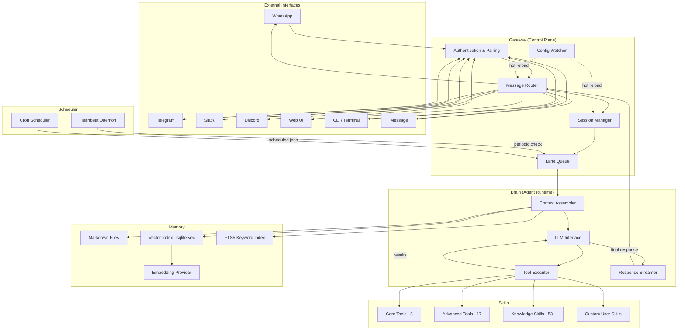
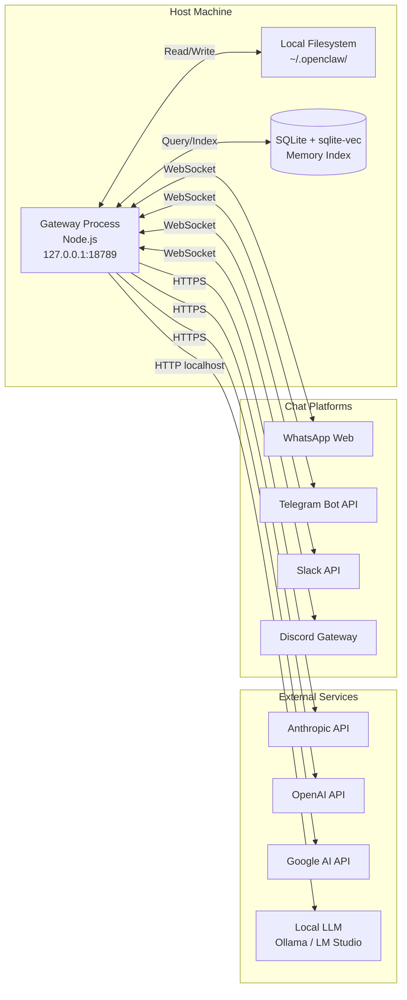
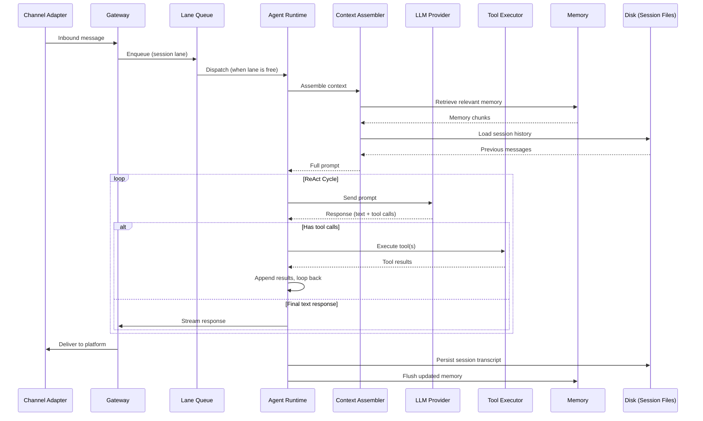
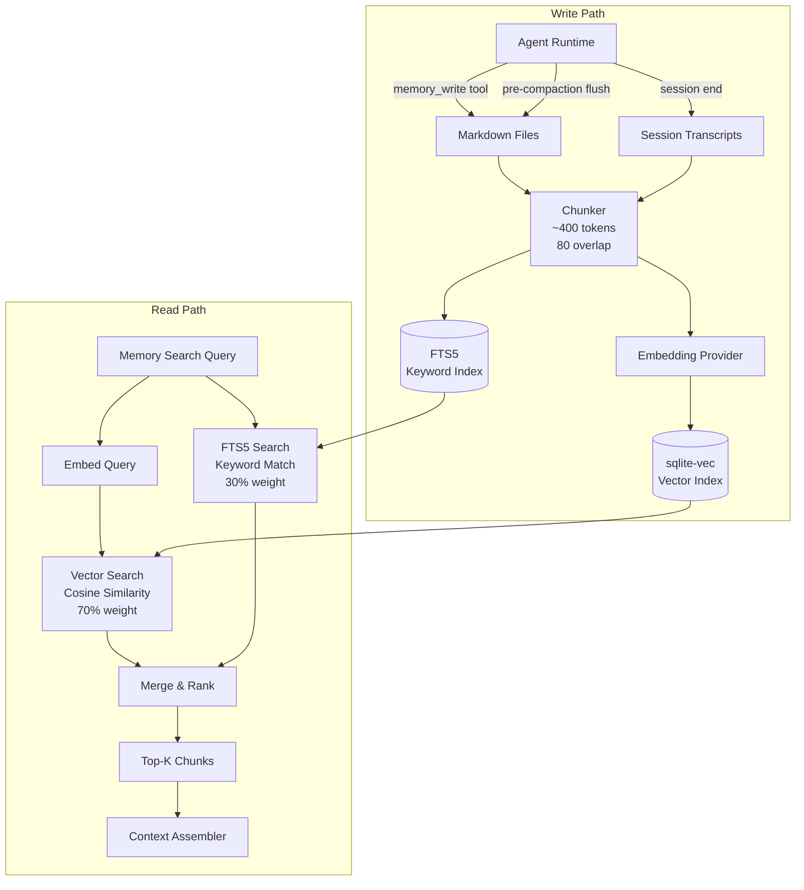
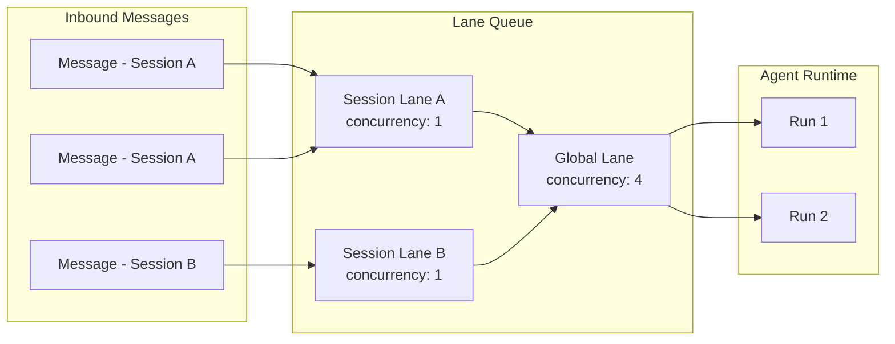
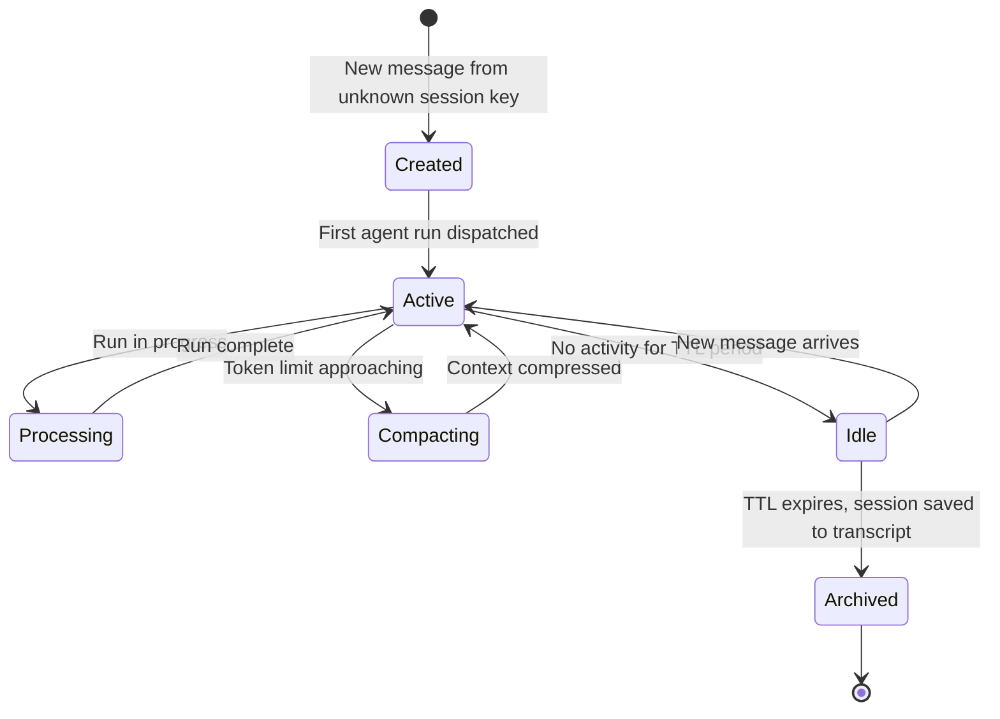
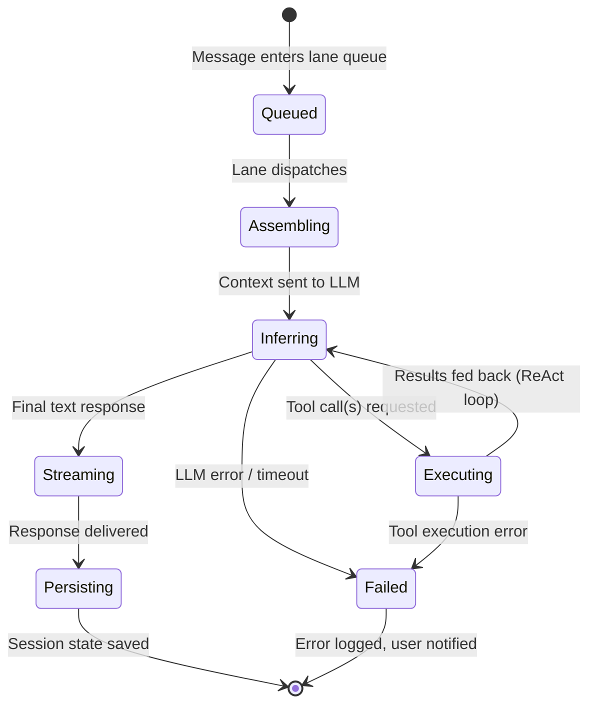

# OpenClaw Replication Blueprint — Architecture & Implementation Guide

**Version:** v1
**Date:** March 12, 2026
**Previous Version:** N/A — initial draft
**Status:** Draft
**Author(s):** Claude (Opus 4.6), commissioned by Taylor

---

## 1. Executive Summary

This document is a comprehensive engineering blueprint for replicating the architecture of OpenClaw, an open-source autonomous AI agent framework created by Peter Steinberger. OpenClaw turns stateless LLM API endpoints into persistent, proactive, multi-channel agents capable of taking real-world actions — reading files, executing shell commands, controlling browsers, sending messages, and scheduling autonomous tasks.

The system's power comes not from any single novel component but from the composition of five well-understood subsystems: a **Gateway** (message routing and session management), a **Brain/Agent Runtime** (the ReAct reasoning loop around the LLM), a **Memory** system (hybrid vector + full-text search over local Markdown files), a **Skills** layer (pluggable tool definitions), and a **Heartbeat/Cron** scheduler (proactive background execution). Each component solves a specific problem that emerges when you try to make an LLM genuinely useful: the Gateway decouples transport from intelligence, the Brain orchestrates multi-step reasoning, Memory provides continuity across sessions, Skills define what the agent can do, and the Heartbeat makes it proactive rather than reactive.

This blueprint documents how each component works internally, how they connect, the key architectural decisions and trade-offs, and a phased implementation strategy. It is written for a senior developer who wants to understand OpenClaw deeply enough to build a tailored version — not a copy, but a system informed by the same patterns and lessons, adapted to building software applications across multiple interfaces (web UI, CLI, chat apps).

The document draws from OpenClaw's official documentation, its open-source codebase (TypeScript monorepo), and third-party architectural analyses published through early March 2026.

---

## 2. Design Principles & Constraints

### Hard Constraints

**Local-first execution.** The agent runs on your machine, not in the cloud. All state — conversations, memory, skills, configuration — lives on local disk as human-readable files (Markdown, YAML, JSON). No external database is required. This means you can inspect, edit, version-control, and back up your agent's entire brain with standard tools.

**The Gateway never reasons.** This is the foundational architectural boundary. The Gateway handles transport, routing, authentication, and session management. It never touches the LLM. The Brain handles all reasoning. This separation means you can swap transport layers without touching AI logic, and vice versa.

**Session-level serialization by default.** Only one agent run executes per session at a time. This prevents race conditions on shared state (session files, logs, tool outputs) and eliminates an entire class of concurrency bugs. Parallelism is opt-in and scoped.

**Model-agnostic.** The system is a dispatcher, not a model. It routes to any LLM provider (Anthropic, OpenAI, Google, local via Ollama/LM Studio) through a unified interface. Switching models is a configuration change, not a code change.

### Soft Principles

**Plain-text over databases for agent state.** Markdown and YAML are preferred over SQLite or Postgres for storing conversations, memory, and skills. The exception is the vector search index, which uses SQLite with extensions because plain-text search isn't fast enough for semantic retrieval.

**Skills as prompt injection, not compiled code.** Skills are Markdown files with YAML frontmatter that get injected into the system prompt at inference time. The LLM discovers available skills and decides how to use them. This makes skills human-readable, easy to author, and versionable.

**Defense in depth for security.** No single layer is trusted to prevent misuse. Gateway authentication, tool policy allowlists, sandbox isolation, secrets management, and prompt injection defenses all operate independently.

**Hot-reloadable configuration.** The Gateway watches its config file and applies changes without restart. This is important for a long-running daemon that users configure iteratively.

---

## 3. System Overview

OpenClaw follows a hub-and-spoke architecture centered on a single Gateway process that mediates between external interfaces (chat platforms, CLI, web UI) and an internal Agent Runtime that orchestrates LLM reasoning and tool execution.

The five major subsystems are:

**Gateway** — A WebSocket server (Node.js, single process) that manages all inbound/outbound messaging across channels. It authenticates clients, routes messages to sessions, manages the lane queue for concurrency control, and persists session state to disk. It is the only network-facing component.

**Brain / Agent Runtime** — The reasoning engine. Assembles context from session history, memory, and skills, sends it to the configured LLM, parses tool call requests from the model's response, executes them, feeds results back, and repeats until the model produces a final text response. This is the ReAct (Reasoning + Acting) loop.

**Memory** — A hybrid retrieval system combining vector search (SQLite + sqlite-vec for cosine similarity over embeddings) and full-text search (SQLite FTS5 for keyword matching). Memory is stored as Markdown files, chunked into ~400-token segments with 80-token overlap, and indexed on write.

**Skills** — Pluggable capability definitions stored as SKILL.md files with YAML frontmatter. Skills are registered in the system prompt so the LLM knows what tools are available. The runtime intercepts tool call requests, executes the corresponding skill, and returns results to the conversation.

**Heartbeat & Cron** — Two complementary scheduling mechanisms. Heartbeat is a periodic background check (default every 30 minutes) that reads a checklist and decides whether action is needed, using the agent's full context. Cron is a precise time-based scheduler for isolated jobs that run outside the main session.



---

## 4. Hardware & Infrastructure Topology

OpenClaw is designed to run on a single machine. There is no distributed component in the default architecture.

### Minimum Requirements

A single host running macOS, Linux, or Windows (WSL2). The Gateway is a Node.js process bound to `127.0.0.1:18789` by default (loopback only — not exposed to the network). For production VPS deployment, a 2-vCPU machine with 4 GB RAM is recommended.

### Network Architecture

All channel adapters maintain outbound connections to their respective platforms (WhatsApp Web socket, Telegram Bot API, Discord Gateway, etc.). The Gateway itself only listens on localhost unless explicitly configured for remote access (which requires authentication and TLS).

Clients (CLI, web UI, macOS app, mobile nodes) connect to the Gateway over WebSocket and declare their role and scope at handshake time. After pairing, the Gateway issues a device token scoped to the connection.

### Deployment Modes

**Local daemon** — `openclaw service install` registers the Gateway as a systemd unit (Linux) or LaunchAgent (macOS). It starts on boot, survives reboots, and stays always-on. This is the primary mode for personal use.

**Docker** — A `docker-compose.yml` is provided with volume mounts for `~/.openclaw` (config) and the workspace directory. Docker is preferred for VPS deployments and security-conscious operators who want container-level sandboxing.

**VPS / Cloud** — Fly.io, Railway, Render, or any provider with persistent volumes. The Gateway binds to a non-loopback address and requires authentication for remote connections.



---

## 5. Component Architecture

### 5.1 Gateway

The Gateway is the process entry point and the only component that touches the network. It is implemented as a single Node.js process using WebSocket for all client and control communication.

**Responsibilities:**
- Manage persistent connections to all channel adapters (WhatsApp, Telegram, Slack, Discord, iMessage, etc.)
- Authenticate and pair client devices (CLI, web UI, mobile apps)
- Route inbound messages to the correct session based on channel, sender, and scope
- Manage the Lane Queue for concurrency control
- Persist session state to disk
- Watch configuration files and hot-reload on change
- Emit typed events: `agent`, `chat`, `presence`, `health`, `heartbeat`, `cron`

**Protocol:** WebSocket text frames with JSON payloads, protocol version 3. Three frame types: `request`, `response`, and `event`. All frames are validated against JSON Schema before dispatch.

**Channel Adapters:** Each messaging platform gets a dedicated adapter that normalizes inbound/outbound messaging into a common internal format. Adapters ship built-in for major platforms (Telegram, Discord, Slack, WhatsApp, iMessage, Signal, IRC, Microsoft Teams, Matrix, LINE, and more). Additional adapters can be loaded as channel plugins. The adapter's job is to translate platform-specific message formats, handle platform authentication (bot tokens, QR code pairing for WhatsApp), manage connection lifecycle, and map platform concepts (threads, reactions, attachments) to OpenClaw's internal message model.

**Session Manager:** Sessions track conversation state and route messages to the correct agent. Each session has a session key that encodes scope, agent ID, and delivery context. Session types include: main (the primary conversation), group (multi-user channels), and isolated (sandboxed sessions for untrusted input). The Gateway creates sessions on demand, persists them to `~/.openclaw/sessions/`, and garbage-collects stale sessions based on configurable TTL.

**Authentication:** After initial pairing (QR code or CLI token exchange), the Gateway issues a device token scoped to the connection's role and capabilities. Tokens are returned in the `hello-ok.auth.deviceToken` frame and persisted by clients for reconnection. For remote deployments, TLS and an auth token are required.

**Hot Reload:** The Gateway watches `~/.openclaw/openclaw.json` and applies changes automatically. Most configuration changes (model selection, channel settings, skill registrations) take effect without restart. Changes to the Gateway port or TLS configuration require a manual restart.

### 5.2 Brain / Agent Runtime

The Brain is the reasoning engine. It receives routed messages from the Gateway, assembles a context window, invokes the LLM, executes tool calls, and streams responses back. This is where all intelligence lives.

**The Agent Loop (step by step):**

1. **Intake** — A message arrives from the Gateway, tagged with its session key, channel, and sender metadata.

2. **Context Assembly** — The runtime builds the full prompt sent to the LLM. This is composed from four sources, concatenated in order:
   - **Base prompt** — OpenClaw's core instructions that define agent behavior, safety rules, and response formatting.
   - **Skills prompt** — A compact list of currently eligible skills (name, description, file path) so the model knows what tools are available.
   - **Bootstrap context files** — Workspace-level files that provide environment context: `AGENTS.md` (agent identity and role definitions), `SOUL.md` (personality, communication style, behavioral rules), `USER.md` (information about the user), `TOOLS.md` (tool documentation), and the daily log.
   - **Per-run overrides** — Any additional instructions injected for this specific run (e.g., from a cron job definition or a skill's execution context).

   After the system prompt, the runtime appends the **session history** (previous messages in this conversation) and the results of a **memory retrieval** query (semantically relevant chunks from the memory index).

3. **Model Inference** — The assembled prompt is sent to the configured LLM provider. The runtime handles model selection (from the `agents.defaults.models` config block), API key rotation and cooling (if multiple keys are configured), token counting, and rate limit backoff.

4. **Response Parsing** — The model's response is parsed for tool call requests. If the model returns a text-only response, the loop terminates and the response is streamed back. If the model requests one or more tool calls, execution continues.

5. **Tool Execution** — For each tool call, the runtime:
   - Fires a `before_tool_call` hook (allowing parameter interception/modification)
   - Executes the tool against the system (file I/O, shell command, browser action, API call, etc.)
   - Fires an `after_tool_call` hook (allowing result transformation)
   - Fires a `tool_result_persist` hook (synchronously transforms results before they're written to the session transcript)
   - Sanitizes results for size and image payloads
   - Emits `tool_start`, `tool_update`, and `tool_end` events on the tool stream

6. **Loop Back** — Tool results are appended to the conversation as new messages, and the runtime returns to step 3 (model inference). This is the **ReAct cycle**: Reason → Act → Observe → Repeat. The loop continues until the model produces a final text response with no tool calls.

7. **Streaming** — The final response is streamed back through the Gateway to the originating channel adapter, which translates it into the platform's native message format.

8. **Persistence** — The complete conversation (including all tool calls and results) is written to the session transcript on disk. Updated memory is flushed. Session state is saved.

**Context Window Management:**

Context windows are finite, and real conversations with tool outputs can exhaust them quickly. The runtime manages this through two mechanisms:

- **Auto-compaction** — When a session approaches its token limit, the runtime triggers a silent agentic turn that instructs the model to write any important information to durable memory (`MEMORY.md`) before the older context is summarized/compressed. This "memory flush before compaction" pattern prevents information loss during compression.

- **Semantic Snapshots** — For browser-based tasks, full page state is compressed into token-efficient representations rather than dumping raw HTML into the context. This dramatically reduces the token cost of web automation tasks.

**Model Configuration:**

The `agents.defaults.models` block in `openclaw.json` defines the model catalog. Models are referenced as `provider/model` (e.g., `anthropic/claude-sonnet-4-5`). Providers can be cloud (Anthropic, OpenAI, Google) or local (Ollama, LM Studio, or any OpenAI-compatible server). The Agent Runner handles provider-specific API differences, token counting variations, and streaming format normalization.



### 5.3 Memory System

The Memory system provides continuity across sessions by persisting and retrieving contextually relevant information. It is the component that makes the agent feel like it "remembers" you.

**Storage Layer:**

All memory is stored as plain Markdown files in the workspace directory:
- `MEMORY.md` — The agent's primary memory file, containing persistent notes, user preferences, project context, and anything the agent decides is worth remembering long-term.
- `memory/**/*.md` — Additional memory files organized by topic or project.
- Session transcripts — Saved conversations with timestamped filenames and LLM-generated descriptive slugs, stored in the sessions directory.

**Indexing Layer:**

Memory files are chunked into segments of approximately 400 tokens with 80-token overlap between adjacent chunks. Each chunk is embedded using a configurable embedding provider (OpenAI, Gemini, Voyage AI, or a local model) and stored in a SQLite database with the `sqlite-vec` extension for vector operations.

Simultaneously, the raw text of each chunk is indexed in a SQLite FTS5 (Full-Text Search 5) virtual table for keyword matching.

**Retrieval (Hybrid Search):**

When the context assembler needs relevant memory, it issues a `memory_search` query that runs both retrieval pathways in parallel:

- **Vector search (70% weight)** — Cosine similarity between the query embedding and stored chunk embeddings. This finds semantically related content even when the wording is different.
- **Keyword search (30% weight)** — FTS5 exact match. This catches specific names, identifiers, code references, and other "needle in a haystack" queries that vector search might miss.

Results are merged using reciprocal rank fusion (or a weighted score combination), deduplicated, and the top-k chunks are returned for inclusion in the context window.

**Memory Lifecycle:**

The agent writes to memory in two ways:
- **Explicit** — The agent calls a `memory_write` tool to store important information during a conversation.
- **Pre-compaction flush** — When auto-compaction triggers, the runtime first runs a silent turn that asks the model: "Write anything important from this conversation to MEMORY.md before context is compressed." This is a critical reliability mechanism — it prevents information loss during context window management.

Session transcripts are automatically saved when a session ends or a new one begins, with descriptive filenames generated by the LLM.

**Why hybrid search matters:** Vector search alone misses exact matches (a query about "CVE-2026-25253" won't reliably find the right chunk by semantic similarity). Keyword search alone misses conceptually related content (a query about "security vulnerabilities" won't find a chunk that discusses "prompt injection attacks" without the exact keywords). The 70/30 weighting reflects the empirical finding that semantic understanding matters more in most conversational queries, but keyword precision is essential for technical and factual retrieval.



### 5.4 Skills System

Skills define what the agent can do beyond generating text. They are the bridge between the LLM's reasoning and real-world actions.

**Skill Structure:**

Each skill is a `SKILL.md` file with YAML frontmatter and natural-language instructions in the body. The frontmatter defines metadata (name, description, version, triggers, required tools), and the body contains the detailed instructions the LLM follows when using the skill.

**Skill Layers (progressive trust model):**

OpenClaw organizes capabilities into three layers:

- **Layer 1 — Core Tools (8 tools):** File access (`read_file`, `write_file`, `list_files`), command execution (`run_command`), web access (`fetch_url`), and basic I/O. These are the foundational capabilities that most users enable. Almost every useful agent configuration starts here.

- **Layer 2 — Advanced Tools (17 tools):** Browser automation (`browser_navigate`, `browser_click`, `browser_type`, `browser_screenshot`), memory operations (`memory_write`, `memory_search`), multi-session management (`sessions_spawn`), and automation primitives. These enable more complex workflows but increase the agent's attack surface.

- **Layer 3 — Knowledge Skills (53+ built-in, 5,700+ community):** Higher-level capabilities that teach the agent how to work with specific services and workflows — Google Workspace, Obsidian, Slack, GitHub, Home Assistant, and thousands more. These are Markdown files that get injected into the system prompt, giving the LLM domain-specific knowledge and tool-use patterns.

**Skill Discovery and Registration:**

Skills are registered in the system prompt during context assembly. The context assembler scans the workspace's `skills/` directory and any installed community skills, reads their YAML frontmatter, and compiles a compact skills manifest (name, description, file path) that's included in the system prompt. The LLM sees this manifest and knows what capabilities are available.

When the LLM decides to use a skill, it references the skill's tools in its tool call. The Tool Executor intercepts the call, loads the skill's full instructions if needed, and executes the requested operation.

**Community Skills (ClawHub):**

ClawHub is OpenClaw's skill registry. The agent can search it automatically, and users can install skills via URL, npm package, or direct file copy. Skills are versioned and can declare dependencies on specific tools or other skills.

**Custom Skill Authoring:**

Because skills are Markdown files, authoring a new skill requires no code compilation. You write a SKILL.md file describing what the skill does, what tools it needs, and how to use them. This is one of the most powerful extension points for tailoring the agent to specific workflows — the patterns we discussed earlier about encoding architectural decisions and reducing ambiguity all happen at this layer.

### 5.5 Heartbeat & Cron Scheduler

These two mechanisms make the agent proactive — able to take initiative without waiting for user input.

**Heartbeat:**

The Heartbeat is a periodic background check that runs within the agent's main session context. The Gateway daemon fires it on a configurable interval (default every 30 minutes; every hour with Anthropic OAuth to manage costs).

On each heartbeat tick:
1. The Gateway dispatches a heartbeat event to the agent runtime.
2. The runtime loads the `HEARTBEAT.md` file from the workspace — a checklist of items to monitor (e.g., "check inbox for urgent messages", "review calendar for upcoming meetings", "check if build pipeline passed").
3. The agent runs a full inference cycle with the heartbeat checklist as the prompt, using the main session's full context (conversation history, memory, current projects).
4. If the agent determines action is needed, it messages the user through the appropriate channel. If nothing needs attention, it responds `HEARTBEAT_OK`, which the Gateway silently drops.

Heartbeat is designed for tasks that benefit from contextual awareness — it knows about your ongoing projects, recent conversations, and current priorities. It's "roughly every N minutes" rather than precisely timed.

**Cron:**

Cron is the Gateway's built-in precise scheduler. Jobs are defined with standard cron expressions and persisted under `~/.openclaw/cron/` so they survive restarts.

Key differences from Heartbeat:
- Cron jobs run in **isolated sessions**, not the main session. They don't have access to your ongoing conversation context.
- Cron fires at **precise times** (e.g., "every weekday at 9:00 AM"), not approximate intervals.
- Cron output can be optionally delivered back to a specific chat channel.
- Cron is for tasks you want to keep **out of your main conversation history** — periodic reports, data fetches, maintenance tasks.

Heartbeat thinks about whether something matters right now based on full context. Cron runs tasks blindly on schedule.

### 5.6 Lane Queue (Concurrency Control)

The Lane Queue is the concurrency management layer that sits between the Gateway and the Agent Runtime. It is critical infrastructure that prevents race conditions when multiple messages arrive simultaneously.

**How it works:**

Every agent run is enqueued into a **lane** — a named FIFO queue with a configurable concurrency cap. The default setup has:
- **Session lanes** (`session:<key>`) — Each session gets its own lane with concurrency 1. This guarantees only one active run per session, preventing competing writes to session files, logs, and tool state.
- **Global lane** (`main`) — All session runs also pass through a global lane with a configurable cap (`agents.defaults.maxConcurrent`, default 4). This limits overall parallelism across all sessions.

When a message arrives, it's enqueued by session key into the session lane. If the lane is already processing a run, the message waits. When the lane is free, the run is dispatched to the runtime. This serialization prevents tool/session races and keeps session history consistent.

**Configurable concurrency:**

For advanced use cases, lane concurrency caps can be tuned:
- `main` lane defaults to concurrency 4
- `subagent` lane defaults to concurrency 8
- Custom lanes can be defined for specific workflows

This allows parallelism for explicitly marked low-risk tasks while maintaining serial execution by default.



---

## 6. Data Flow & Pipeline

### Primary Message Flow (User → Agent → Response)

The end-to-end path of a user message through the system:

1. **Ingress** — User sends a message on a chat platform (e.g., Telegram). The platform delivers it to the channel adapter's persistent connection.

2. **Normalization** — The channel adapter strips platform-specific formatting, extracts text content, attachments, and metadata (sender, timestamp, thread context), and produces a normalized internal message object.

3. **Access Control** — The Gateway checks sender identity against configured access rules. Unauthorized messages are dropped or responded to with a rejection.

4. **Session Resolution** — The Gateway resolves which session should handle this message based on channel type, sender, and existing session state. If no session exists, one is created with the appropriate configuration (main, group, or isolated).

5. **Lane Enqueue** — The message is placed in the session's lane queue. If the session lane is busy (another run is in progress), the message waits.

6. **Context Assembly** — When the lane dispatches the run, the runtime assembles the full context: system prompt (base + skills + bootstrap files + overrides) + session history + memory retrieval results + the new message.

7. **LLM Inference** — The assembled prompt is sent to the configured model. Streaming begins.

8. **ReAct Loop** — If the model requests tool calls, they are executed, results are appended, and inference reruns. This may iterate multiple times.

9. **Response Streaming** — The final text response streams back through the Gateway to the channel adapter, which formats it for the platform (Markdown rendering, attachment handling, message splitting for length limits).

10. **Persistence** — The complete exchange (user message, all tool calls and results, final response) is appended to the session transcript on disk. Memory is updated if the agent wrote to it during the run.

### Heartbeat Flow

1. **Timer fires** — The Gateway daemon's internal timer triggers a heartbeat event.
2. **Load checklist** — The runtime reads `HEARTBEAT.md` from the workspace.
3. **Full agent run** — A normal agent loop executes in the main session, with the heartbeat checklist as the user message.
4. **Decision** — If the agent determines action is needed, it produces a message that gets routed to the user's primary channel. If nothing needs attention, it responds `HEARTBEAT_OK` and the Gateway drops it silently.

### Cron Flow

1. **Schedule fires** — The cron scheduler triggers a job at its configured time.
2. **Isolated session** — A new isolated session is created (or the job's existing session is reused) with the cron job's prompt as the input.
3. **Agent run** — A normal agent loop executes in the isolated session.
4. **Output delivery** — Results are optionally routed to a configured chat channel.

### Memory Write/Read Flow

**Write path:** Agent calls `memory_write` → content is appended to `MEMORY.md` or a topic-specific file → the file is re-chunked → new chunks are embedded and indexed in both sqlite-vec and FTS5.

**Read path:** Context assembler issues `memory_search` with the current query → vector search runs cosine similarity (70% weight) → FTS5 runs keyword match (30% weight) → results are merged, ranked, deduplicated → top-k chunks are included in the context window.

---

## 7. State Machine & Lifecycle Definitions

### Session Lifecycle



**Created** — Session key resolved, session state initialized on disk, no agent run yet.

**Active** — Session is live and accepting messages. May have runs queued in the lane.

**Processing** — An agent run is actively executing (context assembly, LLM inference, tool execution). The session lane blocks additional runs during this state.

**Compacting** — The session has approached its token limit. The runtime is performing auto-compaction: flushing memory, summarizing old context, and resetting the context window. The session returns to Active with a compressed history.

**Idle** — No messages have been received for a configurable period. The session is still loaded but not actively consuming resources.

**Archived** — The session transcript has been saved to disk with a timestamped, descriptive filename. The session object is garbage-collected from memory.

### Agent Run Lifecycle



### Tool Execution Lifecycle

For each tool call within a run:

1. `before_tool_call` hook fires (params can be intercepted/modified)
2. `tool_start` event emitted on tool stream
3. Tool executes (file I/O, shell command, browser action, API call)
4. `tool_update` events emitted during long-running tools
5. Tool completes or times out
6. `after_tool_call` hook fires (results can be transformed)
7. `tool_result_persist` hook fires (results transformed before transcript write)
8. Results sanitized for size and image payloads
9. `tool_end` event emitted
10. Results appended to conversation for next inference cycle

---

## 8. Configuration Management

### Primary Configuration File

`~/.openclaw/openclaw.json` — The central configuration file. The Gateway watches this file and hot-reloads changes without restart (except port and TLS changes).

**Key configuration blocks:**

- **`agents`** — Defines agent identities, model assignments, and workspace paths. Each agent has an `id`, `default` flag, and `workspace` path. The `agents.defaults.models` sub-block defines the model catalog (provider/model pairs) and acts as an allowlist for runtime model switching.

- **`channels`** — Configures channel adapters. Each channel type (telegram, discord, slack, whatsapp, etc.) has its own configuration block with platform-specific credentials (bot tokens, API keys) and behavioral settings.

- **`bindings`** — Maps agents to specific channels and accounts. This is how you route messages from a specific Telegram chat to a specific agent with a specific workspace.

- **`agents.defaults.maxConcurrent`** — Global concurrency cap for the main lane queue (default 4).

- **`heartbeat.interval`** — Heartbeat period in minutes (default 30).

- **`security`** — Sandbox configuration, tool allowlists/denylists, and access control rules.

### Workspace Files

Each agent has a workspace directory containing:

| File | Purpose |
|------|---------|
| `AGENTS.md` | Agent identity, role definitions, and multi-agent routing rules |
| `SOUL.md` | Personality, communication style, behavioral rules |
| `USER.md` | Information about the user (preferences, context) |
| `TOOLS.md` | Tool documentation and usage instructions |
| `MEMORY.md` | Primary persistent memory file |
| `HEARTBEAT.md` | Heartbeat checklist — items to monitor proactively |
| `memory/` | Additional memory files organized by topic |
| `skills/` | Custom skill definitions (SKILL.md files) |
| `sessions/` | Persisted session transcripts |

### Credential Storage

API keys and secrets are stored in `~/.openclaw/credentials/` or in environment variables. The configuration file references credentials by name, not value. Credentials are never written to session transcripts or memory files.

### Configuration Propagation

Changes to `openclaw.json` propagate through the system as follows:
1. The Gateway's file watcher detects the change.
2. The configuration is re-parsed and validated.
3. Affected subsystems are notified: channel adapters reconnect if credentials changed, the session manager updates routing rules, the model catalog is refreshed.
4. Active runs are not interrupted — changes take effect on the next run.

---

## 9. Safety & Guardrails

### Tool Approval

The agent can be configured to require explicit user approval before executing certain tools. This creates a human-in-the-loop checkpoint for high-risk operations (file deletion, shell commands, sending messages). Approval requests are routed to the user through the active channel and the run blocks until a response is received.

### Rate Limiting

API key rotation and cooling prevents hitting provider rate limits. When a key encounters a rate limit response, it enters a cooling period and the runtime rotates to the next available key. The `agents.defaults.models` block can list multiple keys per provider.

### Context Window Guards

Auto-compaction triggers before the context window is exhausted, with a configurable buffer. The pre-compaction memory flush ensures critical information survives compression.

### Sandbox Isolation

Non-main sessions (group chats, channels with untrusted input) can run in Docker sandboxes with restricted tool access. Sandboxed sessions get their own container with no filesystem access to the host workspace by default, and a strict tool allowlist limited to messaging and session-management operations.

### Tool Policy

A granular tool policy system allows enabling, disabling, or conditionally restricting specific tools per agent, per session type, and per channel. Tools can be globally disabled, enabled only for main sessions, or gated behind approval workflows.

---

## 10. Security Model

### Authentication Layers

1. **Device pairing** — Initial connection requires a pairing step (QR code, CLI token exchange). After pairing, the Gateway issues a scoped device token.
2. **Channel-level auth** — Each channel adapter authenticates with its platform using platform-specific credentials (bot tokens, OAuth, etc.).
3. **Access control lists** — Configurable per-channel rules that determine which senders can interact with which agents.

### Sandbox Architecture

OpenClaw's sandbox model uses defense in depth with five layers:

1. **Gateway authentication** — Only paired devices can connect.
2. **Tool policy** — Allowlists and denylists control which tools are available per session type.
3. **Sandbox isolation** — Untrusted sessions run in per-session Docker containers with no host filesystem access.
4. **Secrets management** — Credentials are stored separately and never exposed in conversations or memory.
5. **External content defense** — Prompt injection mitigation through model selection (instruction-hardened models for tool-enabled sessions) and input sanitization.

### Known Vulnerabilities and Mitigations

As of early 2026, OpenClaw has disclosed several security issues that are instructive for building your own system:

- **CVE-2026-25253 (CVSS 8.8)** — A one-click RCE vulnerability (now patched). Lesson: every user-facing input path must be treated as potentially adversarial.
- **TOCTOU race in sandbox path validation** — A sandboxed session could escape its workspace by exploiting a time-of-check-to-time-of-use race condition. Lesson: sandbox path validation must be atomic; check-then-use patterns are inherently vulnerable.
- **Third-party skill exfiltration** — Cisco's AI security team found community skills performing data exfiltration via prompt injection. Lesson: community skills are untrusted code. Review before installation, sandbox by default.
- **30,000+ publicly exposed instances** — Misconfigured Gateway instances with loopback binding disabled and no authentication. Lesson: secure defaults matter more than documentation.

### Recommendations for Your Implementation

Run the agent in isolation (dedicated VM or container). Use tool allowlists aggressively — deny by default, allow explicitly. Treat all community-contributed skills as untrusted. Use the strongest available model for tool-enabled sessions (stronger models are more resistant to prompt injection). Never bind the Gateway to a non-loopback address without TLS and authentication.

---

## 11. Dependencies & External Services

### Runtime Dependencies

| Dependency | Purpose | Access Method |
|-----------|---------|---------------|
| Node.js (v20+) | Runtime environment | Local install |
| SQLite | Session persistence, memory index | Bundled |
| sqlite-vec | Vector search extension for SQLite | Bundled native addon |
| pnpm | Package management (monorepo workspaces) | npm global install |

### External Services (API Keys Required)

| Service | Purpose | Required? |
|---------|---------|-----------|
| Anthropic API | Claude model inference | At least one LLM provider required |
| OpenAI API | GPT model inference + embeddings | Optional |
| Google AI API | Gemini model inference + embeddings | Optional |
| Voyage AI | Embeddings | Optional |
| Ollama / LM Studio | Local model inference + embeddings | Optional (free alternative) |

### Channel Platform Dependencies

Each enabled channel requires its own credentials:

| Platform | Credential Type |
|----------|----------------|
| Telegram | Bot token (via BotFather) |
| Discord | Bot token + application ID |
| Slack | Bot token + app manifest |
| WhatsApp | Linked device session (QR pairing) |
| iMessage | BlueBubbles server or legacy adapter |
| Signal | Signal CLI or linked device |

### Fallback Behavior

If an LLM provider is unavailable, the runtime can fall back to an alternative configured provider. If the sole configured provider is down, runs fail with an error message to the user. If the vector search extension (sqlite-vec) is unavailable, memory search degrades to FTS5-only (keyword search). If a channel adapter loses its connection, it attempts reconnection with exponential backoff.

---

## 12. Notification & Alerting

### User-Facing Notifications

All agent-initiated communication (heartbeat alerts, cron results, tool approval requests) is delivered through the user's configured primary channel. The channel is determined by the agent's bindings configuration.

Message types:
- **Heartbeat alerts** — Sent when the heartbeat run determines something needs the user's attention. Format varies based on the specific checklist item triggered.
- **Cron output** — Optional delivery of cron job results to a specified channel.
- **Tool approval requests** — Sent when a tool execution requires user confirmation. The run blocks until the user responds.
- **Error notifications** — Sent when a run fails due to provider errors, tool failures, or configuration issues.

### System-Level Events

The Gateway emits typed events over WebSocket that control clients (CLI, web UI, macOS app) can subscribe to:
- `agent` — Agent lifecycle events (run start, run end, run error)
- `chat` — Message events (inbound, outbound, tool calls)
- `presence` — Channel connection status
- `health` — System health checks
- `heartbeat` — Heartbeat cycle events
- `cron` — Cron job lifecycle events

---

## 13. Logging & Audit Trail

### Session Transcripts

Every agent run is fully logged in the session transcript on disk. Transcripts include: the user's message, the complete assembled context (system prompt, history, memory retrieval results), every LLM response, every tool call with parameters and results, and the final response. This provides a complete audit trail of what the agent did and why.

Transcripts are stored as Markdown files in `~/.openclaw/sessions/` with timestamped, descriptive filenames (the slug is generated by the LLM based on conversation content).

### Tool Execution Logs

Tool start/update/end events are emitted on the tool stream and logged. Tool results are sanitized for size and image payloads before logging to prevent transcript bloat.

### Gateway Logs

The Gateway logs connection events, routing decisions, authentication attempts, and configuration changes. Logs are written to stdout/stderr and can be captured by systemd journal or Docker logs.

---

## 14. Testing Strategy

### For Your Implementation

When building your own system based on this architecture, focus testing on these layers:

**Unit tests** — Test each component in isolation: context assembly logic, memory chunking and retrieval, tool execution, lane queue behavior, configuration parsing and validation.

**Integration tests** — Test the full agent loop end-to-end with a mock LLM provider. Verify that messages flow correctly from channel adapter through routing, context assembly, inference, tool execution, and response delivery.

**Tool execution tests** — Each tool (file I/O, shell execution, browser automation) needs its own test suite verifying correct behavior and error handling. Test sandbox boundaries — verify that sandboxed sessions cannot access host resources.

**Memory tests** — Verify that memory write/read cycles preserve information correctly. Test hybrid search ranking — ensure that vector search and FTS5 produce complementary results. Test auto-compaction — verify that the memory flush runs before context compression and that important information survives.

**Concurrency tests** — Verify that the lane queue correctly serializes runs per session. Test that multiple simultaneous messages to different sessions are handled in parallel up to the concurrency cap. Test that messages arriving during an active run are queued and processed in order.

**Security tests** — Test sandbox escapes, tool policy enforcement, credential isolation, and prompt injection resistance. OpenClaw's disclosed vulnerabilities provide a useful checklist of attack vectors to test against.

---

## 15. Deployment

### Development Setup

1. Clone the repository (TypeScript monorepo, pnpm workspaces).
2. `pnpm install` to install dependencies.
3. Create `~/.openclaw/openclaw.json` with model provider credentials and channel configuration.
4. `openclaw` to start the Gateway in foreground mode.
5. Pair a client (CLI: `openclaw pair`, web UI: QR code).

### Production Deployment (Daemon)

**Linux (systemd):**
```
sudo openclaw service install --systemd
sudo systemctl enable openclaw
sudo systemctl start openclaw
```

**macOS (LaunchAgent):**
```
openclaw service install --launchd
launchctl load ~/Library/LaunchAgents/com.openclaw.gateway.plist
```

**Docker:**
```
docker-compose up -d
```
Volume mounts: `~/.openclaw` (config + state) and workspace directory.

### Production Checklist

- [ ] Gateway bound to loopback only (or TLS + auth if remote)
- [ ] Device tokens configured for all authorized clients
- [ ] Tool policy reviewed — deny by default, allow explicitly
- [ ] Sandbox enabled for non-main sessions
- [ ] API keys stored in credentials directory, not in config file
- [ ] Heartbeat interval configured
- [ ] Cron jobs defined and tested
- [ ] Log rotation configured (systemd journal or Docker log driver)
- [ ] Backup strategy for `~/.openclaw/` directory

---

## 16. Repo & Code Structure

OpenClaw is a TypeScript monorepo managed with pnpm workspaces.

```
openclaw/
├── src/                          # Core agent code
│   ├── gateway/                  # Gateway server, WebSocket protocol
│   ├── runtime/                  # Agent Runtime, ReAct loop
│   ├── memory/                   # Memory system, chunking, indexing
│   ├── queue/                    # Lane Queue implementation
│   ├── config/                   # Configuration parsing, validation, hot-reload
│   ├── tools/                    # Built-in tool definitions and executors
│   ├── skills/                   # Skill loader, manifest compiler
│   ├── telegram/                 # Telegram channel adapter
│   ├── discord/                  # Discord channel adapter
│   ├── slack/                    # Slack channel adapter
│   ├── whatsapp/                 # WhatsApp channel adapter
│   ├── imessage/                 # iMessage channel adapter
│   ├── signal/                   # Signal channel adapter
│   ├── cli/                      # CLI client and progress utilities
│   ├── terminal/                 # Terminal output (tables, colors)
│   ├── auto-reply/               # Auto-reply system
│   └── plugins/                  # Plugin loader (scans workspace packages)
│       └── loader.ts
├── extensions/                   # Channel plugins (community adapters)
├── skills/                       # Built-in skills (SKILL.md files)
├── packages/                     # Shared packages
│   └── plugin-sdk/               # SDK for building plugins
│       ├── core/
│       ├── compat/
│       └── telegram/
├── docs/                         # Documentation
│   ├── concepts/                 # Architecture, agent loop, memory, queue
│   ├── gateway/                  # Protocol, security, configuration
│   ├── automation/               # Cron, heartbeat
│   └── install/                  # Setup guides
├── docker-compose.yml
├── docker-setup.sh
├── package.json                  # Root workspace config
└── pnpm-workspace.yaml
```

**Key architectural boundaries in the code:**

- `src/gateway/` owns all network I/O. No other module opens sockets or manages connections.
- `src/runtime/` owns the agent loop. It depends on `src/memory/`, `src/tools/`, and `src/skills/` but not on any channel adapter.
- Channel adapters (`src/telegram/`, `src/discord/`, etc.) depend on the Gateway's internal message API but not on each other or on the runtime.
- `src/plugins/loader.ts` scans workspace packages for an `openclaw.extensions` field in their `package.json`, enabling dynamic adapter loading.

---

## 17. Failure Modes & Recovery

| Component | Failure Mode | Detection | Impact | Recovery |
|-----------|-------------|-----------|--------|----------|
| LLM Provider | API error, rate limit, timeout | HTTP response code | Run fails, user sees error message | Automatic retry with backoff; fallback to alternate provider if configured |
| Channel Adapter | Connection lost (platform outage, network issue) | WebSocket close event | Messages from that platform stop arriving/sending | Automatic reconnection with exponential backoff |
| Memory Index | sqlite-vec unavailable or corrupted | Query returns error | Memory search degrades to FTS5-only | Rebuild index from Markdown source files |
| Session Files | Disk write failure | OS error on write | Session history not persisted, potential data loss | Alert user; retry write; degrade to in-memory-only mode |
| Lane Queue | Queue overflow (too many pending messages) | Queue size exceeds configurable threshold | New messages rejected or delayed | Back-pressure signal to channel adapters; increase concurrency cap |
| Heartbeat | Fails to fire (daemon crash, system sleep) | Missed heartbeat event | Proactive monitoring stops | Daemon auto-restart (systemd Restart=always); catch-up run on wake |
| Cron | Missed schedule (system was off) | Job didn't run at expected time | Scheduled task not executed | Configurable: run on next wake or skip |
| Tool Execution | Tool hangs or crashes | Configurable timeout | Run blocks until timeout | Kill tool process after timeout; return error to LLM; let it reason about the failure |

---

## 18. Rollback Procedures

### Configuration Rollback

Since `~/.openclaw/openclaw.json` is a single file, rollback is a file restore. Keep the previous version before making changes (the hot-reload watcher will pick up the restored file automatically). For systematic rollback, version-control the entire `~/.openclaw/` directory with Git.

### Skill Rollback

Skills are individual Markdown files. Restore the previous version of the skill file. The next agent run will use the restored skill definition.

### Memory Rollback

Memory files are Markdown. To roll back a memory corruption, restore from Git or backup. The memory index (SQLite) must be rebuilt after restoring source files — run a re-indexing operation that re-chunks and re-embeds all memory files.

### Session Rollback

Session transcripts are append-only. To "undo" a conversation, you can delete or truncate the session file. The agent will lose context from the deleted portion on the next run.

---

## 19. Risk Register

| Risk | Likelihood | Severity | Mitigation | Status |
|------|-----------|----------|------------|--------|
| Prompt injection via untrusted input | High | High | Sandbox isolation, tool policy allowlists, model selection (instruction-hardened models) | Partially mitigated — defense in depth, but no complete solution exists |
| API cost runaway (agent in infinite tool loop) | Medium | Medium | Max iterations per run, token budget per session, heartbeat interval limiting | Mitigated |
| Community skill exfiltrates data | Medium | High | Skill review before installation, sandbox by default for untrusted skills, tool policy restrictions | Open — requires user discipline |
| Context window exhaustion mid-task | Medium | Medium | Auto-compaction with pre-compaction memory flush, semantic snapshots for browser tasks | Mitigated |
| Sandbox escape via TOCTOU or path traversal | Low | Critical | Atomic path validation, no check-then-use patterns, minimal host filesystem exposure | Mitigated (learned from CVE-2026-25253) |
| Single point of failure (one Gateway process) | Medium | High | Daemon auto-restart, stateless Gateway design (all state on disk, can restart without data loss) | Accepted — complexity of multi-process Gateway not justified for most use cases |
| Model provider outage | Low | Medium | Multi-provider fallback configuration | Mitigated |
| Credential exposure in session transcripts | Low | High | Secrets stored separately, transcript sanitization, tool result filtering | Mitigated |

---

## 20. Scaling & Evolution Notes

### Current Limitations

**Single-process Gateway.** OpenClaw runs as one Node.js process. For personal use and small teams, this is fine. For a product serving many concurrent users, you'd need to either scale vertically (bigger machine) or redesign the Gateway as a distributed service with session affinity.

**Context window ceiling.** Despite auto-compaction and semantic snapshots, very long multi-step tasks still degrade as context grows. The Ralph Loop pattern (hard context resets between iterations) helps but trades continuity for correctness.

**Memory search quality.** The hybrid vector + FTS5 approach is pragmatic but not state-of-the-art. Graph-based memory, episodic memory with temporal weighting, and multi-hop retrieval are active research areas that could significantly improve recall quality.

### Evolution Paths

**Multi-agent orchestration.** OpenClaw supports spawning sub-agents in isolated sessions. Extending this to a full multi-agent pipeline (planning agent → implementation agent → review agent) is a natural evolution, especially for software development workflows.

**Streaming tool execution.** Current tools execute synchronously. Long-running tools (large file operations, complex browser automation) would benefit from streaming intermediate results to the LLM.

**Structured memory.** Moving beyond flat Markdown chunks to a knowledge graph (entities, relationships, temporal metadata) would enable more precise retrieval and reasoning about complex, interconnected information.

**Custom model fine-tuning.** For repetitive, domain-specific workflows, fine-tuning a smaller model on your agent's conversation history could reduce cost and latency while maintaining quality for common tasks.

---

## 21. Decision Log

#### Gateway as Dumb Router
- **Context:** Needed to support many chat platforms without coupling transport to reasoning.
- **Options Considered:** (a) Monolithic server with platform-specific reasoning paths, (b) Gateway/Runtime split with clean boundary.
- **Decision:** Gateway handles only transport; all reasoning lives in the Runtime.
- **Rationale:** Decoupling transport from intelligence means adding a new platform is just writing an adapter. The Runtime never needs to know which platform a message came from.

#### Markdown + YAML Over Databases for Agent State
- **Context:** Agent needs persistent memory, skills, and configuration.
- **Options Considered:** (a) PostgreSQL/SQLite for all state, (b) Plain-text files (Markdown/YAML), (c) Hybrid.
- **Decision:** Plain-text for all state except the vector search index (SQLite + sqlite-vec).
- **Rationale:** Plain-text is human-readable, git-backable, greppable, and debuggable with standard tools. The vector index needs SQLite because cosine similarity search on flat files is too slow.

#### Hybrid Vector + FTS5 Search
- **Context:** Memory retrieval needs to handle both semantic queries and exact-match queries.
- **Options Considered:** (a) Vector-only, (b) Keyword-only, (c) Hybrid with weighted fusion.
- **Decision:** Hybrid with 70% vector weight, 30% FTS5 weight.
- **Rationale:** Vector search alone misses exact matches (specific identifiers, CVE numbers). Keyword search alone misses conceptual relationships. The 70/30 split reflects empirical testing showing semantic retrieval is more important for conversational queries, but keyword precision is essential for technical recall.

#### Session-Level Serialization
- **Context:** Multiple messages can arrive concurrently; tools modify shared state.
- **Options Considered:** (a) Full parallelism with locking, (b) Serial execution per session, (c) Configurable concurrency per lane.
- **Decision:** Serial per session by default, with configurable global concurrency cap.
- **Rationale:** Serialization eliminates race conditions on session files, tool state, and logs. The simplicity benefit outweighs the throughput cost for the vast majority of use cases.

#### Skills as Prompt Injection (Not Compiled Plugins)
- **Context:** Need an extensibility mechanism for adding new capabilities.
- **Options Considered:** (a) Compiled plugins (JS/TS modules loaded at runtime), (b) API-based tool definitions, (c) Markdown files with YAML frontmatter injected into the system prompt.
- **Decision:** Markdown-based skills injected into the prompt.
- **Rationale:** Skills as Markdown are human-readable, easy to author, easy to share, and require no compilation. The LLM discovers skills from the prompt and decides how to use them. The trade-off is that skill behavior depends on the model's interpretation, which is less deterministic than compiled code — but this flexibility is a feature for most use cases.

---

## 22. Diagrams

All diagrams in this document use Mermaid syntax. They are collected inline in their relevant sections:

- **Section 3 (System Overview)** — Full system component diagram showing all five subsystems and their connections.
- **Section 4 (Infrastructure Topology)** — Host machine layout with external services and platform connections.
- **Section 5.2 (Brain)** — Sequence diagram of the complete agent loop from message intake to response delivery.
- **Section 5.3 (Memory)** — Write path and read path for the hybrid memory system.
- **Section 5.6 (Lane Queue)** — Concurrency control flow showing session lanes and global lane.
- **Section 7 (State Machines)** — Session lifecycle and agent run lifecycle state diagrams.

---

## 23. Glossary

| Term | Definition |
|------|-----------|
| **Gateway** | The WebSocket server that handles all network I/O, message routing, authentication, and session management. Never performs reasoning. |
| **Brain / Agent Runtime** | The component that orchestrates the ReAct loop: context assembly, LLM inference, tool execution, and response streaming. |
| **ReAct** | Reasoning + Acting. A pattern where the agent reasons about what to do, takes an action (tool call), observes the result, and repeats until the task is complete. |
| **Session** | A conversation context with its own history, state, and lane queue slot. Sessions can be main (primary), group (multi-user), or isolated (sandboxed). |
| **Lane Queue** | A concurrency control mechanism that serializes agent runs per session and caps global parallelism. |
| **Lane** | A named FIFO queue within the Lane Queue system. Each session gets a lane; there is also a global lane for overall concurrency control. |
| **Skill** | A Markdown file with YAML frontmatter that defines a capability. Injected into the system prompt so the LLM knows what tools are available. |
| **Tool** | A specific executable action (read file, run command, browser click). Tools are the atomic units that skills compose. |
| **Heartbeat** | A periodic background check that runs in the main session context, reading a checklist and deciding whether action is needed. |
| **Cron** | A precise time-based scheduler for isolated jobs that run outside the main session. |
| **Auto-compaction** | Automatic context window compression when token limits approach. Includes a pre-compaction memory flush to prevent information loss. |
| **Semantic Snapshot** | A token-efficient representation of browser page state, used instead of raw HTML to reduce context window pressure during web automation. |
| **Channel Adapter** | A module that normalizes platform-specific messaging (Telegram, Discord, Slack, etc.) into OpenClaw's internal message format. |
| **ClawHub** | OpenClaw's community skill registry. |
| **Bootstrap Context** | Workspace-level Markdown files (AGENTS.md, SOUL.md, USER.md, TOOLS.md) that are loaded into every agent run's system prompt. |
| **Device Token** | A scoped authentication token issued by the Gateway after initial client pairing. |
| **sqlite-vec** | A SQLite extension that enables vector operations (cosine similarity) for embedding-based search. |
| **FTS5** | SQLite's Full-Text Search 5 module, used for keyword-based memory retrieval. |
| **Ralph Loop** | An autonomous execution pattern using hard context resets between iterations to prevent context degradation in long multi-step tasks. |
| **TOCTOU** | Time-of-check-to-time-of-use. A race condition where the state checked for validity changes before it's actually used. |

---

## 24. Open Questions & TODOs

- **Multi-agent orchestration patterns.** How should sub-agents communicate? Shared memory? Message passing? What's the right level of isolation between agents in a pipeline?

- **Memory retention policy.** How aggressively should old memory be pruned? Should there be a decay function based on access frequency or age? What's the right balance between comprehensive recall and noise reduction?

- **Skill trust model.** Community skills are inherently untrusted. Is there a viable automated review mechanism, or does it require human review? Should skills be sandboxed by default even at the cost of reduced capability?

- **Cost management for heavy usage.** API costs of $30-50/day for heavy use are significant. What's the right model routing strategy (cheaper models for simple tasks, expensive models for complex reasoning)? When should local models be used?

- **Offline operation.** Can the agent function usefully with local models only, no internet? What capabilities degrade and which survive?

- **Your specific use case.** This blueprint covers the general architecture. Tailoring it to building software applications will require decisions about: which LLM providers to prioritize for code generation, how to structure skills for your specific development workflows, whether to integrate with your existing CI/CD pipeline, and how to handle long-running build/test processes within the agent loop.

---

## Appendix: Phased Implementation Strategy

If you're building this from scratch, here's a recommended order of implementation. Each phase produces a usable system; later phases add sophistication.

### Phase 1: Core Loop (Week 1-2)

Build the minimum viable agent: a CLI that takes user input, assembles a basic system prompt, calls an LLM, and prints the response. No tools, no memory, no channels.

**Deliverables:**
- LLM interface abstraction (supports at least one provider)
- Basic system prompt assembly (hardcoded base prompt + user message)
- CLI input/output loop
- Configuration file parsing (model provider, API key)

**Why start here:** This gives you the fastest feedback loop. You can iterate on prompt engineering, model selection, and response quality before adding complexity.

### Phase 2: Tool Execution (Week 2-3)

Add the ReAct loop. The agent can now call tools and reason about results.

**Deliverables:**
- Tool definition format (name, description, parameters, executor function)
- Tool call parsing from LLM responses
- Tool execution engine with timeout and error handling
- ReAct loop: inference → tool call → result → re-inference → ... → final response
- Core tools: `read_file`, `write_file`, `list_files`, `run_command`

**Why this order:** Tools are what make the agent useful. Without tools, it's just a chatbot. The ReAct loop is the single most important architectural pattern in the system.

### Phase 3: Session Management & Persistence (Week 3-4)

Add conversation continuity. The agent remembers what happened earlier in the session.

**Deliverables:**
- Session model (create, load, save, archive)
- Session history included in context assembly
- Session transcript persistence to disk (Markdown files)
- Context window tracking (token counting per provider)
- Auto-compaction (summarize old context when approaching token limit)

### Phase 4: Memory System (Week 4-6)

Add long-term memory across sessions.

**Deliverables:**
- Memory file format (Markdown with topic organization)
- Chunking pipeline (~400 tokens, 80-token overlap)
- Embedding integration (at least one provider)
- SQLite + sqlite-vec for vector index
- SQLite FTS5 for keyword index
- Hybrid search with weighted fusion (70/30 default)
- `memory_write` and `memory_search` tools
- Pre-compaction memory flush

### Phase 5: Skills System (Week 6-7)

Add extensible capabilities.

**Deliverables:**
- SKILL.md format (YAML frontmatter + Markdown body)
- Skill loader (scan workspace, compile manifest)
- Skill manifest injection into system prompt
- Bootstrap context files (AGENTS.md, SOUL.md, USER.md, TOOLS.md)
- Custom skill authoring workflow

### Phase 6: Gateway & Multi-Channel (Week 7-10)

Decouple the interface from the runtime. Add support for multiple input channels.

**Deliverables:**
- Gateway WebSocket server
- Channel adapter interface (normalize inbound/outbound messages)
- At least two adapters (web UI + one chat platform)
- Message routing (channel → session)
- Lane Queue for concurrency control
- Device authentication and pairing

### Phase 7: Scheduling (Week 10-11)

Make the agent proactive.

**Deliverables:**
- Heartbeat daemon (periodic checklist execution)
- HEARTBEAT.md format and loading
- Cron scheduler (persistent jobs with cron expressions)
- Cron job isolation (separate sessions)

### Phase 8: Security Hardening (Week 11-12)

Lock it down for production use.

**Deliverables:**
- Tool policy system (allowlists/denylists per session type)
- Sandbox mode for untrusted sessions (Docker isolation)
- Credential isolation (separate storage, never in transcripts)
- Input sanitization and prompt injection defenses
- TLS for remote Gateway connections

### Phase 9: Advanced Features (Ongoing)

**Browser automation** — Browser control tools with semantic snapshots for context-efficient page representation.

**Multi-agent** — Sub-agent spawning in isolated sessions for parallel task execution.

**Skill marketplace** — Registry for discovering and installing community skills.

**Dashboard / Web UI** — Real-time visibility into agent state, session history, memory, and scheduled tasks.
