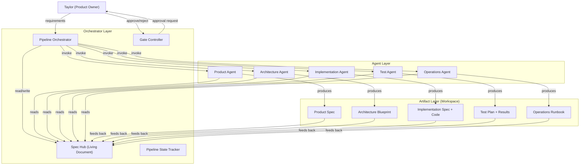
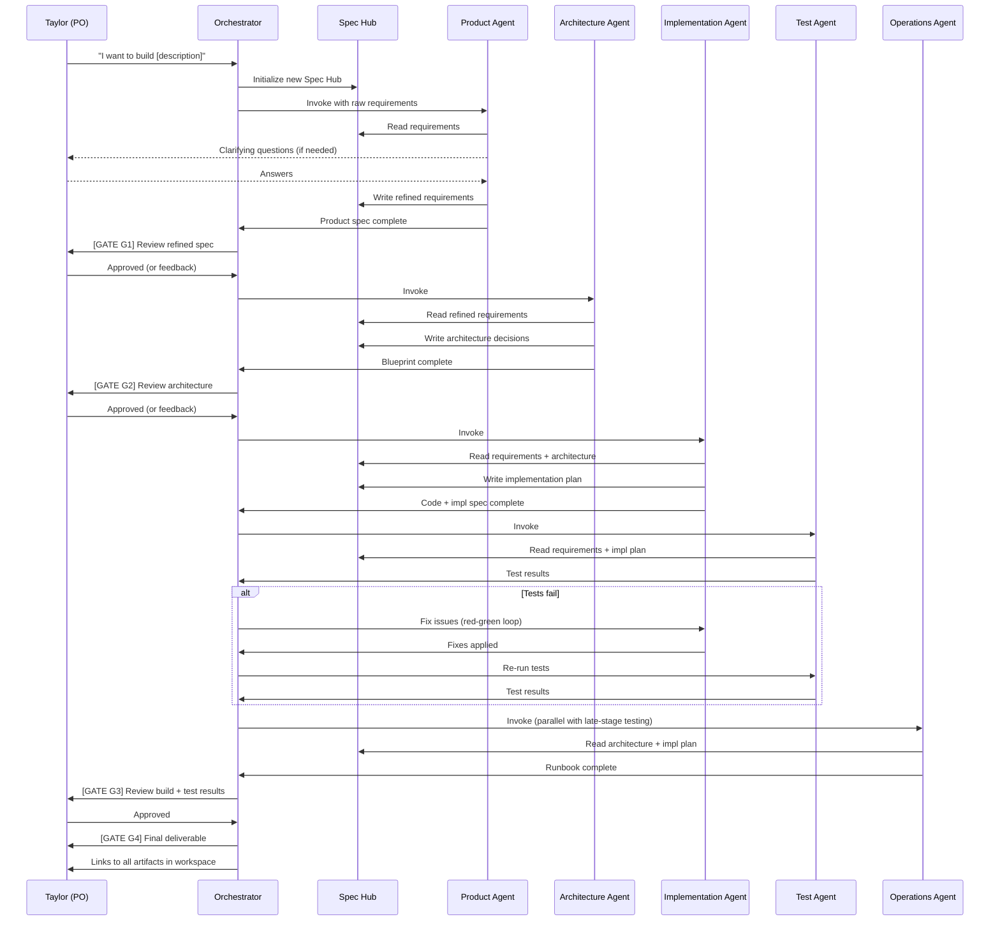
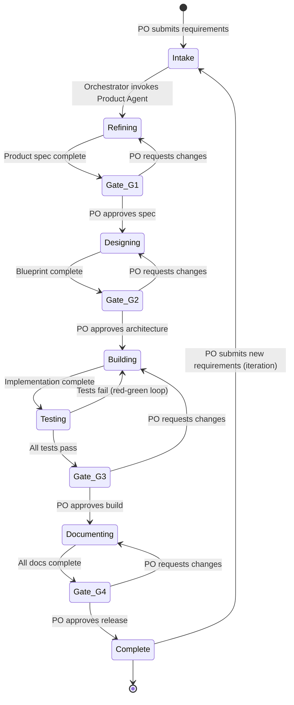
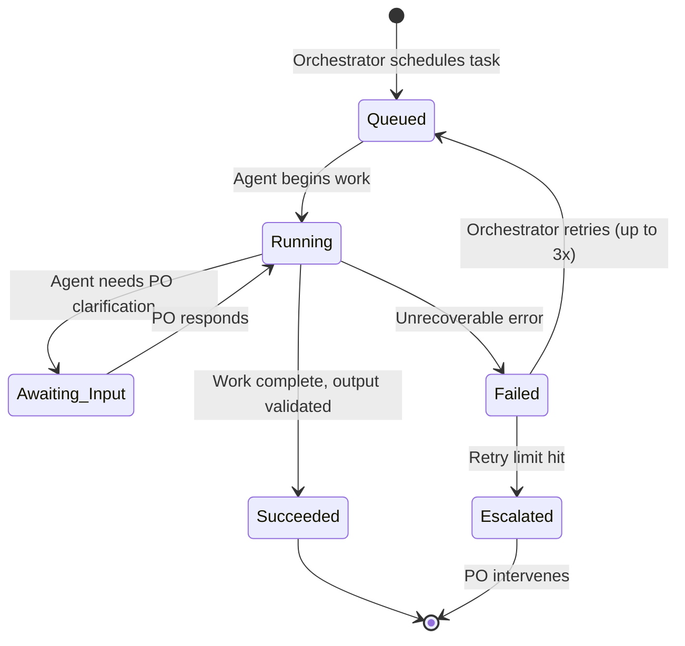

# Autonomous SDLC Pipeline — Architecture Blueprint

**Version:** v1
**Date:** 2026-03-11
**Previous Version:** N/A — initial draft
**Status:** Draft
**Author(s):** Claude (Architect Agent), Taylor (Product Owner)

---

## 1. Executive Summary

This blueprint defines an autonomous software development lifecycle (SDLC) pipeline in which the human operator — Taylor — acts exclusively as the Product Owner (PO). The PO provides product requirements in natural language and approves deliverables at defined gates. Everything between those gates — refinement, architecture, implementation, testing, documentation, and deployment — is handled by a coordinated set of AI agents, each backed by a specialized skill.

The pipeline follows a **spec-driven, hub-and-spoke architecture** rather than a traditional linear phase chain. A living specification document (the "Spec Hub") sits at the center of the system. Every agent reads from and writes back to the spec, ensuring a single source of truth that prevents context degradation across phases. Agents can operate in parallel where their work is independent, and the spec mediates coordination where it isn't.

The system is built on top of the existing SDLC skill chain already in Taylor's workspace: `product-spec` → `architecture-blueprint` → `implementation-spec` → `test-plan` → `operations-runbook`. This blueprint does not replace those skills — it defines the orchestration layer that invokes them, manages the spec, handles inter-agent coordination, and enforces approval gates.

The core value proposition is this: Taylor describes what he wants built, approves a structured spec, and receives a working project — with all intermediate SDLC artifacts (architecture docs, implementation plans, test results, runbooks) produced as byproducts of the build process rather than manual efforts.

---

## 2. Design Principles & Constraints

### Hard Constraints

- **PO-only human involvement.** Taylor's role is limited to: providing requirements, approving specs, and reviewing final output. He should never be asked to make implementation decisions, write code, configure infrastructure, or resolve inter-agent conflicts.
- **Spec is the single source of truth.** Every agent reads from and writes back to a central spec. No agent-to-agent communication bypasses the spec. If it's not in the spec, it doesn't exist.
- **Existing skills are the execution layer.** The five SDLC skills (product-spec, architecture-blueprint, implementation-spec, test-plan, operations-runbook) are the workers. This pipeline orchestrates them — it does not duplicate their logic.
- **Approval gates are blocking.** When a gate requires PO approval, the pipeline halts completely. No speculative execution past an unapproved gate.
- **No silent information loss.** Every artifact produced is versioned. Every decision is logged. Every spec change includes a changelog entry. A future reader (or agent) can trace any decision back to its origin.

### Soft Principles

- **Parallel where possible, sequential where necessary.** Agents should fan out whenever their work doesn't depend on each other's output. The pipeline should never be artificially serialized.
- **Fail fast, escalate clearly.** When an agent encounters ambiguity or failure, it should surface the issue to the orchestrator immediately rather than guessing. The orchestrator decides whether to retry, route to another agent, or escalate to the PO.
- **Incremental over monolithic.** The pipeline should support iterative development — adding features to an existing codebase — not just greenfield builds. The spec must be diffable so agents can identify what changed and plan incremental work.
- **Executable specs over descriptive docs.** Where possible, spec sections should contain machine-parseable acceptance criteria, interface contracts, and validation rules that agents can check automatically — not just prose for humans.

---

## 3. System Overview

The pipeline consists of four layers:

1. **PO Interface Layer** — Where Taylor interacts with the system. He submits requirements and receives deliverables. This is the Cowork chat interface plus the workspace folder.

2. **Orchestrator Layer** — The "brain" of the pipeline. It receives PO input, manages the spec, decides which agents to invoke, enforces gates, handles retries and escalation, and maintains pipeline state.

3. **Agent Layer** — Five specialized agents, each wrapping one of the existing SDLC skills. Each agent reads from the spec, performs its work, and writes results back to the spec and/or workspace.

4. **Artifact Layer** — The workspace folder containing all produced documents, code, tests, and configuration. Everything is versioned and traceable.



---

## 4. Hardware & Infrastructure Topology

This pipeline runs entirely within Taylor's local environment via Cowork's Linux VM sandbox. There are no external servers, cloud services, or network dependencies beyond what the final built project may require.

| Environment | Role | Details |
|---|---|---|
| Cowork VM | Execution sandbox | Ubuntu 22 Linux VM on Taylor's machine. All agents execute here. Ephemeral between sessions except for the workspace mount. |
| Workspace Mount | Persistent storage | `/sessions/.../mnt/TradingMind/` — Taylor's selected folder. All artifacts persist here. This is the source of truth for all produced files. |
| Skills Directory | Skill definitions | `/sessions/.../mnt/.skills/skills/` — Contains the SDLC skill definitions that agents invoke. |

No network topology diagram is needed — all communication is local, between the orchestrator and agents running in the same VM process.

---

## 5. Component Architecture

### 5.1 Pipeline Orchestrator

The orchestrator is the central coordinator. It is implemented as a **skill** (the `sdlc-orchestrator` skill) that the PO invokes to start or continue a pipeline run.

**Responsibilities:**
- Parse PO input and determine pipeline action (new project, iterate on existing, resume paused pipeline)
- Initialize or load the Spec Hub document
- Determine which agents to invoke and in what order/parallelism
- Enforce approval gates by presenting deliverables to the PO and awaiting approval
- Handle agent failures: retry, reroute, or escalate
- Maintain pipeline state so runs can be resumed across sessions
- Log all decisions and state transitions

**Key behaviors:**
- On receiving new requirements, the orchestrator first checks for an existing spec. If one exists, it diffs the new requirements against the existing spec to determine incremental work. If none exists, it starts a greenfield pipeline.
- The orchestrator never performs SDLC work itself. It delegates exclusively to the five agents.
- When multiple agents can work in parallel (e.g., test-plan and operations-runbook can start once implementation-spec is done), the orchestrator launches them concurrently.

### 5.2 Spec Hub

The Spec Hub is a structured Markdown document that serves as the living specification for the project being built. It is not a separate system — it is a file in the workspace that all agents read from and the orchestrator manages.

**Structure:**

```markdown
# [Project Name] — Spec Hub

## Meta
- Pipeline Run ID: [unique identifier]
- Status: [requirements | spec-approved | designing | implementing | testing | deploying | complete]
- Current Gate: [which gate the pipeline is waiting at, if any]
- PO Approvals: [list of gates approved with timestamps]

## Requirements (PO Input)
[Raw requirements as provided by Taylor — preserved verbatim]

## Refined Requirements
[Structured output from the Product Agent — FR-001 format with acceptance criteria]

## Architecture Decisions
[Key decisions from the Architecture Agent — tech stack, patterns, component boundaries]

## Implementation Plan
[Build phases, module interfaces, and task breakdown from the Implementation Agent]

## Test Coverage Map
[Requirement-to-test traceability from the Test Agent]

## Operational Profile
[Deployment, monitoring, and recovery summary from the Operations Agent]

## Change Log
[Every modification to this spec, with timestamp, agent, and reason]
```

The spec is append-and-update — agents add their sections and update existing ones, but never delete content without a changelog entry. The orchestrator is the only component that modifies the Meta section.

### 5.3 Product Agent

**Wraps:** `product-spec` skill (Phase 1)
**Input:** Raw PO requirements from the Spec Hub
**Output:** Product specification document + refined requirements written back to Spec Hub

**Behavior:** Takes Taylor's natural-language requirements and produces a structured product spec following the FR-001 format with acceptance criteria and MoSCoW prioritization. Asks clarifying questions through the orchestrator (which routes them to the PO) when requirements are ambiguous. Does not make design decisions — only captures *what* needs to be built and *why*, never *how*.

### 5.4 Architecture Agent

**Wraps:** `architecture-blueprint` skill (Phase 2)
**Input:** Refined requirements from the Spec Hub
**Output:** Architecture blueprint document + architecture decisions written back to Spec Hub

**Behavior:** Takes the approved product spec and produces a full architecture blueprint with component diagrams, data flows, tech stack decisions, and infrastructure topology. Makes opinionated design decisions and documents the rationale in the Decision Log. Produces Mermaid diagrams for all visual elements. Updates the Spec Hub's Architecture Decisions section with key choices that downstream agents need.

### 5.5 Implementation Agent

**Wraps:** `implementation-spec` skill (Phase 3)
**Input:** Architecture decisions and refined requirements from the Spec Hub
**Output:** Implementation specification document + actual code files + implementation plan written back to Spec Hub

**Behavior:** Translates the architecture into a buildable plan with ordered build phases, module interfaces, code patterns, and dependencies. Then executes the plan — writing actual code files to the workspace. Each build phase has explicit prerequisites, outputs, and "done when" criteria. Updates the Spec Hub's Implementation Plan section so the Test Agent knows what's been built and how.

This is the most complex agent because it both plans and executes. For large projects, it may spawn sub-agents (backend, frontend, data, integration) that work in parallel on independent modules, coordinating through the implementation spec's interface contracts.

### 5.6 Test Agent

**Wraps:** `test-plan` skill (Phase 4)
**Input:** Refined requirements, implementation plan, and code from the Spec Hub and workspace
**Output:** Test plan document + test code + test results + coverage map written back to Spec Hub

**Behavior:** Produces a test plan that traces every requirement (FR-001, FR-002, etc.) to specific test cases. Writes and executes tests (unit, integration, end-to-end as appropriate). Reports results — pass/fail, coverage metrics, identified issues. If tests fail, the agent produces a structured failure report that the orchestrator routes to the Implementation Agent for fixes. This create a **red-green loop** that runs autonomously until all tests pass or a retry threshold is hit (at which point the PO is escalated).

### 5.7 Operations Agent

**Wraps:** `operations-runbook` skill (Phase 5)
**Input:** Architecture decisions, implementation plan, and code from the Spec Hub and workspace
**Output:** Operations runbook document + deployment configuration + operational profile written back to Spec Hub

**Behavior:** Produces a runbook with step-by-step procedures for deployment, monitoring, alerting, failure recovery, and rollback. Generates deployment configuration files (Dockerfiles, CI/CD configs, scripts) as appropriate for the project. Focuses on copy-pasteable commands and assumes the operator may be stressed — clarity and reliability over elegance.

### 5.8 Gate Controller

A sub-component of the orchestrator that manages approval gates.

**Gates in the pipeline:**

| Gate | Trigger | What PO Reviews | Blocking? |
|---|---|---|---|
| G1: Spec Approval | Product Agent completes | Refined requirements, acceptance criteria, scope | Yes |
| G2: Architecture Approval | Architecture Agent completes | Blueprint, tech stack, key design decisions | Yes |
| G3: Build Review | All tests passing | Working code, test results, identified issues | Yes |
| G4: Release Approval | Operations Agent completes | Full deliverable: code + docs + runbook | Yes |

When a gate is reached, the Gate Controller:
1. Presents the relevant deliverables to the PO via the chat interface
2. Summarizes what was produced and any decisions that were made
3. Asks for explicit approval or feedback
4. If approved: updates Spec Hub meta, advances pipeline state, invokes next agents
5. If rejected with feedback: routes feedback to the relevant agent, re-invokes, returns to gate

---

## 6. Data Flow & Pipeline

### 6.1 Greenfield Pipeline Flow



### 6.2 Iteration Pipeline Flow

When Taylor wants to add features or modify an existing project, the pipeline operates incrementally:

1. Orchestrator loads the existing Spec Hub
2. PO provides new/changed requirements
3. Product Agent diffs new requirements against existing spec, produces a **delta spec** — only what's new or changed
4. Architecture Agent evaluates whether the delta requires architectural changes (often it won't)
5. Implementation Agent plans and builds only the incremental changes
6. Test Agent runs full regression plus new tests for the delta
7. Operations Agent updates the runbook if deployment or operational procedures changed

This is significantly faster than a greenfield run because most phases can be skipped or abbreviated when the delta is small.

---

## 7. State Machine & Lifecycle Definitions

### 7.1 Pipeline States



### 7.2 Agent Task States

Each agent task goes through:



---

## 8. Configuration Management

### 8.1 Pipeline Configuration

The pipeline is configured through a `pipeline-config.md` file in the workspace root. This file is human-readable (Markdown) so Taylor can review and modify it.

```markdown
# Pipeline Configuration

## Retry Policy
- Max retries per agent: 3
- Retry delay: None (immediate)
- Escalation: Route to PO after max retries exceeded

## Gate Policy
- All gates require explicit PO approval
- No auto-approval, no timeouts

## Agent Parallelism
- Test Agent + Operations Agent may run in parallel after implementation
- All other agents run sequentially (each depends on prior output)

## Output Locations
- Spec Hub: ./spec-hub.md
- Product Spec: ./docs/product-spec.md
- Architecture Blueprint: ./docs/architecture-blueprint.md
- Implementation Spec: ./docs/implementation-spec.md
- Test Plan: ./docs/test-plan.md
- Operations Runbook: ./docs/operations-runbook.md
- Source Code: ./src/
- Tests: ./tests/
```

### 8.2 Skill Configuration

Each agent invokes its corresponding skill as-is. The skills are configured through their own SKILL.md files in the skills directory. No additional configuration layer is needed — the skills are already designed to be self-contained.

---

## 9. Safety & Guardrails

### 9.1 Gate Enforcement

The most important guardrail is the gate system. No code is written until the PO approves the spec and architecture. No code is delivered until tests pass and the PO reviews the build. This prevents runaway execution where an agent builds the wrong thing at scale.

### 9.2 Red-Green Loop Circuit Breaker

The Test Agent → Implementation Agent feedback loop could theoretically cycle forever if a bug is unfixable by the agent. The circuit breaker limits this to 3 cycles before escalating to the PO with a structured report of what's failing and why the agent couldn't fix it.

### 9.3 Spec Drift Detection

Every agent reads from the Spec Hub before starting work. If an agent's output contradicts the spec (e.g., the Implementation Agent builds a feature not in the spec, or uses a tech stack different from the architecture), the orchestrator catches this during validation and flags it before proceeding to the next gate.

### 9.4 No Destructive Operations Without PO Approval

Agents cannot delete files, overwrite existing deliverables from previous pipeline runs, or modify the Spec Hub's Meta section. Only the orchestrator modifies pipeline state, and only after gate approval.

### 9.5 Scope Creep Prevention

The Product Agent defines the scope boundary (what's in and what's out). If a downstream agent identifies something that needs to be built but isn't in the spec, it flags it as an open question rather than building it. The orchestrator routes the question to the PO, who decides whether to expand scope or defer.

---

## 10. Security Model

Since this pipeline runs entirely within the Cowork VM sandbox and produces files to Taylor's local workspace, the security surface is minimal.

- **No credentials stored in specs or code.** If the project requires API keys or secrets, the spec references them by name (e.g., `BROKER_API_KEY`) and the operations runbook documents where they should be stored. Agents never write actual secret values.
- **No network access during build.** Agents work offline against the workspace. If a project requires external dependencies (npm packages, pip packages), the implementation agent documents them and the operations runbook covers installation.
- **Workspace is the trust boundary.** All files are written to Taylor's selected folder. No files are written outside it. No files are read from outside it (except the skill definitions in the skills directory).

---

## 11. Dependencies & External Services

### Runtime Dependencies

| Dependency | Purpose | Required? |
|---|---|---|
| Cowork / Claude | Execution environment for all agents | Yes |
| Workspace folder | Persistent storage for artifacts | Yes |
| SDLC Skills (5x) | Agent logic for each SDLC phase | Yes |

### Skill Dependencies

| Skill | Location | Phase |
|---|---|---|
| product-spec | `sdlc-skills/product-spec/` | Phase 1 |
| architecture-blueprint | `sdlc-skills/architecture-blueprint/` | Phase 2 |
| implementation-spec | `sdlc-skills/implementation-spec/` | Phase 3 |
| test-plan | `sdlc-skills/test-plan/` | Phase 4 |
| operations-runbook | `sdlc-skills/operations-runbook/` | Phase 5 |

### No External Services

The pipeline itself has no external service dependencies. The *projects it builds* may have external dependencies, but those are defined in the project's own spec, not the pipeline's.

---

## 12. Notification & Alerting

All communication happens through the Cowork chat interface. The orchestrator uses structured messages for different event types:

- **Gate reached:** Presents deliverables with a summary and asks for approval. Includes links to all relevant files in the workspace.
- **Clarification needed:** Routes the agent's question to the PO with context on what the agent was trying to do and why it needs input.
- **Agent failure:** Reports what failed, what was attempted, and what the options are (retry, skip, modify requirements).
- **Pipeline complete:** Summary of all artifacts produced, with links, plus a high-level status (e.g., "12 requirements implemented, 47 tests passing, 0 known issues").

No external notification channels (Discord, email, etc.) are used. The pipeline runs interactively in the Cowork session.

---

## 13. Logging & Audit Trail

### 13.1 Spec Hub Changelog

Every modification to the Spec Hub includes a changelog entry with: timestamp, which agent made the change, what changed, and why. This is the primary audit trail for the *content* of the project.

### 13.2 Pipeline State Log

The orchestrator maintains a state log in the Spec Hub's Meta section tracking: when each phase started and completed, gate approval timestamps, retry counts, and any escalations. This is the audit trail for the *process*.

### 13.3 Agent Output Versioning

Each agent's output document is versioned (v1, v2, etc.) when it's revised during the pipeline. Previous versions are not deleted — they're renamed with a version suffix. This allows comparing what changed between iterations.

---

## 14. Testing Strategy

### 14.1 Pipeline-Level Testing

The pipeline itself (the orchestrator skill) should be tested using the skill-creator's eval framework. Test scenarios:

- **Greenfield happy path:** Requirements → full deliverable with all artifacts
- **Iteration path:** Existing spec + new requirements → incremental changes only
- **Gate rejection:** PO rejects at each gate → agent re-invokes with feedback → revised output
- **Agent failure:** Simulated agent failure → retry → escalation
- **Ambiguous input:** Sparse requirements → clarifying questions → refined spec

### 14.2 Agent-Level Testing

Each agent (skill) already has eval workspaces with test scenarios. The existing eval data covers:
- `product-spec-workspace`: 3 scenarios including sparse input handling
- `architecture-blueprint-workspace`: 3 scenarios including sparse input handling
- `implementation-spec-workspace`: 3 scenarios with varying complexity

Test-plan and operations-runbook workspaces should be created following the same pattern.

---

## 15. Deployment

The pipeline is "deployed" by installing the orchestrator skill into the skills directory. No build step, no packaging, no server setup.

**Installation steps:**
1. Create `sdlc-skills/sdlc-orchestrator/SKILL.md` with the orchestrator logic
2. Ensure all five SDLC phase skills exist in `sdlc-skills/`
3. Invoke the orchestrator skill from Cowork

**Updates:**
When the orchestrator skill or any phase skill is modified, the changes take effect immediately on the next invocation. No restart or redeployment needed.

---

## 16. Repo & Code Structure

```
TradingMind/
├── sdlc-skills/                          # SDLC skill definitions
│   ├── sdlc-orchestrator/                # NEW — the pipeline orchestrator
│   │   └── SKILL.md                      # Orchestrator logic and behavior
│   ├── product-spec/                     # Phase 1 — requirements refinement
│   │   └── SKILL.md
│   ├── architecture-blueprint/           # Phase 2 — system design
│   │   └── SKILL.md
│   ├── implementation-spec/              # Phase 3 — build planning + execution
│   │   └── SKILL.md
│   ├── test-plan/                        # Phase 4 — validation
│   │   └── SKILL.md
│   ├── operations-runbook/               # Phase 5 — deployment + operations
│   │   └── SKILL.md
│   ├── implementation-spec-workspace/    # Eval data for impl spec
│   ├── product-spec-workspace/           # Eval data for product spec
│   └── ...
├── projects/                             # NEW — where built projects live
│   └── [project-name]/
│       ├── spec-hub.md                   # Living spec for this project
│       ├── docs/                         # All SDLC documents
│       │   ├── product-spec.md
│       │   ├── architecture-blueprint.md
│       │   ├── implementation-spec.md
│       │   ├── test-plan.md
│       │   └── operations-runbook.md
│       ├── src/                          # Source code
│       ├── tests/                        # Test code
│       └── config/                       # Deployment and operational config
└── sdlc-pipeline-blueprint-v1.md         # This document
```

---

## 17. Failure Modes & Recovery

| Failure Mode | Detection | Impact | Recovery |
|---|---|---|---|
| Agent produces off-spec output | Orchestrator validates output against Spec Hub | Wrong artifacts, wasted PO review time | Re-invoke agent with explicit spec references; escalate if repeated |
| Agent fails to complete (timeout/error) | Orchestrator monitors agent state | Pipeline stalls at current phase | Retry up to 3x, then escalate to PO |
| PO rejects gate with no feedback | Gate Controller detects empty rejection | Pipeline stalls — agent doesn't know what to fix | Gate Controller prompts PO for specific feedback before accepting rejection |
| Spec Hub becomes inconsistent | Orchestrator validates spec integrity after each agent write | Downstream agents work from contradictory information | Orchestrator flags inconsistency and pauses pipeline; PO resolves |
| Red-green loop exceeds retry limit | Circuit breaker (3 cycles) | Unfixable bug blocks pipeline | Escalate to PO with full failure report; PO may adjust requirements or accept known issue |
| Session interrupted mid-pipeline | Pipeline state persisted in Spec Hub meta section | Work in progress may be lost | Orchestrator resumes from last completed gate on next session |

---

## 18. Rollback Procedures

### Rolling Back a Gate Approval

If a gate was approved but subsequent work reveals the approval was premature:
1. Orchestrator updates Spec Hub meta to revert pipeline state to the prior gate
2. Artifacts produced after the rolled-back gate are preserved but marked as `superseded-v[N]`
3. The relevant agent is re-invoked with updated input
4. Pipeline proceeds from the rolled-back gate

### Rolling Back Code Changes

Since the Implementation Agent writes to the workspace, rollback is file-level:
1. Previous versions of all files are preserved with version suffixes
2. Orchestrator can restore prior versions by copying versioned files back

If the project uses Git (recommended), standard `git revert` provides more granular rollback.

---

## 19. Risk Register

| Risk | Likelihood | Severity | Mitigation | Status |
|---|---|---|---|---|
| Context window limits prevent agent from seeing full spec + codebase | High | High | Chunk work into smaller tasks; use file references instead of inline content; spec hub provides summaries | Open |
| Agent produces plausible but incorrect code | Medium | High | Test Agent validates all implementation; red-green loop catches regressions; PO reviews at gate | Mitigated |
| Skills drift out of sync (e.g., product-spec format changes but test-plan still expects old format) | Medium | Medium | Version skills together; test with eval workspaces after changes | Open |
| Pipeline state lost between sessions | Low | Medium | Spec Hub persists in workspace; orchestrator resumes from last gate | Mitigated |
| PO approval becomes a bottleneck (pipeline waits for hours/days) | Medium | Low | By design — PO is the bottleneck, not the pipeline. Pipeline is instant when PO is present | Accepted |
| Orchestrator skill becomes too complex to maintain | Medium | Medium | Keep orchestrator thin — it coordinates, it doesn't implement. All SDLC logic stays in phase skills | Open |

---

## 20. Scaling & Evolution Notes

### Near-Term Improvements

- **Sub-agents for implementation:** The Implementation Agent could spawn specialized sub-agents (backend, frontend, data, integration) for larger projects. This is the biggest parallelism win available.
- **Eval workspaces for all skills:** Test-plan and operations-runbook need eval workspaces matching the pattern established by the other three skills.
- **Git integration:** Orchestrator could initialize a Git repo for each project and commit at each phase completion, providing natural version history and rollback.

### Medium-Term Evolution

- **Spec validation agent:** A dedicated agent that validates spec consistency, checks for ambiguity, and ensures traceability between requirements and tests — running continuously rather than at gates.
- **Dashboard artifact:** The orchestrator could produce an HTML dashboard showing pipeline progress, test results, and artifact links — updated live during the run.
- **Template library:** Pre-built spec templates for common project types (web app, CLI tool, API service, data pipeline) that pre-populate the Spec Hub with standard architecture decisions and testing strategies.

### Long-Term Vision

- **Multi-project orchestration:** Running multiple project pipelines simultaneously with shared infrastructure decisions.
- **Learning from history:** Using outcomes from previous pipeline runs (what got rejected at gates, what bugs were found, what architecture decisions worked) to improve agent behavior over time.
- **External tool integration:** Connecting the pipeline to real CI/CD systems (GitHub Actions), real deployment targets (cloud providers), and real monitoring (observability platforms) — moving from "produces artifacts" to "executes deployment."

---

## 21. Decision Log

#### Spec-Driven Hub vs. Linear Phase Chain
- **Date:** 2026-03-11
- **Context:** Initial pipeline design considered a traditional linear phase chain (Agent A → B → C) vs. a spec-driven hub where all agents reference a central document.
- **Options Considered:** (1) Linear chain with artifact handoffs, (2) Spec-driven hub with central document, (3) Event-driven pub/sub between agents
- **Decision:** Spec-driven hub
- **Rationale:** Linear chains suffer from context degradation at each handoff. The hub model ensures every agent has access to the full context. It also enables parallelism — agents don't need to wait for the prior agent's specific output format, they read from a shared spec. This pattern is validated by GitHub's Spec Kit and emerging industry practice.

#### Existing Skills as Agent Layer vs. New Purpose-Built Agents
- **Date:** 2026-03-11
- **Context:** Taylor already has five SDLC skills built and tested. Should the pipeline use them as-is, or build new agents from scratch?
- **Options Considered:** (1) Wrap existing skills, (2) Build new agents that incorporate skill logic, (3) Hybrid — wrap some, rebuild others
- **Decision:** Wrap existing skills entirely
- **Rationale:** The existing skills have eval workspaces, tested behavior, and proven output quality. Rebuilding would duplicate effort and lose the iteration history. The orchestrator adds coordination logic on top — it doesn't need to replicate SDLC logic.

#### Four Approval Gates vs. Two (Spec + Final)
- **Date:** 2026-03-11
- **Context:** Research on spec-driven development suggested minimizing gates to just spec approval and final review. Should we reduce gates?
- **Options Considered:** (1) Two gates: spec approval + final review, (2) Four gates: spec, architecture, build, release, (3) Configurable gates
- **Decision:** Four gates, with a path to make them configurable
- **Rationale:** For a v1, more gates provide more safety — especially since the agents are new and trust needs to be established. As confidence grows, Taylor can reduce gates (e.g., auto-approve architecture for small features). The pipeline config supports this evolution.

#### Workspace-Only Execution vs. Cloud/CI Integration
- **Date:** 2026-03-11
- **Context:** Should the pipeline integrate with external CI/CD and cloud services?
- **Options Considered:** (1) Workspace-only, (2) GitHub Actions integration, (3) Full cloud deployment
- **Decision:** Workspace-only for v1
- **Rationale:** The pipeline's value is in producing correct artifacts, not in deployment automation. Cloud integration adds significant complexity (auth, networking, failure modes) that can be layered on later. The operations runbook documents deployment procedures — a human or future automation can execute them.

---

## 22. Diagrams

All diagrams are included inline in their relevant sections:

- **System Component Diagram** — Section 3 (System Overview)
- **Pipeline Sequence Diagram** — Section 6.1 (Greenfield Pipeline Flow)
- **Pipeline State Machine** — Section 7.1 (Pipeline States)
- **Agent Task State Machine** — Section 7.2 (Agent Task States)

---

## 23. Glossary

| Term | Definition |
|---|---|
| **PO (Product Owner)** | Taylor. The only human in the pipeline. Provides requirements, approves gates, reviews output. |
| **Spec Hub** | The central living specification document for a project. All agents read from and write to it. Single source of truth. |
| **Gate** | An approval checkpoint where the pipeline halts and presents deliverables to the PO for review. |
| **Agent** | A specialized AI executor that wraps one of the five SDLC skills. Invoked by the orchestrator. |
| **Orchestrator** | The coordination layer that manages pipeline state, invokes agents, enforces gates, and handles failures. |
| **Red-Green Loop** | The automated cycle between the Test Agent (which finds failures) and the Implementation Agent (which fixes them). Runs autonomously until tests pass or the circuit breaker trips. |
| **Delta Spec** | In iteration mode, the diff between existing spec and new requirements. Allows incremental work instead of full rebuilds. |
| **Circuit Breaker** | A safety mechanism that limits automated retry loops to prevent infinite cycling. |
| **Spec-Driven Development (SDD)** | An approach where a specification document drives all downstream work, rather than sequential phase handoffs. |
| **Artifact** | Any file produced by the pipeline: documents, code, tests, configuration. |
| **Eval Workspace** | A test harness for a skill containing scenarios and assertions that validate the skill's output quality. |

---

## 24. Open Questions & TODOs

| # | Question | Owner | Priority | Dependency |
|---|---|---|---|---|
| OQ-1 | How should the orchestrator handle context window limits when the spec hub + codebase exceeds the model's capacity? Chunking strategy needed. | Architecture | High | Blocks implementation of large projects |
| OQ-2 | Should the orchestrator skill be a single SKILL.md or broken into sub-skills (gate-controller, state-manager, agent-invoker)? | Architecture | Medium | Impacts skill-creator implementation |
| OQ-3 | What's the right format for the Spec Hub — pure Markdown, or Markdown with structured frontmatter (YAML) for machine-parseable sections? | Architecture | Medium | Impacts all agents' spec-reading logic |
| OQ-4 | Should we add a "Spec Validation Agent" as a 6th agent in v1, or defer to v2? | Taylor (PO) | Medium | Would improve autonomous quality but adds scope |
| OQ-5 | Do the existing SDLC skills need modification to read from/write to the Spec Hub, or can the orchestrator mediate all spec access? | Architecture | High | Determines whether skills need updates |
| OQ-6 | Eval workspaces are missing for test-plan and operations-runbook skills. Should these be created before or after the orchestrator? | Taylor (PO) | Low | No hard dependency but improves confidence |

---

*End of blueprint.*
